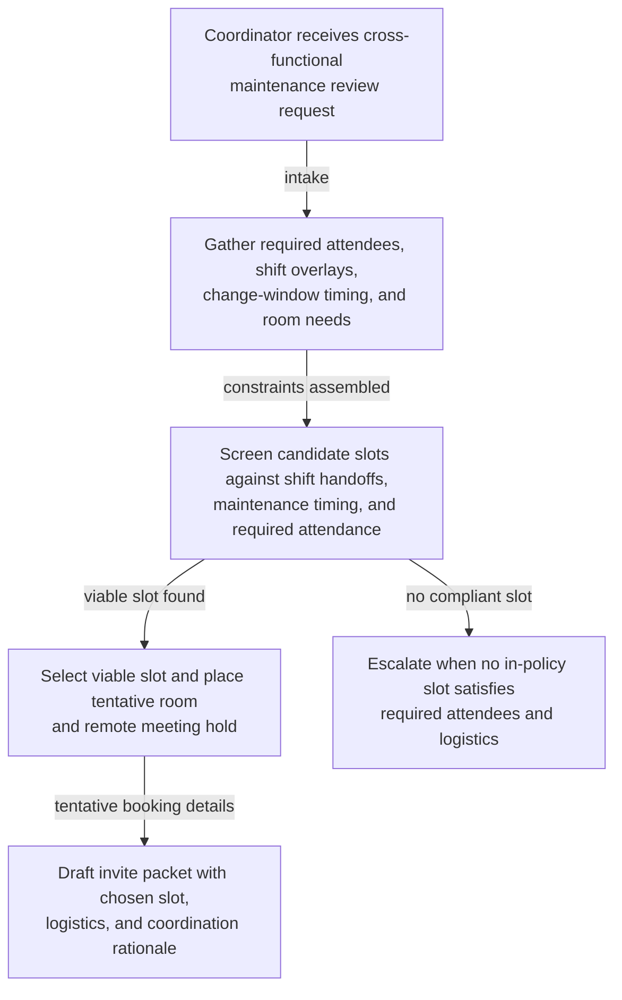

# Cross-functional maintenance review scheduling

## Linked pattern(s)

- `calendar-conflict-coordination`

## Domain

Operations.

## Scenario summary

A plant operations coordinator needs to schedule a pre-maintenance review for a Saturday ERP and warehouse-control cutover affecting manufacturing, facilities, network engineering, and the overnight support desk. The meeting has to land before the approved maintenance window, include both on-site and remote participants across two shifts, avoid shift handoff gaps, and secure a conference room with dial-in support near the operations floor.

## Target systems / source systems

- Team calendars with shift overlays and on-call rotations
- Maintenance calendar and approved change-window tracker
- Conference-room booking system and remote meeting platform
- Change-management ticket with affected-system list and rollback notes
- Messaging threads from operations, facilities, and network leads

## Why this instance matters

This grounds the pattern in a real coordination problem where the cost is operational churn rather than strategic decision risk. The scheduling workflow has to reconcile hard timing constraints, required attendees, and room-plus-remote logistics without turning a routine maintenance review into repeated manual back-and-forth across teams.

## Likely architecture choices

- A tool-using single agent gathers availability, shift boundaries, maintenance-window constraints, and room options from approved scheduling systems.
- Bounded delegation fits because the agent can place tentative holds, rank viable slots, and draft invites, but it should not override blackout windows or executive conflicts silently.
- Human review stays reserved for cases where no in-policy slot exists, a required lead is unavailable, or the proposed time crosses shift or overtime rules.

## Governance notes

- Required attendees, minimum review lead time, and maintenance-window boundaries should be explicit before any tentative booking occurs.
- Calendar access should stay limited to free-busy and scheduling metadata rather than exposing private event details.
- Tentative holds and rejected slot rationales should be logged so coordinators can explain why a final slot was chosen.
- The workflow should escalate instead of guessing when room capacity, remote-bridge support, or shift coverage requirements cannot all be satisfied.

## Evaluation considerations

- Time from scheduling request to a viable review slot covering all required teams
- Rate of maintenance reviews booked without violating shift, room, or maintenance-window constraints
- Frequency of manual rescheduling caused by missed conflicts or stale calendar state
- Usefulness of the coordination log when operations managers review why a slot or attendee exception was selected
