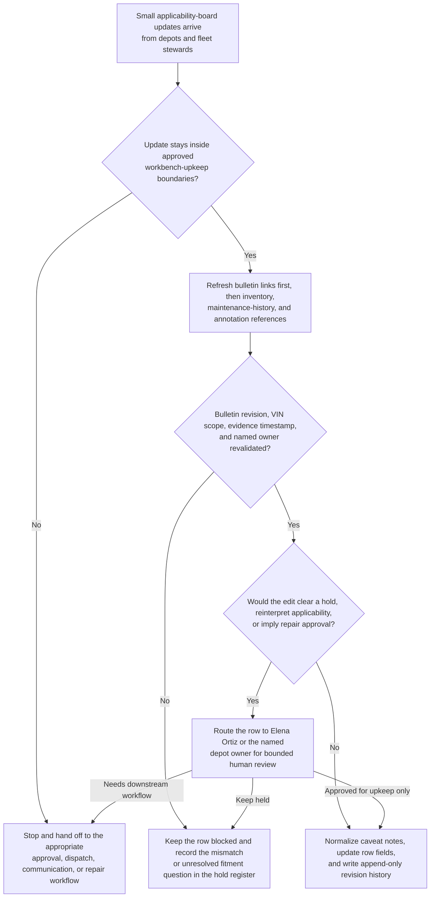

# Delivery fleet brake-inspection bulletin applicability caveat board shared workbench upkeep

## Linked pattern(s)

- `shared-workbench-orchestration`

## Domain

Operations.

## Scenario summary

A fleet standards team maintains an internal brake-inspection bulletin applicability caveat board while depot maintenance leads, fleet safety reviewers, maintenance-planning stewards, and parts-governance coordinators continuously refine notes attached to a newly issued braking-system inspection bulletin for several delivery-vehicle families. The board already carries prerequisite state for each row: the current bulletin revision, vehicle-family or VIN-scope mapping, the latest fleet-inventory sync, any prior temporary-deferral reference, the last maintenance-evidence refresh timestamp, visible blocker and unresolved-fitment fields, and named human ownership under Fleet Safety Standards Steward Elena Ortiz plus each depot row's accountable owner. As small updates arrive, the agent keeps that bounded workbench synchronized by refreshing source-precedence links from the authoritative bulletin repository before inventory or depot annotations, normalizing duplicate caveat notes, updating owner assignments after depot handoffs, and carrying unresolved axle-configuration questions, missing service-history evidence, and parts-catalog mismatches forward in an explicit hold register with append-only revision lineage. Humans remain responsible for deciding whether a vehicle family truly falls under the bulletin, whether any temporary deferral is acceptable, whether road-use restrictions or repair priorities should change, and when any row should move into a separate approval, dispatch, communication, or maintenance-execution workflow.

## Target systems / source systems

- Shared bulletin-applicability caveat board with vehicle-family rows, ownership fields, prerequisite-state columns, blocker tags, explicit source-precedence markers, and append-only revision history
- OEM and fleet-safety bulletin repository containing the current braking-system inspection bulletin revision, superseding clarifications, applicability rules, and approved fitment matrices
- Fleet asset inventory and VIN decoding register showing vehicle classes, brake-package variants, depot assignments, service status, and last synchronization timestamps referenced by board rows
- Computerized maintenance management system and temporary-deferral register containing prior inspections, open brake work orders, service-history evidence, prior deferral links, and parts availability notes
- Depot annotation and photo-review surface where maintenance leads, safety reviewers, and parts coordinators add small edits, local caveats, ownership handoff notes, and unresolved fitment questions

## Why this instance matters

This grounds the pattern in an operations governance surface where the maintained artifact is one internal applicability caveat board for a fleet safety bulletin rather than a repair plan, deferral request, dispatch instruction, or formal approval packet. The useful work is keeping prerequisite state, source precedence, blocker visibility, and row ownership synchronized as many small updates arrive from authoritative policy, inventory, maintenance, and human annotation systems. That keeps the collaboration centered on shared workbench upkeep and resumable context instead of deciding bulletin scope, approving deferrals, or triggering downstream maintenance execution.

## Likely architecture choices

- Event-driven monitoring fits because upkeep should react when bulletin clarifications, VIN-inventory mappings, maintenance-history evidence, or depot comments change.
- A tool-using single agent can refresh source links, reconcile row metadata, normalize duplicate caveat wording, and keep hold markers plus lineage synchronized inside one bounded board.
- Human-in-the-loop review remains necessary when an update would clear a blocker, reinterpret bulletin applicability, or make a row sound like an approved repair or deferral decision.
- Bounded delegation works because Elena Ortiz and depot owners can predefine allowable field updates, source-precedence rules, and hold conditions without delegating repair authorization, road-use restrictions, or maintenance scheduling.

## Governance notes

- The board should clearly separate authoritative bulletin facts, inventory-derived scope, maintenance-evidence status, depot-proposed caveats, accepted human notes, and unresolved fitment questions so routine upkeep never implies that a vehicle is cleared, deferred, or repair-approved.
- Each row should retain inspectable provenance for the bulletin revision, VIN or vehicle-family scope reference, fleet-inventory snapshot, maintenance-history extract, prior deferral lineage, last evidence-refresh timestamp, and named human owner before a blocker is cleared or a status field is updated.
- The agent may normalize wording, merge duplicate caveat notes, and update ownership fields after confirmed handoffs, but it should not decide whether a configuration falls under the bulletin, approve a temporary deferral, remove a hold that Elena Ortiz or a depot owner still considers open, or reprioritize repair work.
- Append-only revision history should preserve row-level lineage, including superseded caveat text, fitment-scope changes, owner handoffs, and blocker-state transitions, so reviewers can reconstruct why the current board differs from earlier revisions.
- If a requested update would authorize continued road use, initiate repair scheduling, assemble a formal exception packet, notify drivers or regulators, or trigger parts ordering and execution, the workflow should stop and hand off to the appropriate adjacent pattern.

## Evaluation considerations

- Percentage of board refreshes that preserve correct bulletin links, VIN-scope references, maintenance-evidence traces, named owner fields, and unresolved-question state across repeated upkeep cycles
- Reviewer correction rate for normalized caveat text, refreshed blocker metadata, or automatically updated ownership assignments after board maintenance
- Rate at which approval-like, dispatch-like, or execution-adjacent edits are held for human review instead of being silently folded into the internal applicability board
- Usefulness of the maintained workbench for helping fleet standards stewards and depot maintenance owners resume bulletin-upkeep work without reconstructing stale lineage, prerequisite state, or blocker context by hand
