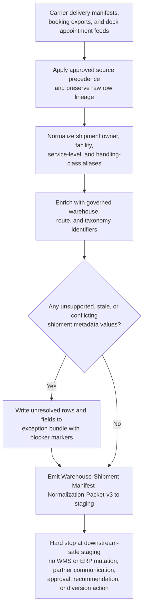
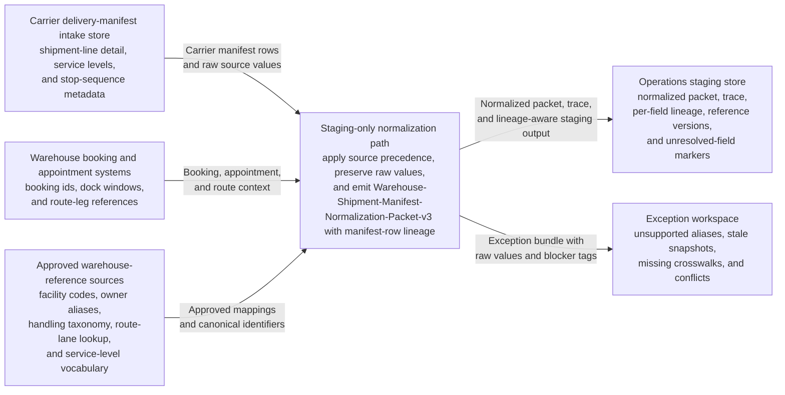

# Delivery manifest and shipment metadata normalization for operations warehouse staging

## Linked pattern(s)

- `normalization-and-enrichment`

## Domain

Operations.

## Scenario summary

A warehouse data stewardship team maintains one governed staging artifact, `Warehouse-Shipment-Manifest-Normalization-Packet-v3`, for inbound and outbound delivery manifests before analytics, dock-planning dashboards, or search-oriented warehouse support views consume them. The raw inputs already arrive as structured or semi-structured records from carrier delivery manifests, warehouse booking exports, dock appointment feeds, and controlled facility-reference tables, but the metadata is inconsistent: carrier service levels use overlapping aliases, facility names mix local nicknames with canonical site codes, shipment owner values reflect retired business-unit labels, and handling-class tags appear in both approved and informal shorthand forms. The workflow must apply explicit source precedence, preserve original field values and manifest-row lineage, normalize supported aliases into the approved staging schema, enrich records only with governed reference identifiers, and keep unresolved or conflicting fields visible in an exception bundle. It stops once the normalized packet, trace, and exception output are written to downstream-safe staging; it does not approve manifest changes, recommend rerouting, investigate shipment discrepancies, onboard suppliers, update WMS or ERP records, contact partners, or trigger any downstream operational action.

## Target systems / source systems

- Carrier delivery-manifest intake store containing shipment headers, pallet or carton identifiers, service-level strings, stop sequencing, and appointment-window metadata received from approved carrier interfaces
- Warehouse booking and appointment systems holding internal shipment booking ids, dock-door assignments, route-leg references, and planned arrival or departure windows for the same manifest batch
- Approved warehouse-reference sources such as the facility-code registry, shipment-owner alias table, handling-class taxonomy, route-lane lookup, and service-level vocabulary used for canonical enrichment
- Operations staging store that accepts schema-aligned manifest rows, per-field lineage, reference-data versions, and unresolved-field markers for downstream-safe reuse
- Exception workspace where operations data stewards inspect unsupported aliases, stale source snapshots, missing crosswalks, or conflicting manifest metadata before any broader operational reuse

## Why this instance matters

This grounds `normalization-and-enrichment` in an operations workflow that is materially different from both corrective-maintenance intake handoff and sampling-policy tuning. The main value is not extracting a document packet, deciding what to do about a shipment, or changing live warehouse state; it is producing a clean, auditable, low-risk staging representation from already structured manifest metadata that is noisy enough to break downstream search, dashboard filtering, and queue preparation. The example shows why explicit source precedence, reversible enrichment, and visible unresolved exceptions matter when operations teams need a trustworthy staging packet without letting cleanup drift into logistics judgment, supplier management, or execution.

## Source precedence

1. Approved manifest staging schema and normalization policy for `Warehouse-Shipment-Manifest-Normalization-Packet-v3` — primary authority for required fields, canonical values, and unsupported-value handling
2. Warehouse booking and appointment system export — authoritative internal shipment, facility-code, dock-window, and route-leg references for the current staging batch
3. Carrier delivery-manifest intake store — primary shipment-line detail, carrier-provided service-level labels, pallet or carton identifiers, and stop-sequence metadata
4. Approved reference tables — facility aliases, shipment-owner mappings, handling-class taxonomy, route-lane lookup, and service-level vocabulary used for allowed enrichment
5. Lower-precedence dock exception annotations or scanner intake notes — context only for traceability when they do not override an approved source

If the warehouse booking export and carrier manifest disagree on a required identifier, quantity bucket, or facility mapping, the workflow leaves the affected field unresolved, records both source values in the trace, and routes the row to the exception bundle instead of choosing a winner silently.

## Prerequisites and blockers

- The current staging schema version, approved alias tables, and reference-data snapshots for this batch must be pinned before normalization begins so the packet can be replayed exactly.
- The manifest batch must already be frozen for staging input, with a captured intake timestamp and source-file lineage for each contributing carrier or booking export.
- Required prerequisite fields include manifest id, shipment-line or package reference, origin or destination facility context, planned movement window, and at least one governed owner or route reference; rows missing these minimum identifiers stay in exceptions.
- Visible blockers include stale carrier revisions that postdate the frozen batch, unapproved facility nicknames without a canonical crosswalk, conflicting shipment-owner mappings between booking and manifest sources, unsupported handling-class shorthand, and missing route-lane reference entries.
- Any row tied to an active downstream discrepancy investigation or operational hold remains in staging-only status; this workflow may preserve the flag but must not interpret, clear, or escalate that condition.

## Likely architecture choices

- A tool-using single agent can ingest the frozen manifest batch, apply source-precedence rules, query approved lookups, and write the normalized packet, trace, and exception bundle in one bounded batch loop.
- The target schema should keep raw observed values separate from normalized and enriched fields so downstream consumers can distinguish carrier-provided metadata from warehouse-approved canonical identifiers.
- Reference enrichment may safely add canonical facility codes, route-lane ids, service-level identifiers, and handling-class taxonomy values, but unsupported inference about shipment readiness, dock assignment quality, diversion need, or partner performance must remain out of scope.
- The staging write path should be append-friendly or snapshot-based so data stewards can replay the same batch after alias-table updates without mutating carrier or warehouse source systems.

## Governance notes

- Every normalized field should retain manifest-row lineage to the exact carrier or booking record, the raw source value, the approved mapping or lookup entry used, and the reference-data version applied during the batch.
- Approved reference sources must be explicit and limited to maintained warehouse vocabularies and alias tables rather than ad hoc operator memory, chat commentary, or unreviewed spreadsheet edits.
- Unknown, conflicting, or stale values should remain visible in the exception bundle with blocker tags such as `missing-facility-crosswalk`, `owner-mapping-conflict`, or `stale-manifest-revision` instead of being forced into a nearby canonical bucket.
- The workflow must stop at downstream-safe staging: it may not approve manifest corrections, recommend shipment diversion, investigate root cause, mutate WMS or ERP records, alter appointments, notify carriers or suppliers, or trigger any warehouse execution step.
- Audit records should preserve enough trace detail to compare packet `v3` against the frozen input bundle, replay normalization after a controlled mapping update, and explain why any field remained unresolved.

## Evaluation considerations

- Percentage of staged manifest rows accepted by downstream warehouse analytics, search, or planning-preparation tools without additional owner, facility, service-level, or handling-class cleanup
- Percentage of normalized and enriched fields that preserve original-value lineage, source-precedence evidence, and reference-data version traceability
- Rate of unsupported aliases, stale source revisions, or cross-system conflicts correctly routed to the exception bundle instead of being silently normalized
- Replay reliability when a facility alias table changes, a new carrier service-level code is approved, or a route-lane lookup entry is corrected after the batch has already been staged
- Absence of downstream-boundary violations such as WMS mutations, ERP updates, rerouting recommendations, supplier onboarding actions, or partner-facing communications emerging from the normalization run
