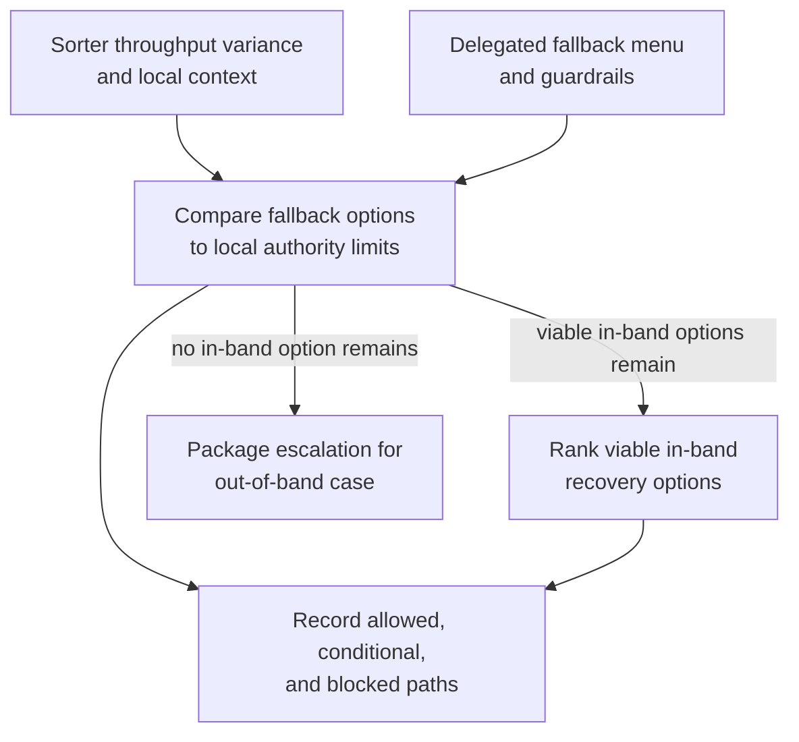
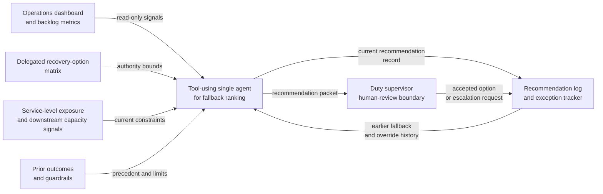

# Distribution sorter throughput fallback option recommendation

## Linked pattern(s)

- `delegated-authority-option-ranking`

## Domain

Operations.

## Scenario summary

A regional distribution hub is entering an evening peak with one sorter lane running below expected throughput after repeated sensor resets. The duty supervisor has a documented local authority band that allows only a limited set of fallback options, such as capped overtime, bounded overflow transfer to a nearby hub, or continuing at reduced throughput for lower-priority volume, while larger vendor-callout spend, cold-chain handling changes, or cross-region service-commitment exceptions require higher approval. The workflow must rank the viable in-band recovery options, show which fallback paths are blocked by spend, safety, and service guardrails, and package escalation only if the local menu no longer covers the case before anyone dispatches labor, reroutes loads, or changes customer commitments.

## Target systems / source systems

- Hub operations dashboard, current backlog metrics, sorter health notes, and shift staffing record
- Delegated recovery-option matrix covering overtime caps, overflow-transfer thresholds, and blocked actions
- Service-level exposure data, parcel-priority mix, cold-chain constraints, and downstream hub capacity signals
- Prior local recovery outcomes, vendor-callout guardrails, and regional escalation criteria
- Recommendation log and exception tracker for earlier fallback or override requests

## Why this instance matters

This grounds the pattern in operations without drifting into command-window planning or actual dispatch. The value is identifying which local recovery option stays inside the duty supervisor's preapproved envelope, which seemingly attractive options are actually escalation-only, and when local authority is exhausted even though the situation has not yet become a critical command case.

## Likely architecture choices

- A tool-using single agent can compare backlog, staffing, and capacity signals against the bounded recovery menu and produce one explainable fallback ranking quickly enough for local use.
- Human-in-the-loop review still matters because the duty supervisor decides whether to accept the recommended local option or escalate when all viable paths are out of band.
- Read-only integration with operations dashboards, staffing systems, and routing data is preferable so the workflow cannot silently authorize overtime, reroute freight, or trigger vendor dispatch.

## Governance notes

- The output should distinguish allowed local fallback options, conditionally allowed options that depend on refreshed downstream-capacity evidence, and blocked paths that exceed spend, safety, cold-chain, or service-commitment guardrails.
- Any recommendation that uses prior fallback cases should show whether the earlier case matched lane criticality, parcel mix, staffing state, and weather or downstream-capacity conditions.
- Backlog detail, staffing constraints, vendor pricing, and parcel-priority information should remain visible only to authorized operations, logistics, and regional-governance reviewers.
- Recommendation packets should preserve the guardrail checks, supporting metrics, blocked-option rationale, and any supervisor override requests so later review can reconstruct why a local path was taken or escalated.

## Evaluation considerations

- Rate at which accepted fallback recommendations stay within duty-supervisor authority without later regional correction
- Time from throughput degradation detection to a reviewed bounded-option packet for the local shift lead
- Frequency with which blocked high-cost or safety-sensitive options are surfaced before labor or routing action begins
- Stability of option ranking when backlog, downstream capacity, or staffing availability shifts during the same operating window
