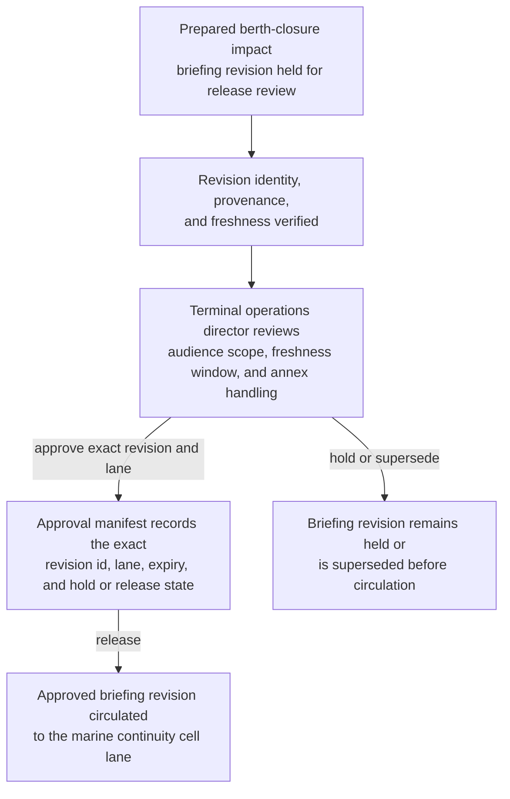
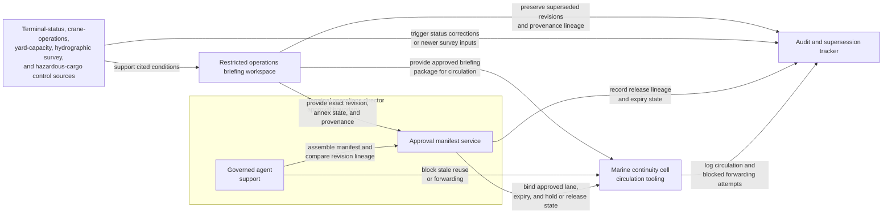

# Gateway port berth closure impact briefing revision approved for marine continuity cell circulation

## Linked pattern(s)

- `approval-gated-briefing-release`

## Domain

Operations.

## Scenario summary

An operations continuity workflow has already synthesized one revision of a gateway-port berth closure impact briefing that summarizes berth availability, crane operating restrictions, container dwell exposure, hazardous-cargo segregation caveats, and unresolved hydrographic survey gaps after overnight silt intrusion closes part of a major terminal. Before that exact revision is circulated into the restricted marine continuity cell lane, a named terminal operations director must approve the audience scope, freshness window, and annex handling so continuity readers receive the reviewed context package rather than a stale draft, an over-broad copy, or a version carrying restricted cargo details beyond the approved lane. The workflow stops at governed release of that briefing revision; it does not choose vessel rerouting, authorize berth reassignment, notify carriers or regulators, or execute downstream port-recovery actions.

## Target systems / source systems

- Restricted operations briefing workspace storing the synthesized berth-closure briefing revision, superseded revisions, annex redactions, and provenance ledger
- Terminal-status, crane-operations, yard-capacity, hydrographic survey, and hazardous-cargo control systems already cited by the prepared briefing revision
- Marine continuity cell circulation tooling enforcing named recipients, internal-use banners, expiry controls, and blocked forwarding outside the approved lane
- Approval manifest service recording the terminal operations director, exact revision id, approved continuity-cell lane, freshness deadline, and explicit hold or release state
- Audit and supersession tracker preserving release lineage, expiry events, and blocked reuse or forwarding attempts when a newer survey result or berth-status correction appears before circulation

## Why this instance matters

This grounds the pattern in operations where the hard governance step is releasing one exact synthesized briefing revision into a tightly bounded continuity lane, not deciding how the terminal will recover. Port disruption briefings often change quickly as survey updates, crane restrictions, and hazardous-cargo handling details shift, so release authority must stay tied to one reviewed version rather than a vague permission to brief continuity leadership. The example keeps the family boundary clean by ending at bounded circulation of context rather than drifting into vessel sequencing, yard replanning, carrier communication, or execution.

## Likely architecture choices

- Approval-gated execution fits because the berth-closure briefing remains held until the terminal operations director approves one exact revision for the restricted marine continuity cell lane.
- Human-in-the-loop review is necessary because only accountable operations leadership should accept unresolved survey uncertainty, confirm cargo-detail handling, and authorize circulation of sensitive terminal context.
- A governed agent can assemble the release manifest, compare revision lineage, and block stale reuse or forwarding, but it should not recommend rerouting, assign recovery work, or trigger downstream port-operations actions.

## Governance notes

- Approval should bind to one immutable briefing revision, one named marine continuity cell lane, one freshness deadline, and one explicit annex profile so later edits or copied versions cannot inherit permission silently.
- The released brief should preserve unresolved survey gaps, crane-operating caveats, and hazardous-cargo segregation constraints rather than smoothing them into a false recovery-ready narrative.
- If a new sounding result, berth-capacity correction, or cargo-classification update appears during approval review, the pending revision should remain on hold and be superseded rather than circulated under stale approval.
- Audit records should preserve the released or held revision id, approver identity, continuity-cell recipient scope, expiry timing, annex state, and any blocked forwarding attempts to carrier-relations, commercial scheduling, or other non-approved recipients.

## Evaluation considerations

- Percentage of marine continuity cell circulations where the released briefing revision id, hold or release state, and manifest metadata align exactly without later correction
- Rate at which stale, superseded, expired, or out-of-scope berth-closure briefings are blocked before continuity-cell visibility
- Time required to move from briefing-ready status to approved bounded circulation when provenance, annex handling, and survey freshness are already complete
- Reviewer correction rate for missing caveats, wrong audience scope, or blocked-forwarding failures after the continuity cell receives the released briefing
