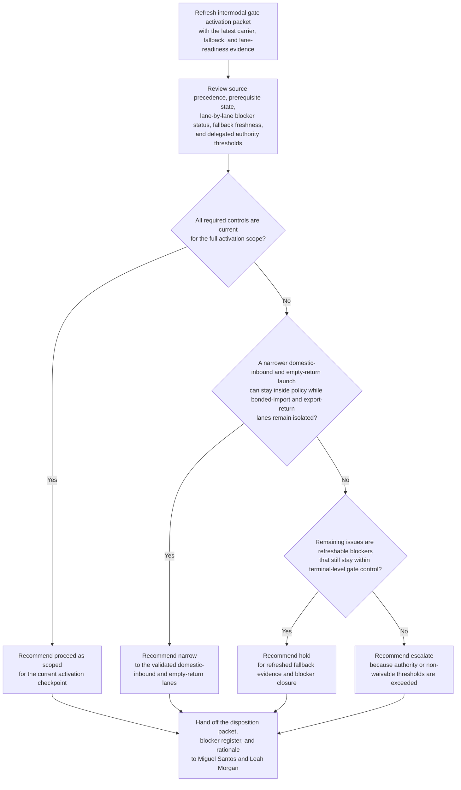

# Intermodal gate appointment platform activation readiness gate disposition recommendation

## Linked pattern(s)

- `readiness-gate-disposition-recommendation`

## Domain

Operations.

## Scenario summary

A terminal operations readiness board is re-evaluating whether the governed packet `IGA-Activation-Gate-v4` is ready to pass its gate-appointment platform activation checkpoint before a holiday congestion-control program begins at the inland intermodal hub. Since the previous packet revision, one drayage-carrier EDI replay for export returns remains incomplete, the fallback manual check-in drill for the night gate shift aged past the policy freshness window, and the bonded-import exception matrix still lacks customs-operations closure, although a narrower activation limited to domestic inbound and empty-return lanes appears feasible. The workflow must recommend whether operations should proceed with the activation as scoped, hold for refreshed evidence and blocker closure, narrow the activation to the validated lane set, or escalate because lane-coupling, fallback-readiness, or delegated authority thresholds no longer fit local control before any appointment system-of-record switch, driver notice, slot release, or live gate activation occurs.

## Target systems / source systems

- Terminal activation gate tracker, delegated terminal-change authority matrix, and gate-operations policy library
- Carrier master, appointment-platform replay dashboard, and lane-by-lane EDI validation reports for inbound, bonded-import, empty-return, and export-return traffic
- Fallback manual check-in drill log, handheld scanner image inventory, and rollback rehearsal evidence store for each gate shift
- Yard-capacity baseline, customs-operations exception matrix, and congestion-control program calendar for the named activation window
- Prior packet revisions, reviewer comment history, and restricted audit log preserving packet lineage and accepted narrowing paths

## Why this instance matters

This instance grounds the pattern in operations through one exact activation-readiness checkpoint rather than an approval-gated packet release, scheduling workflow, or live yard-control action. The hard problem is refreshing a governed readiness judgment as carrier evidence, fallback rehearsal state, and lane-specific blockers change, while keeping the workflow bounded at a proceed, hold, narrow, or escalate recommendation for one activation packet.

## Likely architecture choices

- Event-driven monitoring fits because EDI replay failures, fallback-drill expiry, customs-exception updates, and calendar pressure should trigger a refreshed activation recommendation as soon as the gate context materially changes.
- Human-in-the-loop review is mandatory because the workflow should advise on the gate disposition, not approve the system-of-record switch, release appointment slots, notify carriers, or activate live terminal lanes.
- Read-only integration with terminal, carrier, customs, and policy systems is preferable so the agent cannot silently convert a readiness recommendation into a live operating change.

## Governance notes

- The workflow should stay centered on one inspectable activation packet, `IGA-Activation-Gate-v4`, owned by Nadia Flores, Director of Intermodal Gate Readiness, for the `terminal activation review lane` at the 2026-04-03 holiday-program checkpoint.
- Source precedence should be explicit: the approved gate-operations standard, delegated authority matrix, current carrier master, customs-operations exception matrix, and signed fallback-drill log outrank vendor cutover standup notes, lane-supervisor chat, and carrier phone updates; conflicts should remain visible as blockers rather than being normalized away.
- Prerequisite policy and operating state should remain visible in the packet, including appointment-rule freeze status, deployment of handheld scanner image `gate-handheld-7.2.4` to every in-scope lane, completion of rollback and manual-check-in drills within the fourteen-day freshness window, approved driver-notice template pack `driver-activation-notice-v2`, and countersigned customs escalation contacts for bonded-import handling.
- Open blockers and unresolved items should remain explicit, including the incomplete export-return EDI replay for carrier North Spur Logistics, the stale night-shift fallback drill, and the still-open bonded-import exception matrix row for seal-break inspection routing, with any narrowed recommendation showing exactly which lanes remain out of scope.
- Revision lineage should preserve prior packet revisions, including `IGA-Activation-Gate-v2` full-scope proceed review, `IGA-Activation-Gate-v3` bonded-import narrowing proposal, accepted and rejected reviewer comments, and the evidence delta that changed the recommendation so later reviewers can reconstruct why the packet moved between proceed, hold, narrow, or escalate.
- The human decision recipients should remain concrete in the handoff lane: Miguel Santos, Vice President of Terminal Operations, and Leah Morgan, Chair of the Peak Flow Readiness Board, receive the packet for governed disposition review while customs-operations advisor Priya Dsouza remains an explicitly named reviewer rather than the decision owner.
- The boundary must remain clear: the workflow does not approve the activation, issue live driver notices, switch the appointment platform, resequence lane staffing, or execute fallback procedures.

## Evaluation considerations

- Reviewer agreement with the recommended proceed, hold, narrow, or escalate disposition before any appointment system-of-record switch or live lane activation is authorized
- Rate at which stale fallback evidence, unresolved customs exception rows, or carrier replay gaps are surfaced before the governed activation checkpoint meets
- Quality of traceability linking source-precedence rules, prerequisite operating state, blocker visibility, lane ownership, and reviewer-lineage evidence to the disposition recommendation
- Stability of recommendations when replay status, fallback drill freshness, or lane-scope exceptions change during the final activation window
