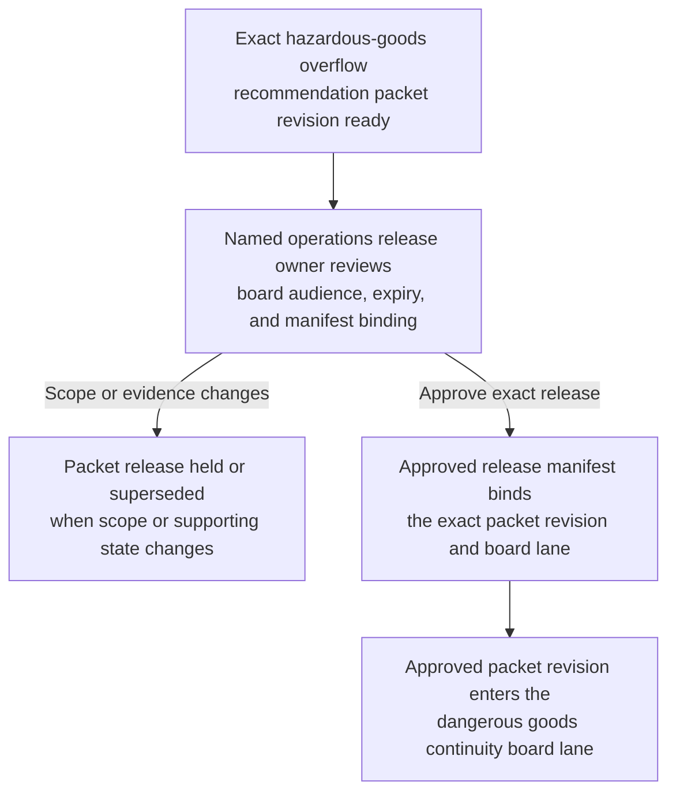

# Intermodal hazardous-goods overflow staging recommendation packet revision approved for dangerous goods continuity board decision lane

## Linked pattern(s)

- `approval-gated-recommendation-release`

## Domain

Operations.

## Scenario summary

An intermodal yard operations workflow has already prepared one exact recommendation packet revision for temporary overnight handling of delayed hazardous-goods containers after a main rail handoff window collapses and the ordinary segregated pad reaches its safe occupancy cap. The packet narrows the bounded options to release a recommendation for staging the named containers in one monitored overflow pad with class-compatible spacing, fire-watch coverage, and a twelve-hour dwell cap; release a narrower recommendation limited to the lowest-risk compatibility group with daylight-only onward transfer; or escalate to corporate dangerous-goods authority review, and it keeps blocked paths such as mixed-compatibility overflow stacking, use of an unmonitored trailer lot, or onward truck dispatch without renewed placard and seal inspection explicit. Before that exact packet revision can enter the restricted dangerous goods continuity board decision lane, a named operations release owner must approve the board audience, expiry window, and manifest binding so reviewers receive the governed recommendation artifact rather than a stale, broadened, or misrouted copy. The workflow stops at governed release of that packet revision; it does not decide whether overflow staging is allowed, resequence yard moves, issue driver instructions, or move any container.

## Target systems / source systems

- Hazardous-goods recommendation workspace holding the current packet revision, bounded option set, blocked-path rationale, and superseded drafts
- Yard occupancy, container location, compatibility-class mapping, placard status, seal-inspection, and rail-handoff delay records already cited by the recommendation packet
- Dangerous-goods governance repository defining the named continuity board lane, authorized recipients, release expiry, and the human owner who may approve packet release
- Approval manifest and restricted-routing tooling that records the exact packet hash, container scope, board audience, and any blocked forwarding attempts outside the approved lane
- Audit and supersession ledger used to hold older packet revisions when compatibility evidence, fire-watch coverage, rail timing, or overflow-pad availability changes before board review

## Why this instance matters

This grounds the pattern in operations where the governance challenge is not deciding whether hazardous-goods overflow staging should proceed, but controlling release of one bounded recommendation artifact into one human decision lane. Overflow-staging packets can change late as container makeup shifts, compatibility checks fail, inspections expire, or fire-watch staffing changes, so approval must stay tied to one reviewed revision rather than to a vague permission to circulate yard-continuity advice. The example keeps the family boundary explicit by ending at dangerous-goods-board handoff rather than overflow adjudication, yard replanning, dispatcher coordination, or container movement.

## Likely architecture choices

- Approval-gated execution fits because the recommendation packet remains held until a named operations owner authorizes release into the dangerous goods continuity board decision lane.
- Human-in-the-loop review remains necessary because only accountable operations and safety governance owners should confirm lane scope, expiry timing, and blocked-option visibility without collapsing the workflow into overflow-staging approval itself.
- A governed agent can compare packet hashes, assemble the manifest, and block broadened distribution, but it should not authorize hazardous-goods staging, re-slot containers, notify carriers, or create yard-execution tasks.

## Governance notes

- Approval should bind to one immutable packet revision, one named dangerous goods continuity board lane, one bounded review window, and one exact container and option set so later edits cannot inherit release authority silently.
- Blocked paths such as mixed-compatibility overflow stacking, use of unmonitored space, expired placard or seal inspection status, or truck dispatch outside the packet scope should remain visible in the released packet rather than being compressed into a cleaner continuity summary.
- If container scope, compatibility evidence, fire-watch coverage, overflow-pad readiness, or board audience changes during approval review, the pending packet should be held and superseded rather than routed under stale approval.
- Audit records should preserve the released packet id, option-set hash, approver identity, recipient scope, expiry timing, manifest linkage, and any blocked redistribution attempts.

## Evaluation considerations

- Percentage of dangerous-goods-continuity-board releases where the overflow-staging recommendation packet revision, option-set hash, container scope, and manifest metadata align exactly without later correction
- Rate at which superseded, expired, or out-of-scope hazardous-goods overflow recommendation packets are blocked before board review
- Time required to move from packet-ready status to approved bounded board release when compatibility, inspection, staffing, and occupancy evidence are complete
- Reviewer correction rate for missing blocked paths, wrong audience scope, or stale-state handling after the board receives the released recommendation packet
