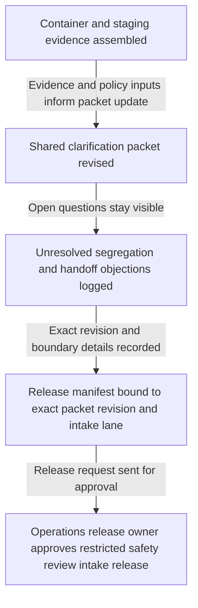

# Intermodal hazardous-goods segregation deviation clarification packet approved for restricted dangerous-goods safety review intake

## Linked pattern(s)

- `approval-gated-collaborative-artifact-release`

## Domain

Operations.

## Scenario summary

A marine terminal dangerous-goods coordinator, an inland rail-yard transfer planner, and a network safety governance lead are co-producing one governed segregation-deviation clarification packet because several import containers arrive with placard combinations, overpack notes, and transfer timing assumptions that do not match the temporary staging-zone map now being used during crane-maintenance congestion. Agents help reconcile container-segregation maps, yard-slot assignments, placard conflict photos, train consist extracts, temporary buffer-zone constraints, and rail-handoff objections into the shared packet while preserving which compatibility questions remain unresolved and which residual caveats the human artifact owner accepted explicitly. The workflow ends only when the named operations release owner approves that exact packet revision for one restricted dangerous-goods safety review intake lane, where downstream reviewers may decide whether the packet is sufficient for formal safety review or requires narrower scope and fresher evidence. It does not adjudicate dangerous-goods acceptability, authorize truck or rail movement, contact regulators, or execute yard reconfiguration.

## Target systems / source systems

- Governed intermodal-operations collaboration workspace holding the segregation-deviation clarification packet, revision history, disagreement ledger, and release-manifest draft
- Terminal operating, yard-management, and rail-handoff systems providing container identifiers, slot maps, planned transfer windows, consist sequencing, and temporary staging-location lineage
- Placard-imaging feeds, gate inspection records, packing declarations, and hazardous-goods reference extracts supplying classification claims, conflict evidence, overpack notes, and document freshness timestamps
- Dangerous-goods policy, restricted review-intake routing, and access-control systems defining required signers, approved reviewer audience, annex limits, and the single downstream intake lane
- Approval-routing, audit, and retention systems preserving held-release reasons, superseded packet revisions, accepted residual objections, and downstream handoff traceability

## Why this instance matters

This grounds the pattern in intermodal dangerous-goods operations governance rather than facilities impairment handling, continuity briefing circulation, or movement authorization. The reusable challenge is collaborative stewardship of one segregation-deviation clarification artifact whose exact revision must be approved before it can cross into a restricted dangerous-goods safety review lane, while disagreement about container adjacency, placard conflicts, temporary staging-zone constraints, rail-yard handoff readiness, and manifest freshness stays visible instead of being polished away. The example stays inside the pattern boundary because dangerous-goods adjudication, train or truck dispatch, regulator communication, and physical yard changes remain separate downstream workflows.

## Likely architecture choices

- Approval-gated execution fits because the clarification packet can be collaboration-ready while still blocked from restricted dangerous-goods safety review intake until the human release owner approves the exact revision.
- Human-in-the-loop control is required because only accountable operations and safety-governance leaders may accept residual disagreement, confirm audience scope, and authorize release of the packet itself.
- Agents may crosswalk container maps, refresh placard evidence, normalize objection wording, and maintain the release trace, but they must not decide segregation acceptability, clear a rail handoff, authorize dray moves, or trigger staging changes.

## Governance notes

- The release manifest should bind one exact packet revision, the named restricted dangerous-goods safety review-intake lane, signer identities, the covered container set and staging-zone snapshot, and any residual objections the human release owner accepted explicitly.
- Disagreement about placard interpretation, segregation distances, temporary buffer markers, rail-yard handoff objections, manifest version drift, and overpack-document consistency should remain visible in the packet or boundary ledger rather than being normalized away before release.
- Audience scope should stay limited to the approved dangerous-goods safety review intake lane; reuse of the packet for movement clearance, regulator outreach, customer communication, rail operating instructions, or yard re-slotting should require separate downstream approval.
- If container positions change materially, revised placard evidence arrives, the temporary staging-zone map is updated, or reviewer assignments shift during approval review, the workflow should hold release and supersede the prior packet revision rather than letting stale approval carry forward.

## Evaluation considerations

- Rate at which dangerous-goods safety review intake accepts the released packet without finding hidden container-scope drift, stale placard evidence, staging-map mismatches, or audience-boundary mistakes
- Time required to keep one collaborative segregation-deviation clarification packet synchronized as yard positions, handoff objections, signer state, and manifest references evolve
- Reliability of binding between the released artifact revision, accepted residual disagreement, the covered container-and-staging snapshot, and the bounded restricted dangerous-goods safety review-intake lane
- Frequency with which humans reject agent-assisted edits because they drifted into dangerous-goods adjudication, movement authorization, regulator contact, or physical yard reconfiguration
