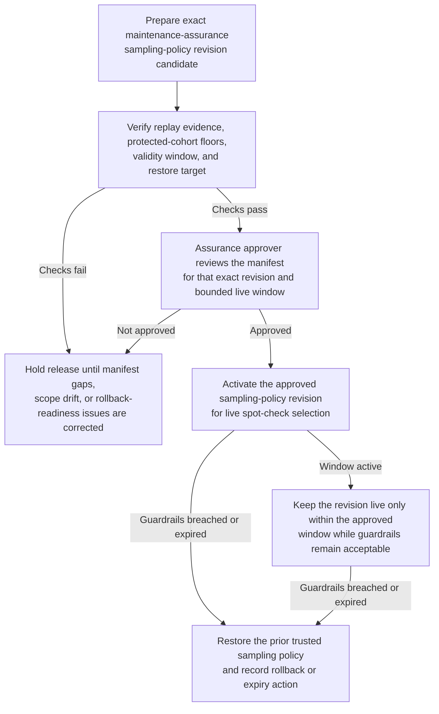
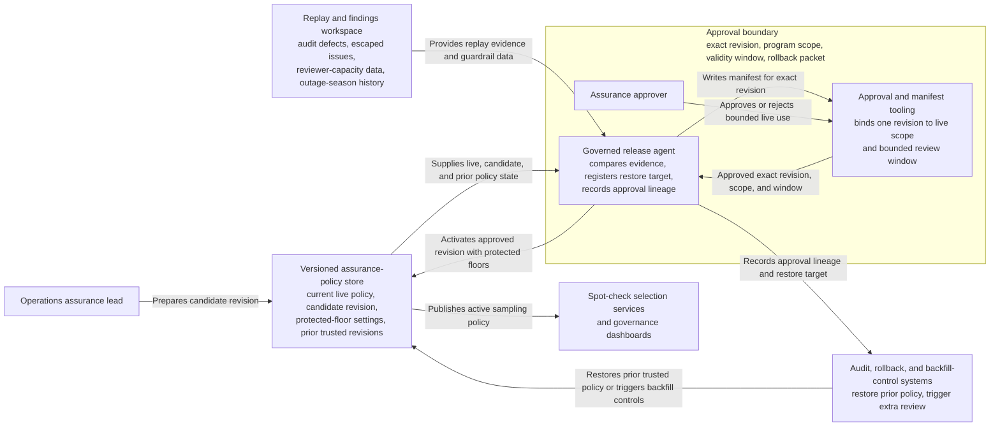

# Maintenance-assurance sampling-policy revision approved for live use

## Linked pattern(s)

- `approval-gated-optimization-state-release`

## Domain

Operations.

## Scenario summary

An operations assurance lead has prepared one exact sampling-policy revision for maintenance documentation spot checks after replay shows that the current policy undercovers newly onboarded vendors and safety-critical asset classes during outage season. The candidate revision increases coverage for those protected cohorts, tightens cooldown rules on recent low-yield strata, and includes an explicit restore target if escaped defects rise. The workflow must release that exact policy revision into live selection only after a human approver confirms the manifest, validity period, and rollback packet, while staying bounded at optimization-state release rather than assigning reviewers, changing maintenance schedules, or dispatching corrective work.

## Target systems / source systems

- Versioned assurance-policy store with the current live sampling rules, candidate revision, protected-floor settings, and prior trusted revisions
- Replay and findings workspace with audit defects, escaped documentation issues, reviewer-capacity data, and outage-season workload history
- Approval and manifest tooling used by assurance leadership to authorize one live sampling-policy revision for a bounded review window
- Audit, rollback, and backfill-control systems that can restore the prior policy and trigger extra review if guardrails are breached
- Spot-check selection services and governance dashboards that consume the active sampling policy

## Why this instance matters

This grounds the pattern in operations without sliding into execution. The released artifact is a versioned oversight-sampling policy that changes how future maintenance records are selected for review, not a dispatch order or field action. The approval-gated release shape becomes visible here because the problem is governing one exact live tuning revision with expiry and restore controls, not merely recommending a new rate set or letting autonomous tuning run without a named approver.

## Likely architecture choices

- Approval-gated execution fits because the sampling revision can be activated in the policy store only after assurance leadership approves that exact version and review-program scope.
- Human-in-the-loop review should remain normal because leaders must explicitly accept the change in live oversight coverage, protected-floor handling, and validity timing.
- A governed release agent can compare the candidate revision to replay evidence, register the restore target, and record the approval lineage, but it should not assign specific reviewers or expand the release into operational maintenance execution.

## Governance notes

- Safety-critical assets, new-vendor cohorts, and regulator-visible maintenance classes should remain explicit protected floors in the release packet and should not be weakened by a later unapproved edit.
- The release manifest should bind approval to one exact policy revision, one program scope, and one validity window so outage-season tuning does not become silent baseline policy.
- Rollback and backfill controls should trigger if escaped defects rise, protected cohorts are undercovered, or reviewer-capacity assumptions fail during the live window.
- Audit records should preserve the approved and prior policy ids, replay evidence consulted, approver identity, expiry timing, restore action, and any manual extension.
- The workflow must not assign assurance staff, reschedule maintenance, or close work orders; it only releases the live sampling-policy revision used by the oversight system.

## Evaluation considerations

- Change in escaped-documentation defects and protected-cohort review yield after the approved sampling revision becomes live
- Accuracy of binding among the approved revision id, protected-floor settings, and activated review-program scope
- Reliability of automatic expiry or rollback when reviewer-capacity assumptions fail or safety-critical misses rise
- Time required for assurance leaders to inspect one revision, approve bounded live use, and verify safe restoration to the prior trusted policy
