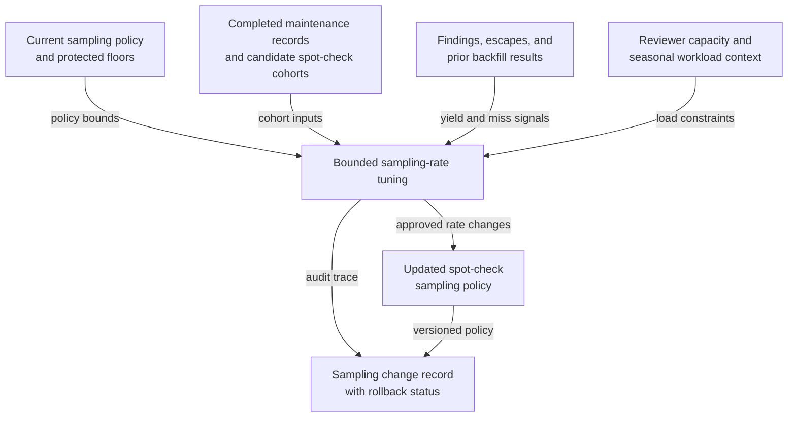

# Maintenance documentation spot-check sampling-rate tuning

## Linked pattern(s)

- `adaptive-review-sampling-rate-tuning`

## Domain

Operations.

## Scenario summary

An operations assurance team reviews completed maintenance work orders, inspection photos, calibration certificates, and technician notes to catch documentation gaps before they undermine safety audits, warranty recovery, or preventive-maintenance planning. A fixed spot-check policy currently over-samples routine low-risk records while under-covering work from recently onboarded vendors, safety-critical asset classes, and sites where documentation escapes were discovered only during later audits. The workflow must autonomously retune bounded spot-check sampling rates so maintenance records with rising escape risk or higher finding yield receive more review coverage, while preserving protected floors for safety-critical assets, respecting reviewer-capacity and outage-season workload constraints, minimizing copied worker detail, and preserving rollback if the loop begins chasing short-lived local defects.

## Target systems / source systems

- Maintenance-assurance policy store with active sampling rates, protected asset classes, and prior configuration versions
- Work-order, inspection, and asset systems with completed maintenance records, vendor identifiers, site metadata, and candidate spot-check cohorts
- Findings history with audit defects, later discovered documentation escapes, supervisor overrides, and prior backfill review results
- Reviewer-capacity dashboard covering assurance analysts, safety specialists, and seasonal workload pressure
- Governance and audit workspace used by operations leaders to inspect sampled tuning runs, freeze autonomous changes, and restore the last trusted policy

## Why this instance matters

This grounds the pattern in operations while keeping the boundary clear. The workflow is not dispatching crews, changing maintenance schedules, or deciding whether a work order is operationally complete; it is tuning how much documentation oversight different record cohorts should receive in future spot checks. That makes the main output a bounded self-tuning review artifact, which is family-safe for optimize/adapt.

## Likely architecture choices

- Event-driven monitoring should trigger reevaluation when audit findings cluster around a vendor, asset class, site, or shift pattern, or when reviewer capacity changes during outage season.
- A tool-using single agent can compute bounded sampling moves, enforce protected asset-class floors and reviewer-load ceilings, update the sampling policy, and write the audit trace.
- Autonomous-with-audit fits because in-policy spot-check changes can run automatically, while assurance leaders review sampled tuning cycles and intervene when escaped documentation defects or fairness concerns rise.
- Operations owners should remain able to freeze the loop, backfill reviews for a cohort, and restore the prior trusted policy if a recent decrease leaves safety-critical records under-reviewed.

## Governance notes

- Safety-critical assets, regulator-visible maintenance classes, and newly onboarded vendors with limited history should keep protected minimum coverage that autonomous tuning cannot quietly reduce.
- Audit records should capture which finding windows, workload assumptions, blocked moves, and rollback triggers justified each rate change.
- Logs should minimize copied technician or site detail unless restricted annexes are needed for authorized safety or vendor-governance review.
- The workflow must not assign crews, alter preventive-maintenance plans, or close work orders; it only changes the future documentation spot-check coverage policy.

## Evaluation considerations

- Change in meaningful documentation-defect yield per assurance review hour after tuned sampling is applied
- Rate of escaped documentation gaps discovered in later safety or warranty audits after a cohort's coverage decreases
- Frequency of freezes, backfill sweeps, or rollbacks that indicate the loop is misreading temporary local defect clusters
- Reviewer-load stability across protected asset classes, vendors, and sites during seasonal workload surges
