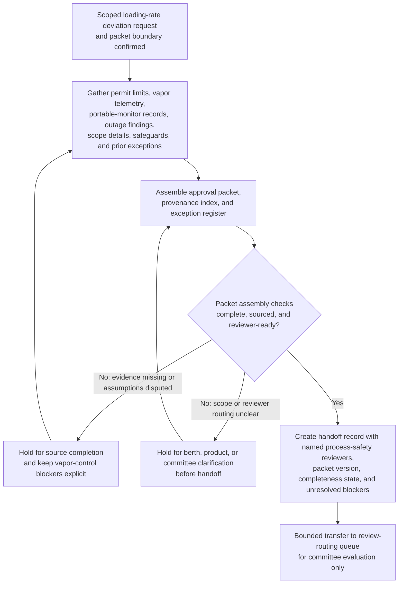

# Marine terminal vapor-recovery outage loading-rate deviation approval packet for process-safety committee review

## Linked pattern(s)

- `approval-packet-generation`

## Domain

Operations.

## Scenario summary

A terminal operations governance lead must assemble a decision-ready approval packet because a marine terminal's vapor-recovery unit has an unplanned fan-and-seal outage, and any temporary request to continue limited hydrocarbon loading at a reduced rate requires explicit process-safety committee review before anyone relies on the deviation package. The workflow gathers the scoped deviation request, permit operating limits, recent vapor-destruction telemetry, portable-monitor calibration records, outage maintenance findings, affected product and berth scope, prior exception history, and the already-defined temporary safeguards into one governed packet for process-safety committee review. Agents help map packet claims to source evidence, build a reviewer-visible provenance index, keep unresolved issues such as disputed vapor-composition assumptions, missing overnight monitor checks, or incomplete shift-staffing attestations in an explicit exception register, and prepare the handoff record showing the named committee reviewers and current completeness status. The workflow stops at packet generation and handoff; it does not recommend whether the deviation should be granted, set loading rates, authorize vessel operations, notify environmental regulators, or direct maintenance execution.

## Target systems / source systems

- Terminal operations exception workspace holding the scoped deviation request, packet draft, completeness checklist, and handoff status
- Process historian, emissions-monitoring, and portable-gas-detection systems containing vapor-destruction telemetry, hydrocarbon concentration readings, alarm history, calibration records, and monitoring coverage gaps
- Computerized maintenance management and reliability systems storing outage work orders, inspection findings, failed-component history, repair timelines, and vendor service notes
- Environmental permit, operating-procedure, and policy libraries containing loading-rate limits, vapor-control requirements, weather and monitoring thresholds, committee review criteria, and required disclosure rules
- Berth, tank, and cargo characterization systems documenting affected loading assets, product volatility classes, isolation boundaries, and already-scoped operational constraints
- Incident, shift-supervision, and prior exception repositories preserving staffing attestations, control-room acknowledgments, near-miss history, and earlier vapor-control deviation packets

## Why this instance matters

This grounds `approval-packet-generation` in an operations workflow where the hard part is assembling a trustworthy approval packet from terminal operations, maintenance, emissions, and permit evidence without letting unresolved vapor-control uncertainty disappear behind a clean narrative. Process-safety committee review depends on one inspectable packet that preserves provenance, scoped constraints, and visible exceptions before reviewers decide whether the request is ready for their lane. The example stays inside the gather-family boundary because the primary outputs are the packet, evidence index, exception register, and handoff record rather than an operational recommendation, approval outcome, loading instruction, regulator communication, or repair plan.

## Likely architecture choices

- Orchestrated multi-agent retrieval and synthesis fit because permit clauses, historian telemetry, maintenance findings, and staffing evidence often live in separate systems and require coordinated packet assembly.
- Human-in-the-loop checkpoints should remain mandatory so an accountable terminal operations owner can confirm request scope, required reviewers, and whether unresolved evidence gaps are acceptable to surface in the packet before handoff.
- Agents may reconcile monitor identifiers, align outage and telemetry timelines, and draft packet sections, but they should not decide whether emissions risk is acceptable, set the temporary operating envelope, approve vessel loading, or trigger downstream regulator or maintenance actions.

## Governance notes

- Every consequential claim about affected berths, product scope, vapor-destruction performance, monitor coverage, staffing readiness, permit thresholds, or committee routing should link to inspectable source evidence in the provenance index.
- The exception register should keep disputed vapor-composition assumptions, missing overnight monitor checks, incomplete staffing attestations, stale calibration certificates, and any unclear permit-interpretation notes visible so the packet cannot appear cleaner than the underlying control state.
- The handoff record should name the intended process-safety committee reviewers, packet version, completeness state, unresolved blockers, and the explicit boundary where packet generation ends and human approval review begins.
- Sensitive facility diagrams, hazardous-material handling details, and security-restricted berth information should remain access-controlled, minimally excerpted, and fully auditable across packet assembly and handoff.
- If new evidence shows an active release, uncontrolled ignition risk, or a permit breach requiring immediate containment, the workflow should stop and escalate into incident handling rather than continue packet assembly.

## Evaluation considerations

- Percentage of process-safety committee intakes accepted without missing mandatory evidence, routing corrections, or hidden vapor-control exceptions
- Reviewer correction rate for packet sections where agent-assisted synthesis overstated monitoring coverage, underreported operational constraints, or implied review readiness without sufficient support
- Time required for reviewers to trace a challenged packet claim back to the exact permit clause, historian trend, calibration record, outage ticket, or staffing attestation in the provenance index
- Bounce rate from committee review caused by stale evidence, incomplete exception visibility, or unclear handoff ownership
