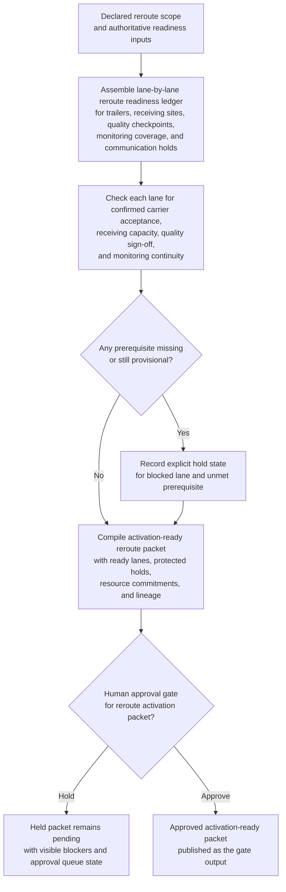
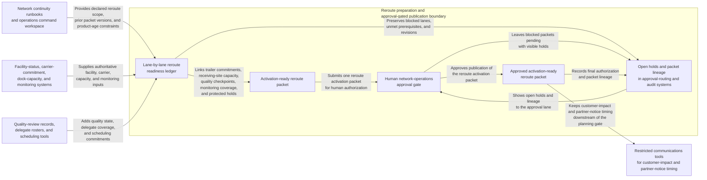

# Network cold-chain emergency reroute activation gate

## Linked pattern(s)

- `contingency-plan-activation-gate`

## Domain

Operations.

## Scenario summary

During a regional refrigeration-control outage, network operations has already declared a bounded contingency path that would reroute temperature-sensitive inventory through alternate cross-docks and overflow cold storage if the primary network cannot recover before product-age thresholds are breached. Upstream monitoring and incident workflows have already established the trusted facility status and the named human approval lane. The planning workflow must now prepare one activation-ready reroute packet showing trailer commitments, receiving-site capacity, quality-release checkpoints, cold-chain monitoring coverage, and protected customer-communication holds. It should keep explicit holds for any lane that lacks confirmed carrier acceptance, receiving capacity, or quality sign-off, and stop at the approval gate instead of dispatching trucks, changing inventory state, or choosing a different emergency response.

## Target systems / source systems

- Network continuity runbooks and operations command workspace with the declared reroute scope, prior packet versions, and product-age constraints
- Facility-status, carrier-commitment, dock-capacity, and monitoring systems already designated as authoritative inputs for reroute preparation
- Quality-review records, delegate rosters, and scheduling tools for site leaders, carrier coordinators, food-safety reviewers, and network control
- Approval-routing and audit systems used to record open holds, packet lineage, and final human authorization before reroute activation
- Restricted communications tools for customer-impact and partner-notice timing that remain downstream of the planning gate

## Why this instance matters

This grounds the pattern in operations where the value is assembling one coherent contingency activation packet before any trucks move. It is distinct from contamination command-window resequencing because the workflow is not managing a live active command timeline after activation starts. It is also distinct from execution because the workflow remains bounded at readiness planning, capacity alignment, and visible hold management rather than dispatching the reroute itself.

## Likely architecture choices

- Approval-gated execution fits because the reroute may be fully prepared in systems while still blocked pending a human operations approval.
- The readiness ledger should link trailer, carrier, receiving-site, monitoring, and quality checkpoints so network leadership can see which lanes are actually activation-ready.
- Holds should remain explicit for missing receiving capacity, incomplete quality release, or unconfirmed temperature-monitoring coverage.
- The workflow should stop at the approval packet and hold register rather than re-verifying the facility truth, recommending a broader crisis authority, or dispatching inventory movement.

## Governance notes

- Protected prerequisites such as food-safety release, cold-chain monitoring continuity, receiving-site acceptance, and customer-notice controls should be modeled as explicit holds before the packet can be approved.
- Shared packets should disclose only role-relevant lane, timing, and blocker state while restricted shipment, customer, and contractual details stay in narrower governed systems.
- Human network-operations ownership is required before the packet becomes the authoritative basis for any emergency reroute activation.
- Packet lineage should preserve which carrier, capacity, and site-readiness commitments changed across revisions so later reviews can distinguish planned readiness from executed action.

## Evaluation considerations

- Time from declared reroute-preparation request to a human-reviewable activation packet with complete lane readiness and hold visibility
- Rate at which blocked lanes or missing monitoring coverage remain visible rather than being masked by partial readiness elsewhere in the network
- Agreement between the workflow's reroute packet and the final human-approved contingency gate used for downstream activation
- Reliability of the packet when carrier acceptance, receiving capacity, or quality status changes repeatedly during the same product-risk window
