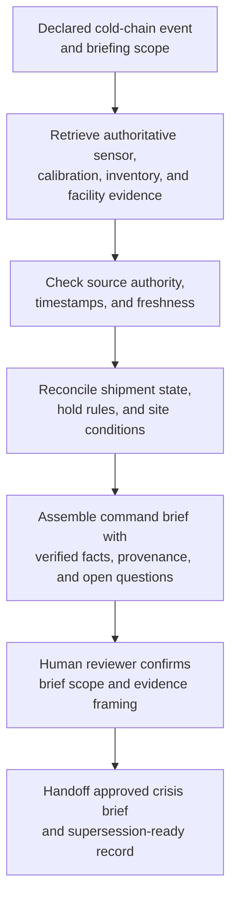

# Network cold-chain excursion command crisis briefing evidence synthesis

## Linked pattern(s)

- `crisis-briefing-evidence-synthesis`

## Domain

Operations.

## Scenario summary

An operations command center has already declared a critical cold-chain event after temperature excursions propagate across multiple distribution hubs handling time-sensitive medical inventory. Before anyone decides recall scope, reroutes shipments, authorizes disposal, or initiates regulator notifications, the workflow must assemble one command briefing that compresses confirmed affected inventory, sensor confidence, facility conditions, transit status, quality-hold rules, and unresolved containment questions into a provenance-preserving brief. The goal is a time-sensitive shared picture that separates verified current state from lower-authority field notes and incomplete recovery assumptions so human crisis leaders can coordinate from grounded context rather than fragmented spreadsheets and bridge traffic.

## Target systems / source systems

- Operations command workspace where reviewed crisis briefs, restricted annexes, and superseded versions are stored
- Cold-chain sensor telemetry platform, excursion alarms, and calibration-history records for the affected lanes and hubs
- Warehouse management, shipment-tracking, and route-manifest systems showing current inventory location and in-transit status
- Quality-hold system, product disposition rules, and regulatory playbooks governing quarantine and release boundaries
- Facility maintenance logs, backup-power status, staffing rosters, and manual field check-ins from impacted sites
- Prior command briefs and unresolved-question tracker for continuity as the event evolves

## Why this instance matters

This grounds the pattern in an operations crisis where many live data feeds matter, but none alone provides a trustworthy situation picture. Critical excursions quickly mix sensor noise, manual readings, routing updates, and quality-policy constraints that carry different authority and freshness. The instance shows why a bounded crisis-briefing synthesis pattern is useful: leaders need fast cross-source compression with explicit provenance before they decide consequential inventory, safety, and regulatory steps.

## Likely architecture choices

- An orchestrated multi-agent design can split telemetry validation, shipment-and-inventory retrieval, policy-context assembly, and final briefing composition across specialized roles while preserving one shared command-state model.
- Human-in-the-loop review should remain mandatory because affected-product counts, manual temperature overrides, and regulator-facing statements can have safety and compliance consequences if overstated.
- The workflow should maintain a provenance and freshness trace that distinguishes calibrated sensor evidence, system-of-record inventory state, approved hold policies, and lower-authority site commentary.
- Retrieval should stay within approved operations, quality, and safety repositories, and the synthesis should stop at briefing handoff instead of recommending disposal, recall, or rerouting actions.

## Governance notes

- Calibrated sensor data, authoritative inventory records, and approved quality-hold rules should outrank ad hoc bridge notes or locally maintained spreadsheets when the event picture conflicts.
- Lot identifiers, shipment destinations, and customer-sensitive fulfillment details should be minimized or masked outside the restricted audiences that need them.
- Each brief revision should make stale facility checks and superseded route assumptions visible so command leaders do not treat old recovery reports as current fact.
- Open questions such as unverified pallet exposure, incomplete facility inspection, or uncertain carrier handoff state should remain explicit rather than being collapsed into confident product-status statements.

## Evaluation considerations

- Median time from critical cold-chain declaration to reviewer-approved command brief with complete source and freshness trace
- Percentage of affected-inventory, facility-status, shipment-state, and policy-constraint statements backed by inspectable authoritative sources
- Reviewer correction rate for sensor-authority handling, inventory scoping, or stale-site-status reuse across successive crisis briefs
- Rate at which unresolved containment, release, or regulator-trigger questions are surfaced explicitly before downstream operational decisions are made
