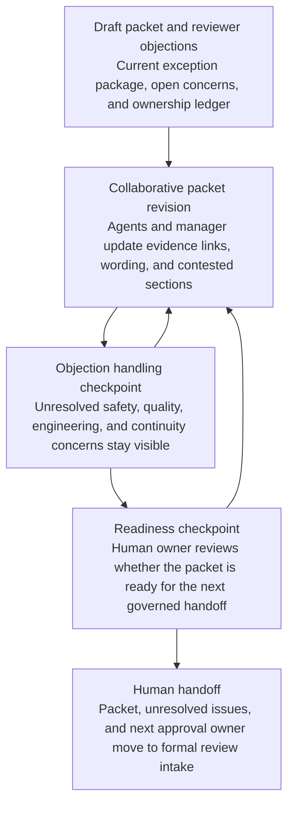
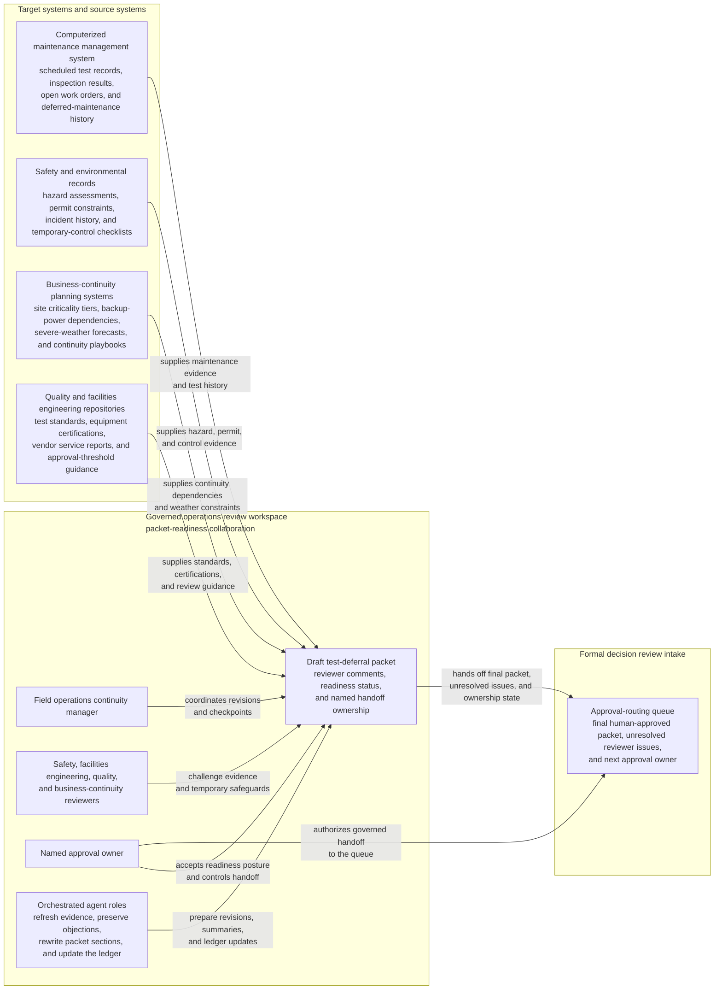

# Network fuel system test deferral exception package readiness loop

## Linked pattern(s)

- `approval-centered-collaboration`

## Domain

Operations.

## Scenario summary

A field operations continuity manager is coordinating a formal exception package because several regional facilities cannot complete a scheduled backup fuel-system integrity test before a forecasted severe-weather window, yet deferring the test requires explicit cross-functional approval. In a governed review workspace, the manager and agent support iterate on the packet as safety, facilities engineering, quality, and business-continuity reviewers challenge whether the operational constraints are evidenced adequately, whether the temporary safeguards are strong enough, whether site-level test history and open defects are represented accurately, and whether unresolved concerns are being carried forward transparently. The agents help preserve reviewer objections, refresh maintenance and continuity evidence, rewrite the packet to reflect accepted edits and contested issues, and maintain an explicit handoff ledger showing who owns the next approval-readiness checkpoint. The human operations manager and named approval owner remain responsible for deciding whether the packet is ready for formal approval review, whether any objection should stop progression, and whether the request should pause for more evidence or alternate continuity planning rather than move toward adjudication.

## Target systems / source systems

- Governed operations review workspace with the draft test-deferral packet, reviewer comments, readiness status, and named handoff ownership
- Computerized maintenance management system with scheduled test records, prior fuel-system inspection results, open work orders, and deferred-maintenance history
- Safety and environmental records containing hazard assessments, permit constraints, incident history, and temporary-control checklists
- Business-continuity planning systems with site criticality tiers, backup-power dependencies, severe-weather forecasts, and continuity playbooks
- Quality and facilities engineering repositories with test standards, equipment certifications, vendor service reports, and approval-threshold guidance
- Approval-routing queue where the final human-approved packet, unresolved reviewer issues, and next approval owner are transferred for formal decision review

## Why this instance matters

This grounds the pattern in an operations workflow where the core challenge is making a governed deferral packet approval-ready without implying that the maintenance exception has already been accepted or that operational execution may proceed. The scenario stays distinct from the supplier-labeling remediation brief because it centers on formal readiness collaboration across safety, quality, and continuity reviewers rather than supplier-facing narrative drafting. It shows how agents can reduce packet churn by tracking evidence, preserving objections, and clarifying handoff ownership while still stopping short of approving the deferral or authorizing downstream site actions.

## Likely architecture choices

- Human-in-the-loop collaboration should remain primary because safety posture, operational risk tolerance, and continuity tradeoffs require accountable facilities and operations ownership.
- An orchestrated multi-agent setup fits when separate agent roles refresh maintenance evidence, normalize reviewer objections, verify policy completeness, and maintain the shared handoff ledger across several revision cycles.
- Agents may prepare revised packet sections, evidence-response matrices, and readiness summaries, but final approval routing, maintenance schedule changes, and any site execution decisions should remain explicitly human-controlled.

## Governance notes

- The packet should distinguish raw maintenance facts, quoted safety or quality requirements, reviewer objections, agent-drafted revision proposals, and human-accepted language so downstream approvers can inspect what is still contested.
- Every material claim about test feasibility, temporary safeguards, weather constraint, equipment condition, or continuity impact should link to inspectable evidence such as CMMS records, hazard assessments, vendor reports, or continuity-plan references; stale or missing support should block readiness.
- Objections from safety, quality, facilities engineering, or business-continuity reviewers should remain visible in the packet and handoff ledger unless a named human reviewer explicitly accepts the residual risk of carrying them into formal approval.
- The handoff ledger should record the current approval owner, mandatory reviewers, unresolved blockers, and the exact boundary where approval-readiness collaboration ends and the formal human approval decision begins, preventing the packet from being mistaken for an approved test deferral.
- If refreshed evidence suggests imminent equipment failure, safety exposure, or continuity loss beyond the approved exception criteria, the workflow should branch into incident, emergency maintenance, or contingency activation handling instead of continuing a routine readiness loop.

## Evaluation considerations

- Time to produce an internal-review-ready test-deferral exception packet that preserves reviewer disagreement, evidence lineage, and explicit ownership of the next approval handoff
- Reviewer correction rate for sections where agent-assisted revisions overstated temporary-control sufficiency, minimized unresolved equipment concerns, or implied the packet was approval-ready before required evidence was complete
- Reliability of the handoff ledger, including whether approval owner, pending reviewers, unresolved issues, and accepted residual risks stay synchronized with the latest packet version
- Rate at which formal approval review sends the packet back because the collaboration loop hid objections, lost maintenance evidence traceability, or blurred the boundary between readiness and approval
