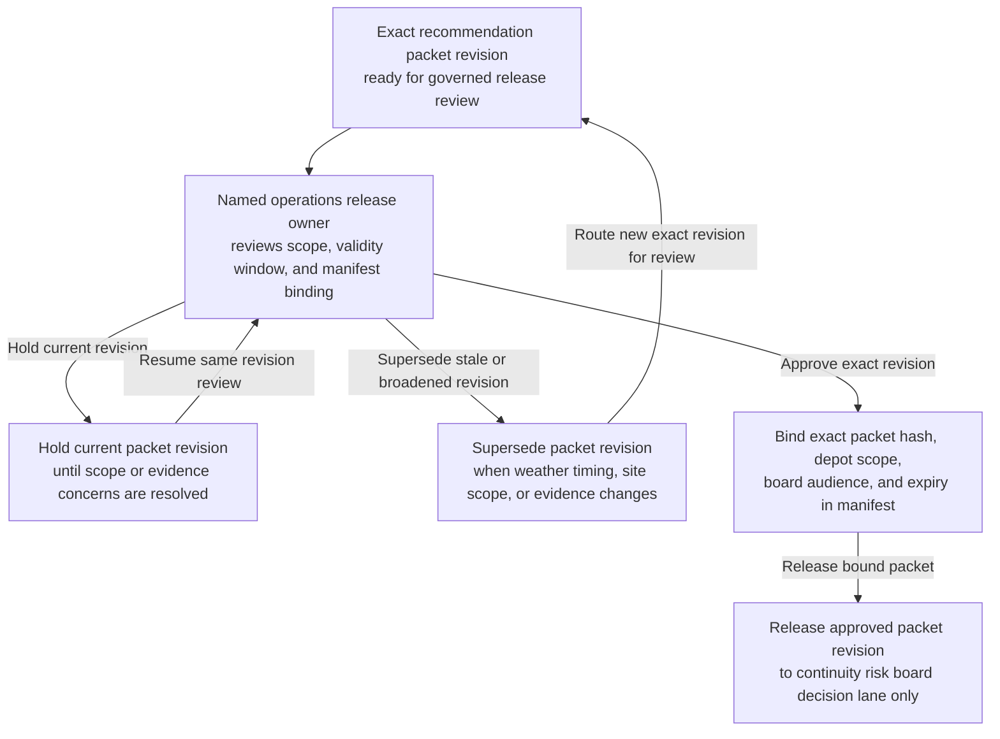
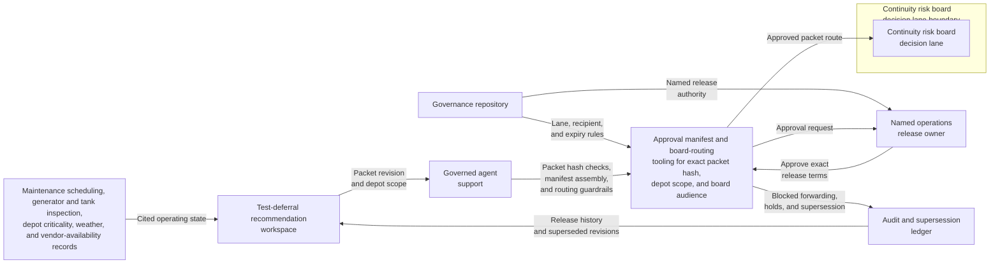

# Network fuel-system test deferral recommendation packet revision approved for continuity risk board decision lane

## Linked pattern(s)

- `approval-gated-recommendation-release`

## Domain

Operations.

## Scenario summary

An operations continuity workflow has already prepared one exact recommendation packet revision for a temporary deferral of scheduled backup fuel-system integrity tests across several depots ahead of a forecast severe-weather window. The packet narrows the bounded options to defer the named sites with daily manual inspection and generator-watch controls, release a narrower deferral limited to the lowest-risk depots with vendor standby coverage, or escalate to executive safety review, and it keeps blocked paths such as a region-wide blanket deferral, extension past the allowed retest window, or vendor-cancellation without compensating controls explicit. Before that exact packet revision can enter the restricted continuity risk board decision lane, a named operations release owner must approve the board scope, validity window, and manifest binding so reviewers receive the governed recommendation artifact rather than a stale, broadened, or misrouted copy. The workflow stops at governed release of that packet revision; it does not decide whether the deferral is granted, reschedule the tests, or dispatch any field work.

## Target systems / source systems

- Test-deferral recommendation workspace holding the current packet revision, bounded option set, blocked-path rationale, and superseded drafts
- Maintenance scheduling, generator and tank inspection, depot criticality, severe-weather forecast, and vendor-availability records already cited by the recommendation packet
- Governance repository defining the named continuity risk board lane, authorized recipients, release expiry, and the human owner who may approve packet release
- Approval manifest and board-routing tooling that records the exact packet hash, depot scope, board audience, and any blocked forwarding attempts outside the approved lane
- Audit and supersession ledger used to hold older packet revisions when weather timing, equipment condition, or site scope changes before board review

## Why this instance matters

This grounds the pattern in operations where the governance problem is not to adjudicate the maintenance deferral, but to control release of one bounded recommendation artifact into one human decision lane. Fuel-system test deferral packets can change late as forecast severity, equipment condition, depot criticality, or vendor coverage windows shift, so approval must stay tied to one reviewed revision rather than to a vague permission to keep circulating continuity advice. The example keeps the family boundary clear by ending at continuity-risk-board handoff rather than deferral adjudication, maintenance rescheduling, or field execution.

## Likely architecture choices

- Approval-gated execution fits because the recommendation packet remains held until a named operations owner authorizes release into the continuity risk board decision lane.
- Human-in-the-loop review remains necessary because only accountable operations and safety governance owners should confirm lane scope, expiry, and blocked-option visibility without collapsing the workflow into deferral approval itself.
- A governed agent can compare packet hashes, assemble the manifest, and block broadened distribution, but it should not authorize the test deferral, modify maintenance schedules, or create dispatch tasks.

## Governance notes

- Approval should bind to one immutable packet revision, one named continuity risk board lane, one bounded validity window, and one exact site and option set so later edits cannot inherit release authority silently.
- Blocked paths such as blanket regional deferral, expiry beyond the allowed retest window, or suspension of interim inspections should remain visible in the released packet rather than being compressed into a cleaner operational summary.
- If severe-weather timing, equipment-failure evidence, depot scope, or board audience changes during approval review, the pending packet should be held and superseded rather than routed under stale approval.
- Audit records should preserve the released packet id, option-set hash, approver identity, recipient scope, expiry timing, manifest linkage, and any blocked redistribution attempts.

## Evaluation considerations

- Percentage of continuity-risk-board releases where the test-deferral recommendation packet revision, option-set hash, depot scope, and manifest metadata align exactly without later correction
- Rate at which superseded, expired, or out-of-scope test-deferral recommendation packets are blocked before board review
- Time required to move from packet-ready status to approved bounded board release when maintenance, weather, and vendor evidence are complete
- Reviewer correction rate for missing blocked options, wrong audience scope, or stale-state handling after the board receives the released recommendation packet
