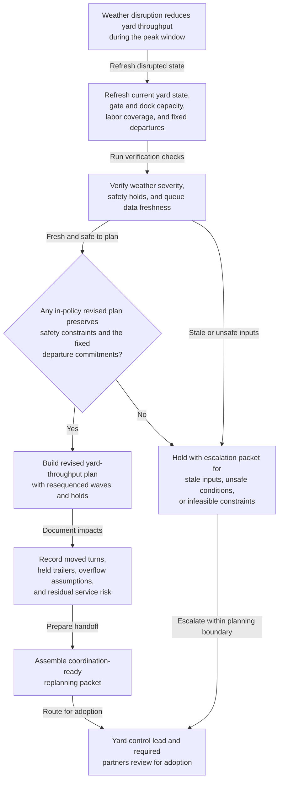

# Peak-season yard throughput replanning after weather disruption

## Linked pattern(s)

- `schedule-adjustment-and-replanning`

## Domain

Operations.

## Scenario summary

A regional distribution yard is already running a peak-season throughput plan that sequences inbound gate appointments, trailer spotting, dock-door turns, linehaul departure cuts, overflow-lot usage, and cold-chain protection windows. Then severe weather disrupts the baseline plan: lightning or ice slows yard moves, gate throughput drops, one outbound departure window stays fixed, and a safety hold limits which trailers can be repositioned until conditions stabilize. The workflow should recompute a revised yard-throughput plan, document which waves can move and which checkpoints must stay fixed, and prepare a coordination-ready replanning packet for the yard control lead, dock manager, linehaul dispatcher, safety coordinator, and regional network planner rather than deciding customer service exceptions, authorizing off-network reroutes, or executing trailer moves itself.

## Target systems / source systems

- Yard-management system with the approved peak plan, trailer locations, dock assignments, wave sequence, and prior replanning versions
- Gate, dock, and labor dashboards showing current queue depth, spotter availability, door productivity, and weather-driven operating restrictions
- Linehaul schedule and dispatch systems capturing fixed departure commitments, overflow transfer options, and protected cold-chain or service-tier moves
- Safety and weather feeds publishing lightning, ice, wind, or local-site restrictions that place explicit holds on yard movement or labor exposure
- Coordination workspace used to track rationale, unresolved blockers, stakeholder acknowledgements, and adoption status for the revised yard plan

## Why this instance matters

This grounds the replanning pattern in operations where the problem is restoring a feasible peak-yard sequence after weather invalidates the original flow plan, not deciding who gets service exceptions or dispatching the recovery itself. The value is a revised throughput plan, an inspectable rationale and impact ledger, and a coordination-ready packet that keeps yard, dock, dispatch, and safety teams aligned around one bounded planning artifact.

## Likely architecture choices

- An orchestrated multi-agent workflow fits because one role can refresh yard and departure state, another can test candidate sequences against safety and fixed-cut constraints, and another can package the accepted replanning result with explicit holds and downstream impacts.
- Human-in-the-loop adoption remains necessary because the yard control lead, linehaul dispatcher, or regional network planner must accept any consequential shift in wave order, overflow usage, or dock-turn expectations before the revised plan becomes authoritative.
- Recommendation-only autonomy is the right ceiling: the workflow can propose a feasible revised sequence and surface blocked alternatives, but it should not waive safety holds, change customer commitments, authorize off-network reroutes, or execute trailer movement.

## Governance notes

- Hard constraints should remain explicit throughout replanning: weather safety holds, fixed departure commitments, cold-chain protection windows, labor-exposure rules, and any non-waivable yard-capacity limits.
- The rationale and impact ledger should preserve lineage from the baseline peak plan to the revised proposal, including which waves moved, which trailers remained held, what alternatives were rejected, and what residual service risk remains.
- Source freshness matters because a revised plan built on stale weather, queue, or departure data can create false confidence and trigger another avoidable yard reset.
- The workflow should escalate instead of improvising when no in-policy plan can preserve both safety constraints and fixed departures, when severe-weather conditions make throughput assumptions unreliable, or when a proposed change would cross from planning into service-commitment or dispatch authority.

## Evaluation considerations

- Time from weather-disruption trigger to a revised yard-throughput plan with explicit dependency impacts and adoption-ready handoff
- Rate of replanning events resolved with an accepted revised plan without forcing a full manual rebuild of the peak-yard sequence
- Frequency of adopted revised plans that still miss fixed departures or violate explicit safety holds because constraint interactions were not surfaced early enough
- Audit usefulness of the rationale ledger for reconstructing which waves moved, which trailers remained held, what deadline risk remained, and why human owners accepted or escalated the revised plan
