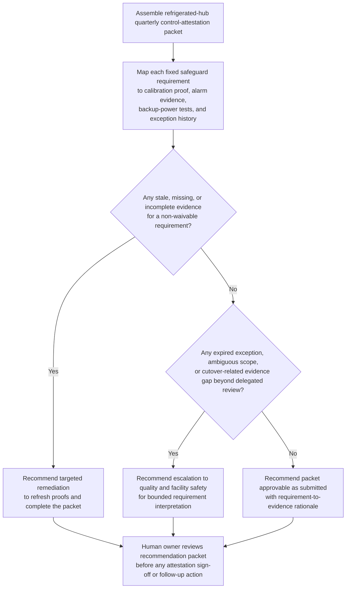

# Refrigerated distribution hub temperature-safeguard attestation recommendation

## Linked pattern(s)

- `control-requirement-attestation-recommendation`

## Domain

Operations.

## Scenario summary

A cold-chain operations assurance lead is preparing the quarterly internal attestation for a refrigerated distribution hub that stores vaccines and temperature-sensitive biologics overnight before regional dispatch. The requirement set is fixed: every active storage zone must have current probe-calibration proof, alarm-routing coverage, documented backup-power test evidence, excursion-review completion, and approved temporary compensating controls for any sensor outage window. The evidence packet is close, but one calibration certificate predates a mid-quarter probe replacement, one overnight alarm-acknowledgement export is incomplete after a monitoring gateway cutover, and a temporary handheld-check exception may now exceed the allowable duration for routine use. The workflow must recommend whether the packet is approvable as-is, needs targeted remediation, or should escalate to the quality and facility-safety reviewers because the requirement fit is no longer routine before any human signs the quarterly attestation or changes live cold-chain operations.

## Target systems / source systems

- Building management system and cold-chain monitoring platform with zone temperatures, alarm-routing configuration, acknowledgement logs, and probe inventory
- Calibration certificate repository and maintenance records covering probe replacement dates, validation reports, and approved service notes
- Facility resilience and backup-power test workspace holding generator test summaries, failover checks, and unresolved maintenance exceptions
- Quality review tracker containing excursion investigations, corrective-action status, prior quarterly outcomes, and reviewer notes
- Internal operations controls library defining the quarterly attestation checklist, evidence freshness rules, compensating-control limits, and escalation thresholds

## Why this instance matters

This grounds the pattern in operations where the valuable work is a bounded recommendation on whether a known cold-chain safeguard attestation packet actually satisfies explicit operational-control requirements. The scenario stays inside the family boundary by focusing on requirement mapping, visible evidence gaps, and attestation-packet assembly rather than dispatch rescheduling, maintenance approval, remediation execution, regulatory filing, or live monitoring changes. It also shows why low-risk governance still matters in operations: weak guidance can delay sign-off or mask a safety-control gap, but the workflow remains advisory and every consequential decision stays human-owned.

## Likely architecture choices

- A tool-using single agent can retrieve the current attestation checklist, correlate calibration and alarm evidence, compare exception age against policy thresholds, and assemble one reviewable rationale packet.
- Human-in-the-loop review is required because quality or facility-safety owners must decide whether partial evidence is acceptable, whether a compensating control still fits policy, or whether the case must escalate.
- Read-only integration with monitoring, maintenance, and quality systems is preferable so the workflow cannot alter alarms, close investigations, or mark the attestation approved.

## Governance notes

- The packet should preserve requirement-by-requirement status as satisfied, partial, stale, missing, or exception-backed, with direct links to the exact calibration proof, alarm export, test log, or review record used.
- Probe swaps, gateway cutovers, overdue backup-power evidence, or overlong handheld-check exceptions should trigger remediation or escalation explicitly instead of being normalized into a green summary.
- Temperature records, excursion details, and facility resilience artifacts should remain visible only to authorized operations, quality, safety, and maintenance reviewers under normal need-to-know controls.
- The boundary between recommendation and action must stay explicit: approving the attestation, extending an exception, changing alarm routing, or launching corrective work remains outside this workflow.

## Evaluation considerations

- Reviewer agreement with the recommended approve, remediate, or escalate posture without major requirement-mapping corrections
- Rate at which stale calibration proof, incomplete alarm acknowledgements, or expired compensating controls are surfaced before quarterly attestation sign-off
- Quality of traceability from each temperature-safeguard requirement to current monitoring, maintenance, resilience, and quality evidence
- Stability of recommendations when probe inventories, alarm-routing paths, or temporary exception posture change during the review period
