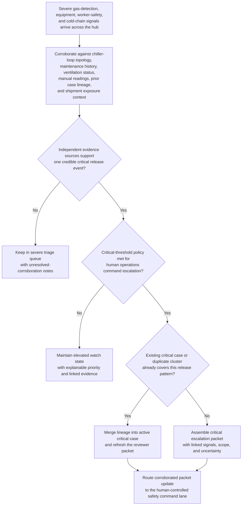

# Regional ammonia refrigeration leak critical corroboration triage

## Linked pattern(s)

- `critical-signal-corroboration-triage`

## Domain

Operations.

## Scenario summary

A food-distribution operator watches for severe facility-safety and cold-chain continuity signals at regional refrigerated hubs: fixed ammonia detectors spiking across one engine room and adjacent dock zones, compressor and emergency-shutdown telemetry, ventilation faults, worker duress badges or supervisor safety check-ins, manual handheld-gas readings, and outbound trailer temperature drift tied to the same chiller loop. The workflow must determine whether these signals corroborate one potentially critical ammonia-release event with network-level fulfillment impact, preserve duplicate-aware linkage across alarms and open maintenance records, assemble an escalation packet with the linked evidence and unresolved uncertainty, and route that packet into a human-controlled operations and safety command lane. It stops before declaring evacuation, dispatching hazmat response, shutting down the site, rerouting inventory, notifying regulators, or performing root-cause investigation.

## Target systems / source systems

- Building-management, gas-detection, compressor-control, and emergency-shutdown telemetry systems capturing ammonia concentration spikes, ventilation faults, valve state changes, and refrigeration loop shutdowns
- Worker-safety, badge, duress, radio check-in, and supervisor incident-intake systems providing human observations, headcount concerns, and manual hazard confirmations
- Maintenance-management, inspection, and contractor-work systems exposing open leak-repair history, deferred work, sensor calibration state, and recent equipment interventions on the affected loop
- Warehouse-management, trailer-temperature, shipment-priority, and dock-operations systems showing potentially exposed inventory, outbound lane commitments, and downstream cold-chain risk if the hub is impaired
- Critical operations case-management and escalation-routing tooling used to preserve duplicate lineage, packet revisions, policy checks, and human-controlled handoff to safety and duty leadership

## Why this instance matters

This grounds the pattern in an operations setting where the urgent problem is not one noisy gas alarm or one equipment fault in isolation, but a fast-moving convergence of severe safety and continuity signals that may indicate a critical release event at a major refrigerated facility. The instance makes the family boundary concrete by focusing on multi-source corroboration, duplicate-aware case aggregation, escalation-packet assembly, and governed routing into human operations command rather than on evacuation choice, hazmat mobilization, cold-chain rerouting, regulator contact, or failure analysis.

## Likely architecture choices

- Event-driven monitoring fits because gas detectors, equipment shutdowns, manual safety observations, and shipment-exposure signals can arrive asynchronously and materially change corroboration within minutes.
- Orchestrated multi-agent or staged service roles fit because telemetry review, maintenance-context retrieval, worker-safety linkage, duplicate handling, and escalation-packet assembly are specialized tasks that need one shared critical-case state.
- Human-in-the-loop review remains necessary because even a recommendation-only critical packet can rapidly influence consequential evacuation, shutdown, labor-safety, and customer-service decisions.

## Governance notes

- The escalation packet should show which detector, equipment, worker-safety, and shipment-exposure signals were fused, what independent evidence linked them, and what uncertainty still prevents a definitive release-scope conclusion.
- Duplicate handling must preserve lineage across detector zones, chiller loops, maintenance work orders, worker reports, and active command cases so reviewers can distinguish one expanding release event from coincidental but unrelated alarms.
- Policy thresholds for critical escalation, affected-zone scoping, and watch-state retention should be versioned and reviewable because overtuned logic can either miss a true life-safety event or flood the command lane with false criticals.
- Broad queue views should minimize worker identifiers, exact shipment contents, and sensitive facility-security details while preserving controlled references back to authoritative operations and safety systems.
- The workflow must end at corroborated triage, packet assembly, and human-controlled routing rather than implying evacuation orders, shutdown execution, inventory disposition, regulator notification, or root-cause determination.

## Evaluation considerations

- Recall of historically critical ammonia-release or refrigeration-safety clusters that should have reached human-controlled command escalation
- Median time from first severe multi-source signal burst to a corroborated packet ready for safety-command review
- Accuracy of duplicate merging and lineage preservation when sensor spikes, worker reports, and equipment faults partially overlap across adjacent refrigeration zones
- Reviewer agreement that the packet distinguishes genuine cross-source corroboration from coincidental co-occurrence in noisy facility telemetry and manual incident reports
- Reliability of uncertainty escalation when evidence conflicts, such as strong detector and shutdown signals with weak manual confirmation or strong worker reports with sparse equipment linkage
