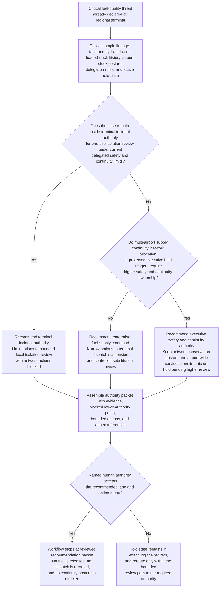
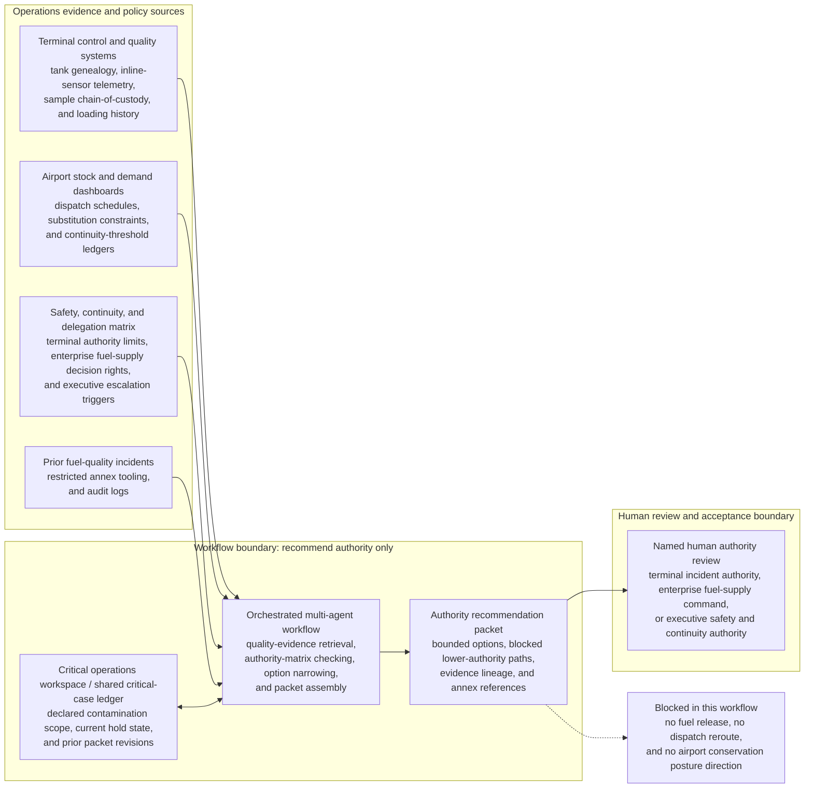

# Regional aviation-fuel terminal contamination authority recommendation

## Linked pattern(s)

- `critical-escalation-authority-recommendation`

## Domain

Operations.

## Scenario summary

A critical fuel-quality threat has already been declared after conflicting laboratory and inline-sensor results suggest one regional aviation-fuel terminal may have loaded contaminated product into the hydrant supply chain serving multiple airport banks. Terminal operations, enterprise fuel supply, airport continuity teams, and executive safety leaders now need a governed recommendation about which human authority should decide the next step: keep the case inside terminal incident authority for tightly bounded isolation review, move it to enterprise fuel-supply command for network dispatch-suspension review, or escalate to executive safety and continuity authority because multi-airport service posture and protected continuity options may be implicated. The workflow must narrow the decision-ready option set and assemble the authority packet without releasing fuel, rerouting dispatches, changing airport conservation posture, or coordinating the wider response.

## Target systems / source systems

- Critical operations workspace with the declared contamination scope, current hold state, and prior packet revisions
- Terminal control and quality systems holding tank genealogy, inline-sensor telemetry, sample chain-of-custody records, and truck or hydrant loading history
- Airport stock and demand dashboards, regional dispatch schedules, substitution constraints, and continuity-threshold ledgers
- Safety, continuity, and delegation matrix covering terminal authority limits, enterprise fuel-supply decision rights, and executive escalation triggers
- Prior fuel-quality incidents, restricted annex tooling, and audit logs for human redirects, packet recipients, and protected evidence handling

## Why this instance matters

This grounds the critical recommendation pattern in operations without drifting into contamination investigation briefing, airport continuity planning, or live dispatch control. The hard problem is deciding which human authority should own the severe choice and what tightly bounded options they should see once one terminal's quality uncertainty may expand into multi-airport service risk that local operators cannot resolve alone.

## Likely architecture choices

- An orchestrated multi-agent workflow can separate quality-evidence retrieval, authority-matrix checking, option narrowing, and packet assembly while preserving one shared critical-case ledger.
- Human-in-the-loop review is mandatory because the workflow should recommend the correct decision owner and bounded option set, not release fuel, suspend dispatches, or set airport conservation posture.
- Human-directed autonomy fits because terminal, enterprise fuel-supply, and executive continuity leaders must explicitly accept the authority lane before any irreversible supply decision is considered.

## Governance notes

- The output should distinguish options that remain inside terminal isolation authority from options that require enterprise fuel-supply or executive safety and continuity ownership because of multi-airport impact, service commitments, or protected continuity thresholds.
- Any narrowed option set should preserve reversibility boundaries around tank quarantine duration, terminal dispatch suspension scope, and network conservation posture rather than flattening them into one operationally convenient path.
- Sensitive sample results, airport stock vulnerabilities, and service-commitment detail should remain limited to authorized operations, safety, continuity, and executive reviewers, with broader packets using the minimum needed for authority selection.
- Recommendation packets should preserve evidence lineage, delegation state, blocked lower-authority routes, and human redirects so later review can reconstruct why one authority lane was chosen during the critical window.

## Evaluation considerations

- Time from declared critical fuel-quality threat to a reviewed packet naming the correct human authority and bounded decision options
- Reviewer agreement that blocked lower-authority paths and continuity-threshold triggers were surfaced before any fuel release, dispatch, or conservation decision was considered
- Quality of evidence linking contamination scope, airport stock posture, delegation rules, and reversibility limits to the authority recommendation
- Stability of the recommended authority lane when sample confirmation, loading-history reconstruction, or airport demand assumptions change during the critical window
