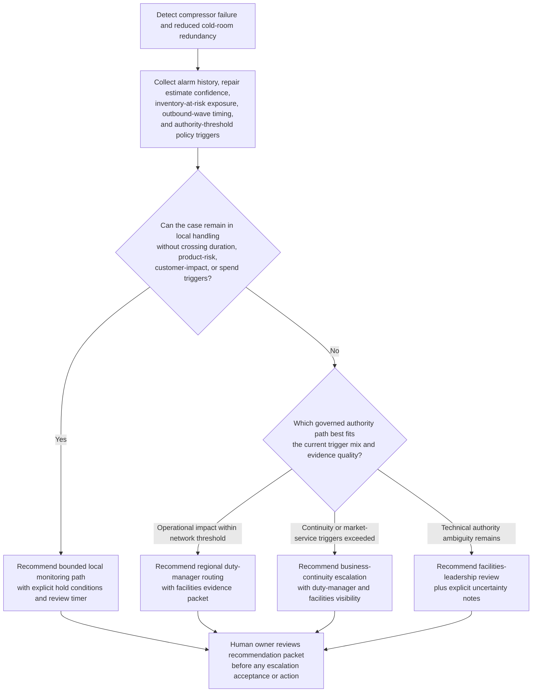

# Regional cold-chain compressor failure escalation routing

## Linked pattern(s)

- `policy-constrained-escalation-routing`

## Domain

Operations.

## Scenario summary

A regional grocery distribution campus loses its lead low-temperature compressor during a summer weekend peak, leaving one freezer hall and two chilled marshalling lanes on reduced redundancy while repair estimates remain uncertain and outbound replenishment waves for several stores are already staged. The local site operations manager can document conditions, request engineering assessment, and hold product movement inside narrow existing work instructions, but cannot authorize prolonged operation beyond the redundancy-loss threshold, declare business continuity mode, commit emergency rental refrigeration, or accept customer-order degradation across multiple markets. The workflow must recommend the governed escalation route—such as regional duty manager first, regional business continuity if duration and network-impact triggers are met, and facilities leadership for bounded technical review—assemble the supporting evidence and policy basis, keep blocked local-only options visible, and stop before any authority decides the response posture or dispatches execution work.

## Target systems / source systems

- Refrigeration monitoring platform, building management alarms, compressor telemetry, and freezer-zone temperature trends
- Facilities maintenance system with open incident ticket, technician notes, spare-parts availability, and estimated repair windows
- Cold-chain operations dashboard covering inventory location, dwell-time exposure, outbound wave timing, and customer-service criticality
- Business continuity and escalation matrix defining redundancy-loss thresholds, market-impact triggers, spend limits, and mandatory routing paths
- Prior refrigeration-event reviews, local hold-work-instruction history, and regional duty-manager handoff logs

## Why this instance matters

This grounds the pattern in a high-consequence cold-chain operations exception where the primary value is governed routing, not diagnosing the equipment fault or commanding the response. The hard part is distinguishing when a compressor failure remains a bounded local monitoring case versus when policy requires escalation to the right regional authority because product exposure, network service impact, or emergency-spend implications move beyond site authority.

## Likely architecture choices

- A recommendation-only workflow can correlate telemetry loss, repair uncertainty, inventory exposure, outbound commitments, and escalation policy thresholds into one ranked routing recommendation.
- Human-in-the-loop review is mandatory because site, facilities, duty-manager, and continuity leaders must decide whether to accept the recommended route and what operational response to authorize.
- Read-only integration with monitoring, maintenance, inventory, and continuity systems is preferable so the workflow cannot start rental equipment, reroute inventory, declare emergency posture, or change shipment plans.

## Governance notes

- The output should distinguish the preferred escalation destination, alternate governed routes, and blocked local options such as prolonged degraded running, emergency rental commitments, customer-allocation changes, or cross-market service degradation acceptance.
- Any recommendation should show which policy triggers fired, including redundancy-loss duration, product-at-risk thresholds, expected repair uncertainty, customer-impact scope, and emergency-spend boundaries.
- Temperature exposure details, inventory value, customer-priority lanes, and facilities incident notes should remain visible only to authorized operations, facilities, quality, and continuity reviewers under normal need-to-know controls.
- The packet should preserve evidence references, unresolved uncertainty, blocked-option rationale, and current ownership lineage so later audit can reconstruct why the case was routed upward or held locally for review.
- The boundary between routing and execution must stay explicit: approving a continuity posture, authorizing dry-ice or rental equipment, reallocating inventory, or instructing store-order cuts remains outside this workflow.

## Evaluation considerations

- Reviewer agreement that the recommended escalation destination matched the eventual correct authority path without unnecessary rerouting
- Time from compressor failure qualification to delivery of a complete escalation packet to the authorized regional reviewer
- Rate at which blocked local options and mandatory escalation triggers are surfaced before anyone commits emergency spend or service-impact decisions
- Stability of routing recommendations when repair confidence, temperature trend severity, or outbound market impact changes during the same incident
