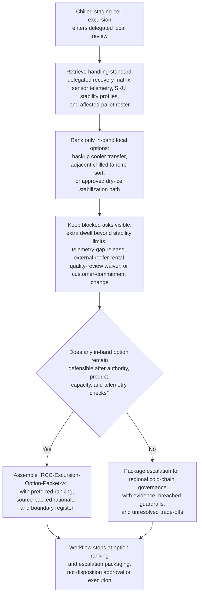

# Regional cold-chain cross-dock temperature excursion fallback option recommendation

## Linked pattern(s)

- `delegated-authority-option-ranking`

## Domain

Operations.

## Scenario summary

After a refrigeration-door seal fault lets one regional cross-dock chilled staging cell drift above its validated range during an outbound consolidation wave, Elena Torres, Regional Cold-Chain Cross-Dock Operations Manager, must prepare one inspectable delegated-authority recommendation artifact, `RCC-Excursion-Option-Packet-v4`, for the affected pallet set before product is reassigned, released, or escalated. Her local authority band allows only a narrow in-band fallback menu: move eligible pallets into validated backup cooler capacity inside the documented dwell window, recommend a capped re-sort into a prequalified adjacent chilled lane already cleared for the same handling class, or use a preapproved dry-ice replenishment and shortened handoff path for SKUs whose stability profiles explicitly allow that treatment. The workflow must keep source precedence explicit by favoring the signed cold-chain handling standard, the current delegated recovery matrix, validated sensor telemetry, and SKU stability profiles ahead of carrier ETA chat, dock commentary, or informal warehouse notes; it must preserve blocked asks such as extending product dwell beyond the approved stability window, releasing product with unresolved telemetry lineage, booking an external reefer trailer, waiving quality review, or changing downstream customer commitments; and it must package escalation for regional cold-chain governance only if no in-band fallback remains defensible. The artifact stops at local option ranking and escalation packaging rather than approving product disposition, rescheduling routes, instructing labor, changing appointments, or executing the downstream temperature-recovery action.

## Target systems / source systems

- Warehouse execution and cross-dock visibility systems holding the affected-pallet roster, staging-cell assignments, outbound wave context, and backup cooler capacity snapshot
- Cold-chain monitoring platform with validated probe telemetry, excursion alarms, calibration status, and sensor-lineage checks for the impacted cell and candidate fallback locations
- Delegated local recovery matrix covering allowed fallback paths, dwell-time caps, dry-ice eligibility rules, spend limits, blocked actions, and escalation thresholds
- SKU stability-profile library, packaging instructions, product handling class rules, and quality-review prerequisites for refrigerated and frozen inventory under review
- Recommendation audit log, prior override history, and regional escalation templates used when local fallback authority is exhausted or source evidence is stale

## Why this instance matters

This grounds the pattern in cold-chain cross-dock operations through a delegated fallback-choice problem that is distinct from sorter-throughput recovery or dock-door loss. The reusable challenge is narrowing a temperature-excursion case to the local options that genuinely remain inside delegated authority while keeping product-safety guardrails, telemetry uncertainty, and blocked out-of-band asks visible. That makes the workflow valuable without drifting into quality adjudication, route replanning, appointment control, or live warehouse execution.

## Likely architecture choices

- A tool-using single agent can retrieve the delegated recovery matrix, excursion telemetry, SKU stability rules, capacity state, and prior overrides and turn them into one bounded fallback ranking for Elena Torres to inspect.
- Human-in-the-loop review remains necessary because the named local owner decides whether the ranked in-band recommendation is acceptable inside delegated cross-dock authority or whether escalation packaging is required.
- Read-only integration with warehouse, telemetry, product-quality, and governance systems is preferable so the workflow cannot silently release product, move inventory, reassign labor, alter appointments, or trigger downstream carrier actions.

## Governance notes

- Source precedence should remain explicit: the signed cold-chain handling standard and delegated recovery matrix outrank validated sensor telemetry, SKU stability profiles, and the frozen affected-pallet roster, which outrank dock chat, carrier ETA commentary, or informal shift notes when the workflow compares fallback options.
- Prerequisite live-control state should remain visible before any local recommendation is treated as complete, including confirmation that the excursion event window is sealed, the affected-pallet roster is frozen, candidate backup cooler and adjacent-lane capacity snapshots are current, probe calibration for the impacted cell is still valid, and no product has already been released under a parallel workaround.
- The output should distinguish allowed in-band fallback paths, conditionally allowed options that depend on refreshed telemetry lineage or product-profile confirmation, blocked requests such as extra dwell beyond stability caps or external reefer rental, and escalation-only asks such as customer-commitment exceptions or quality-policy waivers.
- Visible blockers and unresolved items should stay attached to the packet, including stale calibration evidence on one secondary probe, missing pallet-to-SKU mapping for two relabeled totes, an unconfirmed sanitation-clearance timestamp for the adjacent chilled lane, and incomplete dry-ice replenishment inventory confirmation for one high-sensitivity SKU cohort.
- Revision lineage should preserve why `RCC-Excursion-Option-Packet-v2` was returned after the first telemetry export omitted the door-open interval, why `v3` demoted the adjacent-lane option when sanitation clearance could not be confirmed, and how `v4` narrowed the preferred ranking without erasing blocked asks or prior override context.
- Audit records should preserve Elena Torres as the named local owner, the compared option set, source references used, blocker status, guardrail checks, blocked-option rationale, and the exact escalation packet contents if delegated cold-chain fallback scope is exhausted.
- The boundary must stay explicit: approving product disposition, changing outbound schedules, notifying customers, dispatching carriers, instructing warehouse labor, or executing the selected recovery action remains outside this workflow.

## Evaluation considerations

- Rate at which accepted local excursion fallback recommendations stay inside delegated cold-chain authority without later quality, safety, or regional-governance correction
- Frequency with which blocked dwell extensions, telemetry-gap releases, or external equipment requests are surfaced before anyone implies a product or service commitment
- Time required to produce a complete bounded recommendation packet after the staging-cell excursion enters delegated local review
- Stability of option ranking when telemetry lineage, backup cooler capacity, SKU sensitivity, or sanitation-clearance evidence changes during the same excursion review cycle
