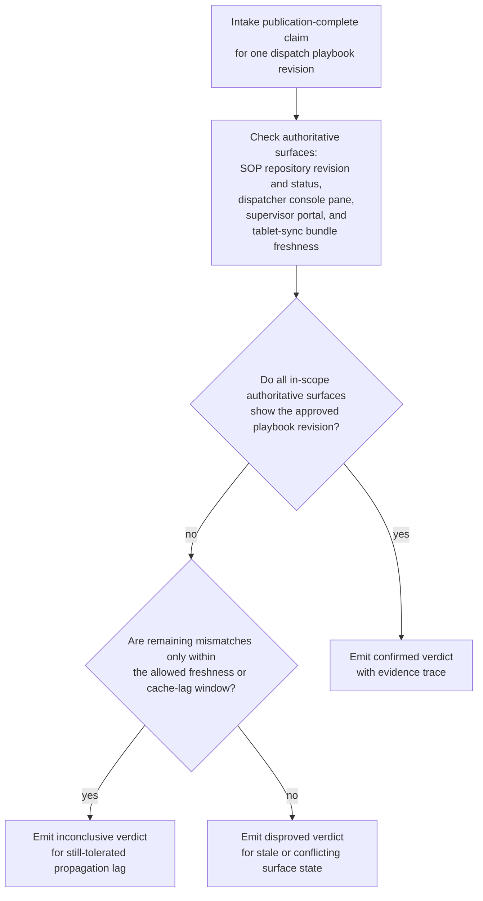

# Regional delivery-exception dispatch playbook publication verification

## Linked pattern(s)

- `claimed-state-verification`

## Domain

Operations.

## Scenario summary

A network operations knowledge team marks an updated delivery-exception dispatch playbook as published after posting a new revision for routine failed-delivery, address-clarification, and customer-unavailable cases. Regional dispatch leads still need to know whether that claimed publication state is actually true across the approved playbook surfaces before they rely on the new guidance during shift handoffs. The workflow checks authoritative evidence, applies freshness and cache-lag tolerances, and emits an explicit confirmed, disproved, or inconclusive verdict; it must not assign routes, contact drivers, reopen the playbook draft, or direct downstream dispatch work.

## Target systems / source systems

- Central dispatch SOP repository containing the approved playbook revision, publication status, and effective-from metadata
- Dispatcher console playbook pane that exposes the currently served guidance revision to regional coordinators
- Shift-supervisor kiosk or operations portal that mirrors the approved dispatch playbook for floor leads
- Offline tablet-sync status service used by overnight dispatch coordinators to confirm the mirrored playbook bundle version and last refresh time
- Knowledge-operations tracker or event feed that records the original publication-complete claim and any replayed publication events
- Verification log preserving evidence checks, observed revision ids, verdicts, tolerated-lag decisions, and bounded follow-up records

## Why this instance matters

This instance grounds the pattern in an operations surface that is materially different from warehouse reference rollouts because the claim concerns a regional dispatch playbook propagated across console, portal, and offline coordinator surfaces rather than floor slotting aids. A publication-complete claim can be directionally right while one embedded console pane or offline mirror still serves an older revision inside or beyond the allowed lag window. The workflow adds value by proving what state actually holds on the approved reference surfaces before dispatch leaders trust the claim, while stopping short of any live dispatch decision or remediation.

## Likely architecture choices

- Event-driven monitoring fits because the workflow should begin from the publication-complete claim and immediately verify whether the approved playbook revision propagated to the in-scope dispatch surfaces.
- A tool-using single agent can compare playbook identifiers, revision markers, effective timestamps, and sync freshness across the SOP repository, dispatcher console, supervisor portal, and offline tablet mirror.
- Bounded delegation is appropriate because operations owners can predefine the authoritative playbook surfaces, tolerated sync delay, and corroboration rules while humans retain ownership of any republish, local exception handling, or dispatch instruction changes.
- Durable verification state should preserve duplicate publication claims and prior inconclusive runs so repeated checks do not create conflicting verdicts for the same playbook revision.

## Governance notes

- Only the approved SOP repository, dispatcher console pane, supervisor portal, and tablet-sync status endpoint should count as authoritative evidence; screenshots, radio confirmations, or copied playbook text should remain non-authoritative.
- Verification records should preserve revision ids, effective timestamps, sync freshness, and affected surfaces so regional leads can inspect why a claim was confirmed, disproved, or held as inconclusive.
- If one approved surface still lags within the allowed propagation window, the workflow should keep the result explicitly inconclusive instead of overstating full publication or failure.
- Republishing the playbook, changing dispatch policy, briefing drivers, or routing delivery exceptions remains outside this verification workflow and under human control.

## Evaluation considerations

- Percentage of dispatch-playbook publication claims that receive a verdict with complete repository, console, portal, and offline-sync traceability
- Rate at which stale or partially propagated playbook revisions are detected before dispatch leads rely on the new guidance during shift handoff
- Reviewer agreement that the workflow applied the correct freshness, cache-lag, and authoritative-surface rules
- Clarity of follow-up records when one approved dispatch surface remains out of date beyond the allowed publication window
