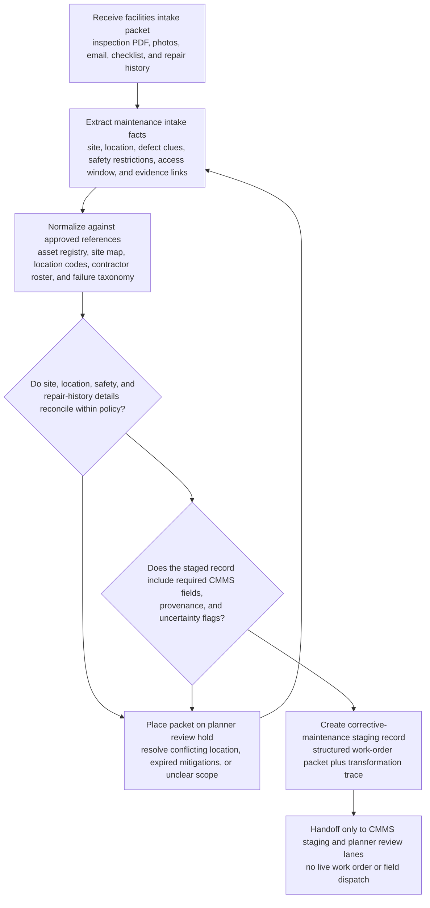

# Site inspection packet to corrective maintenance work-order handoff

## Linked pattern(s)

- `document-to-structured-data-handoff`

## Domain

Operations.

## Scenario summary

A regional facilities operations center receives a corrective-maintenance intake packet after a distribution hub roof inspection finds recurring leaks above a conveyor mezzanine. The packet combines a contractor inspection PDF, annotated site photos, a facilities manager email summarizing affected zones, a handwritten temporary-mitigation checklist from the night shift, and a spreadsheet of prior patch repairs. Before any repair crew is dispatched, the workflow must transform the packet into a structured work-order staging record with the required CMMS fields for site, asset or location code, failure category, safety restrictions, access window, suspected cause, affected production area, and supporting evidence links while preserving uncertainty around root cause and repair scope.

## Target systems / source systems

- CMMS or facilities work-order staging system with a defined intake contract for maintenance case creation
- Shared operations inbox and document repository holding inspection reports, photos, shift notes, and repair-history attachments
- OCR and document-parsing service for marked-up inspection PDFs and handwritten mitigation checklists
- Asset registry, site map, location-code table, contractor roster, and approved failure-code taxonomy
- Operations exception queue for planner review before the staged record becomes an executable work order

## Why this instance matters

This grounds the transform pattern in an operations workflow where the valuable output is a trustworthy structured maintenance handoff, not automated repair execution. Facilities teams need a consistent work-order record to prioritize labor, materials, and downtime planning, but the source packet is document-heavy and often contradictory about exact location, severity, or prior repair history. The instance shows why schema-aware transformation, field provenance, and explicit exception routing matter before operations planners commit resources or open a live corrective job.

## Likely architecture choices

- A tool-using single agent can assemble the packet, extract candidate location and defect details, normalize site and asset identifiers against the CMMS contract, and emit a structured work-order package with a transformation trace.
- The handoff schema should require explicit confidence or review flags for root-cause, severity, and access-window fields so downstream planners can distinguish verified intake facts from provisional interpretations.
- Approved reference data may standardize location codes, roof-section names, contractor identifiers, and failure categories, but unsupported guesses about hidden damage extent or repair method should be prohibited.
- Human review remains necessary when location references do not reconcile to the asset registry, safety restrictions conflict across documents, or the packet implies a capital project rather than routine corrective maintenance.

## Governance notes

- Every high-consequence field should retain provenance to the underlying inspection page, photo annotation, email statement, or checklist line that supports it.
- The workflow should route exceptions when the packet lacks a valid site or asset code, when temporary mitigations appear to have expired without confirmation, or when the same leak area is described inconsistently across contractor and shift documents.
- The structured handoff should record schema version, normalization actions, extracted-versus-enriched field status, and any lossy compression of narrative defect descriptions into standardized maintenance codes.
- Human planners or supervisors, not the transformation workflow, should decide final priority, crew assignment, spend approval, and whether the staged record is safe to release as an active work order.

## Evaluation considerations

- Percentage of staged maintenance records accepted into CMMS without manual remapping of location, failure-code, or safety fields
- Rate of ambiguous or contradictory inspection packets correctly escalated before a live work order is created
- Completeness of provenance for location, safety-restriction, and suspected-cause fields during post-incident review
- Reliability of the handoff when inspection templates change, attachments are missing, or the CMMS intake contract adds new mandatory planner fields
