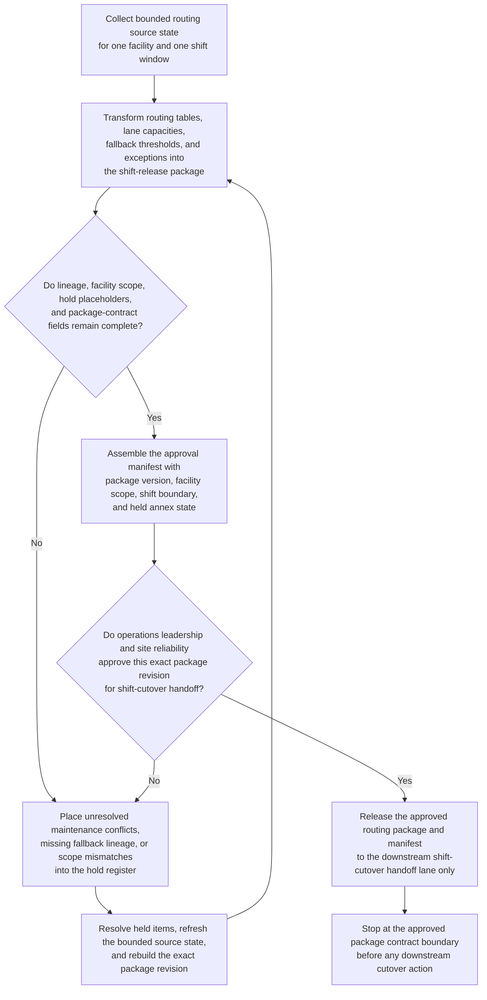
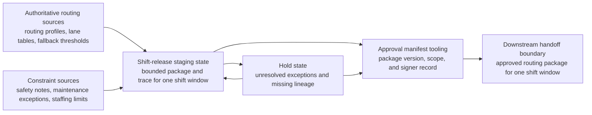

# Sorter routing package approved for shift cutover handoff

## Linked pattern(s)

- `approval-gated-transformation-release`

## Domain

Operations.

## Scenario summary

A distribution network is preparing to roll a revised sorter routing profile into one facility for an overnight shift after throughput and misroute issues made the current configuration unsustainable. The authoritative source state spans routing tables, lane capacities, fallback thresholds, maintenance exceptions, shift staffing constraints, and safety-console notes, but the downstream cutover workflow expects one structured routing package with explicit hold placeholders and a manifest authorizing handoff for that single shift window. The transformation workflow must reshape the bounded source material into the approved shift-release package, preserve lineage for every routing and fallback field, and stop once the manifest is signed rather than activating the profile, recommending whether the cutover should happen, or verifying operational readiness beyond the package contract itself.

## Target systems / source systems

- Routing-profile repository, sorter configuration stores, and lane-capacity systems holding the authoritative profile inputs
- Safety console, maintenance exception log, staffing roster, and fallback-threshold tables used to define cutover constraints
- Operations release-package staging store and manifest service for the shift-safe transformed bundle
- Approval tooling used by operations leadership and site reliability reviewers to sign the exact routing package version and shift boundary
- Hold and exception queue for unresolved maintenance exceptions, facility-scope conflicts, or missing fallback lineage before any live cutover workflow receives the package

## Why this instance matters

This grounds the pattern in operations work where teams need one governed transformed package to hand into a later cutover flow without letting package preparation become activation. Operational cutovers often fail when shift teams inherit inconsistent routing state or when approvals are detached from the exact profile revision that was assembled. The instance shows how approval-gated transformation release can remain in-family by centering on the structured routing package and manifest, not on readiness recommendation, verification verdicts, or live profile activation.

## Likely architecture choices

- Approval-gated execution fits because the routing package is ready for one shift handoff but stays blocked until the manifest explicitly authorizes that downstream cutover boundary.
- Human reviewers should remain in the normal path to confirm facility scope, held maintenance exceptions, and fallback-profile completeness before release.
- The workflow should emit only the transformed routing bundle, trace, hold register, and manifest rather than a go-live recommendation, readiness verdict, or activation action.
- Approved reference tables may normalize lane groups, shift identifiers, and fallback classes, but unsupported assumptions about live throughput or operator behavior should remain outside the package.

## Governance notes

- Every routing field, fallback threshold, lane group, and facility-scope marker should retain lineage to authoritative source systems and the exact version approved for handoff.
- The manifest should make the approved facility, shift window, package version, and held annexes explicit so downstream cutover tooling cannot inherit stale scope.
- The workflow should hold release when maintenance exceptions remain unresolved, safety-console constraints conflict with routing tables, or one facility's fallback profile is missing authoritative lineage.
- Operations and site-reliability owners must approve changes to routing-package schemas or hold rules; the transform workflow ends before activation or operational execution.

## Evaluation considerations

- Percentage of approved routing packages accepted by downstream shift-cutover workflows without manual reformatting or source reassembly
- Rate of scope, hold-state, or lineage issues discovered after routing-package approval
- Quality of manifest binding between the approved package version, facility boundary, and shift window
- Reliability of supersession handling when routing tables change late, maintenance constraints tighten, or one held fallback profile is cleared during approval
