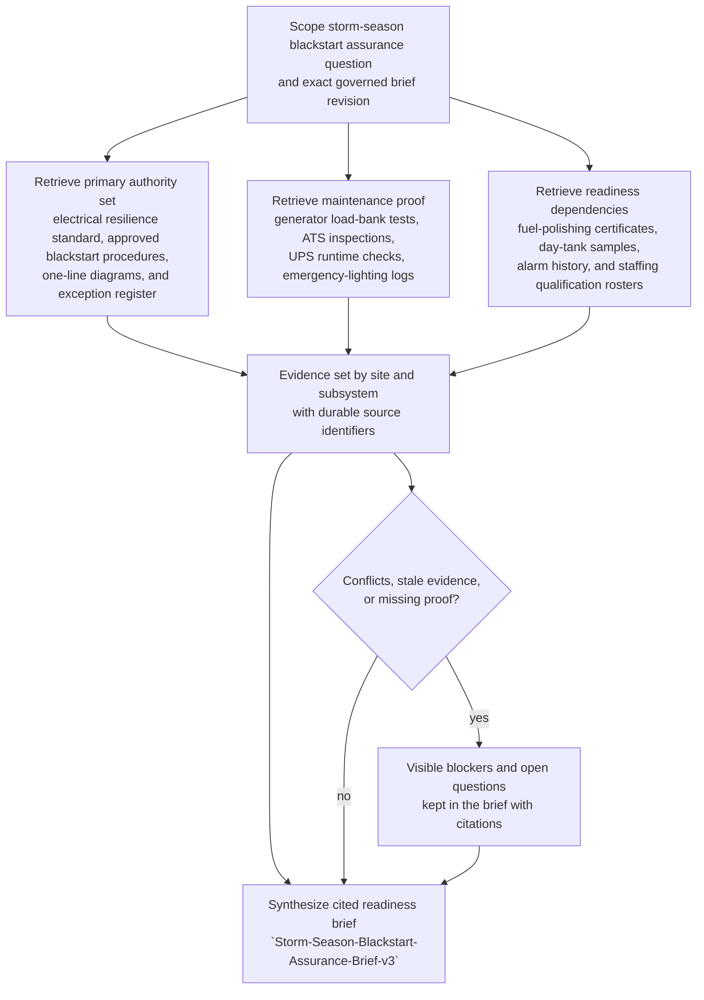

# Storm-season backup power blackstart evidence synthesis for network assurance review

## Linked pattern(s)

- `research-synthesis-with-citation-verification`

## Domain

Operations.

## Scenario summary

A network infrastructure assurance team is preparing a storm-season continuity review for backup-power readiness across coastal distribution hubs and inland relay sites. The workflow must assemble one exact governed synthesis artifact, `Storm-Season-Blackstart-Assurance-Brief-v3`, that shows which generator-start prerequisites, transfer-switch dependencies, fuel-quality controls, emergency-lighting support conditions, operator qualification requirements, and unresolved readiness gaps are actually supported by the current approved evidence set at each site. The value is a briefing-ready, citation-backed synthesis for the assurance review; it does not recommend site closures, approve deferrals, dispatch electricians, trigger generator starts, notify partners, or mutate CMMS, SCADA, or facility records.

## Governed synthesis artifact

- `Storm-Season-Blackstart-Assurance-Brief-v3`
- One bounded assurance-review brief covering generator availability, transfer readiness, fuel integrity, life-safety support dependencies, and known evidence gaps for the named storm-season review window
- Companion evidence trace embedded in the brief so each material readiness claim points back to an inspectable source record

## Target systems / source systems

- Continuity assurance workspace or restricted operations review repository that stores the cited brief revision and evidence trace
- Approved electrical resilience standard `OPS-ER-12`, controlled blackstart procedures, and facility one-line diagram library
- CMMS records for generator preventive maintenance, load-bank tests, automatic transfer switch inspections, and corrective-maintenance exceptions
- Fuel-quality repository with diesel polishing certificates, day-tank water-content tests, and vendor service acknowledgments
- Building-management or SCADA alarm historian, UPS runtime test archive, and emergency-lighting impairment log
- Workforce qualification matrix, on-call electrician coverage roster, and restricted facility exception register

## Source precedence

1. Approved resilience standard `OPS-ER-12`, signed blackstart procedures, current one-line diagrams, and active exception-register entries outrank every other source when defining what evidence is required and what temporary impairments are formally in force.
2. Completed CMMS maintenance records, signed inspection forms, fuel-quality certificates, and recorded runtime or alarm-history exports are the primary operational proof for whether a readiness claim is currently supported.
3. Controlled staffing rosters and qualification records can confirm named coverage and certification status, but they do not override missing maintenance or fuel-integrity evidence.
4. Prior assurance briefs and reviewer annotations may help reconcile lineage and wording, but they cannot supersede current approved standards or fresh source-system records.
5. Email summaries, shift notes, and informal facility chat are lower-precedence context only and must appear as open questions when they conflict with approved records.

## Visible blockers / open questions

- Gulfport hub generator `GEN-3` has a fuel-polishing certificate that is outside the storm-readiness freshness window, so the brief cannot treat its diesel-quality status as verified.
- Memphis relay site's `ATS-2` firmware revision is inconsistent between the signed inspection sheet and the CMMS asset record, leaving transfer-readiness evidence unresolved until the authoritative version is confirmed.
- Jacksonville mezzanine egress path `EL-Zone-4` is missing its latest discharge-test record, so the life-safety support dependency for blackstart occupancy conditions remains open.
- Savannah overnight coverage roster references electrician callout addendum `EC-447`, but the signed weekend-coverage acknowledgment is absent from the restricted roster package.

## Why this instance matters

This grounds the gather/synthesize family in an operations assurance setting where the failure is not bad prose but misplaced confidence in readiness that is assembled from uneven facility evidence. Storm-preparation reviews often mix authoritative standards, fresh maintenance proof, stale certificates, staffing assumptions, and inherited prior-review language that do not carry equal weight. The instance shows why source-ranked retrieval, citation verification, and visible blockers are essential before leaders rely on a continuity-readiness brief.

## Likely architecture choices

- A tool-using single agent can retrieve the approved resilience standard, site procedures, maintenance proof, fuel-integrity evidence, alarm-history extracts, and qualification rosters, then draft a structured synthesis with claim-to-source mappings.
- Human-in-the-loop review should remain mandatory when one-line diagrams and CMMS records disagree, when exception-register language is ambiguous, or when a blocker could materially change the assurance interpretation for a site.
- The workflow should maintain site-by-site evidence state that separates verified prerequisites, formally approved temporary impairments, inherited prior-brief lineage, and unresolved proof gaps.
- Retrieval must stay bounded to approved continuity, facilities, maintenance, and workforce-governance repositories; unsupported inference about safe occupancy, storm response posture, repair urgency, or generator dispatch should be blocked.

## Governance notes

- The brief should clearly distinguish verified readiness evidence, approved temporary exceptions, historical context, and unresolved blockers instead of flattening them into a simple ready or not-ready narrative.
- Source timestamps and signature state should remain visible because stale load-bank tests, expired fuel certificates, or unsigned coverage acknowledgments can make network readiness look stronger than it is.
- Copied excerpts from restricted rosters or facility diagrams should be minimized to what reviewers need to inspect the cited claim, preserving least-privilege access patterns.
- The workflow stops at briefing-ready evidence synthesis for the assurance review and must not drift into recommendation packaging, approval circulation, maintenance scheduling, dispatch, partner communication, or live operating action.

## Evaluation considerations

- Percentage of material blackstart-readiness, transfer-switch, fuel-integrity, and life-safety dependency claims backed by inspectable citations to current approved records
- Reviewer correction rate for source precedence, evidence freshness, subsystem applicability, or citation mismatch during the assurance review
- Rate at which stale certificates, missing discharge tests, qualification gaps, or conflicting asset records are surfaced explicitly before downstream continuity decisions
- Usefulness of the blockers and open-questions section for helping facilities, maintenance, and continuity reviewers close evidence gaps without reconstructing the source set from scratch
