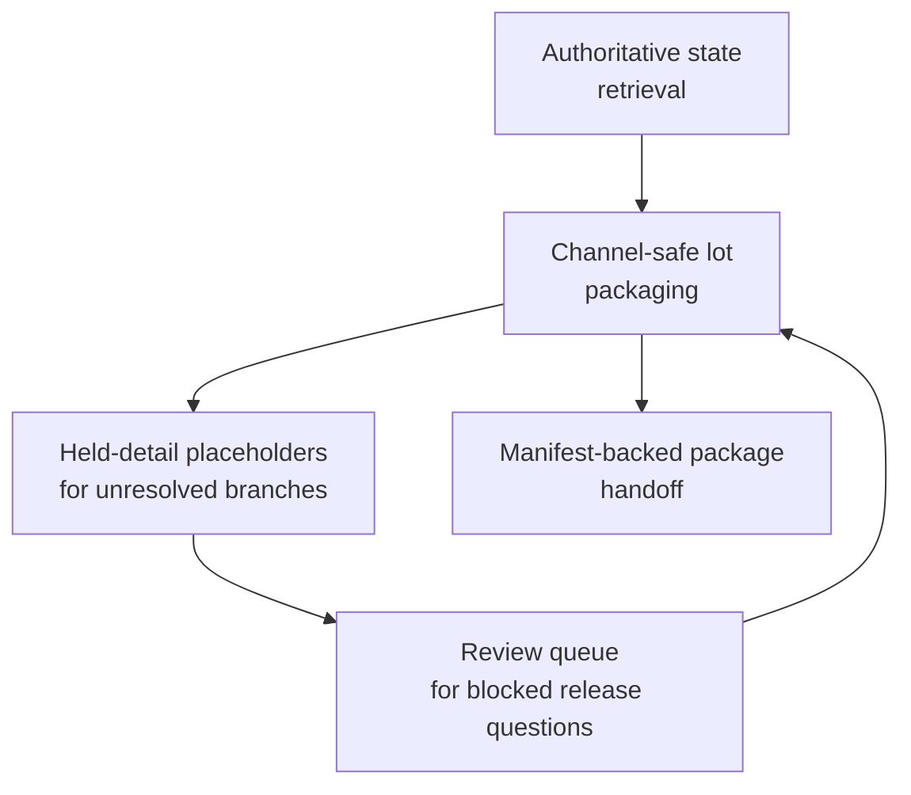
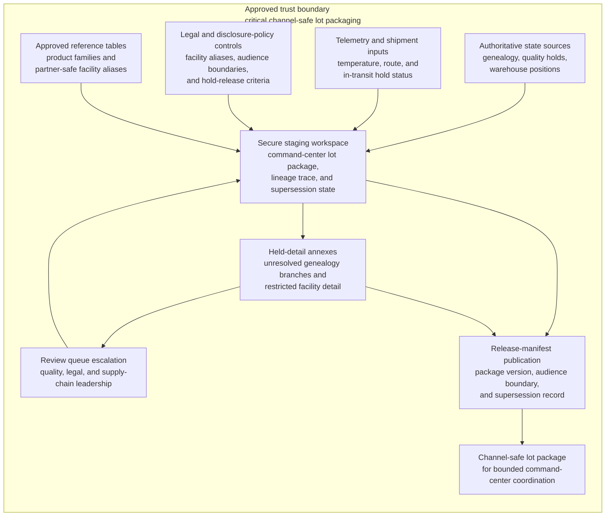

# Suspected contamination command-center channel-safe lot package

## Linked pattern(s)

- `critical-channel-safe-state-packaging`

## Domain

Operations.

## Scenario summary

An operations command center has declared a critical product-contamination event after multiple facilities report converging quality failures and downstream distribution partners begin asking for a current list of potentially exposed lots. The authoritative state spans lot genealogy systems, plant quality holds, cold-chain telemetry, warehouse inventory positions, shipment manifests, and legal-review notes that restrict which facility or product identifiers can be shared externally before verification is complete. Before partner coordination, executive oversight, and internal containment channels can work from one governed artifact, the workflow must transform that authoritative state into a channel-safe structured lot package with product-family groupings, region-level exposure fields, shipment-hold counts, quarantine-status codes, facility-alias renderings, held-detail placeholders for unresolved genealogy branches, and manifest-backed lineage that keeps restricted annexes inside the approved trust boundary.

## Target systems / source systems

- Manufacturing, quality, genealogy, and warehouse systems holding authoritative lot, facility, and quarantine state
- Telemetry and shipment systems providing current temperature, route, and in-transit hold information
- Legal and disclosure-policy registries defining partner-safe aliases, audience boundaries, and hold-release criteria
- Secure staging workspace for command-center packages, held-detail annexes, lineage traces, and supersession manifests
- Review queue for quality, legal, or supply-chain leadership when unresolved lot relationships or disclosure constraints block release

## Why this instance matters

This grounds the pattern in an operations workflow where the urgent need is a structured, audience-safe package that can coordinate containment without exposing every raw quality or facility detail to every recipient. A contamination event can become materially worse if partners act from inconsistent lot lists or if internal teams overshare unverified plant identifiers and speculative exposure paths. The instance shows why a transform-first pattern with facility aliasing, held genealogy branches, and explicit release manifests is distinct from crisis briefing, recall decision-making, or shipment rerouting execution.

## Likely architecture choices

- An orchestrated multi-agent design can separate authoritative genealogy retrieval, partner-safe rendering, held-branch validation, and release-manifest publication while preserving clear trust boundaries.
- Human reviewers should stay in the loop because legal and quality owners must decide when unresolved lot branches, specific facility names, or early telemetry anomalies are safe to expose beyond the command center.
- The workflow should emit only the governed lot package, held-detail register, and manifest rather than recommending recall scope, approving partner notifications, or triggering routing changes.
- Approved reference tables may normalize facilities into partner-safe aliases and roll item SKUs into product families, but unsupported inference about root cause or final contamination scope should stay out of the package.

## Governance notes

- Every exposed lot count, shipment-hold value, quarantine code, and facility-alias field should retain lineage to authoritative source systems and the exact aliasing rules used for release.
- The workflow should hold package elements whenever genealogy branches are incomplete, legal review has not cleared a facility disclosure, or shipment state and warehouse state conflict.
- Supersession manifests should make it obvious which partner-safe package version replaced an earlier one and which held details remain internal-only.
- Quality, supply-chain, and legal owners must approve audience expansion or hold-release changes; the workflow ends at safe package handoff and does not decide recall or operational reroute actions.

## Evaluation considerations

- Percentage of package versions accepted by partner-coordination teams without reopening raw genealogy or quality systems
- Rate of disclosure-boundary, stale-lot-state, or unresolved-branch findings discovered after package release
- Quality of lineage and hold-state explanation for exposed product-family counts, shipment holds, and facility aliases
- Reliability of the package when lot relationships are revised, telemetry backfills arrive late, or legal guidance changes the allowed partner audience mid-event
