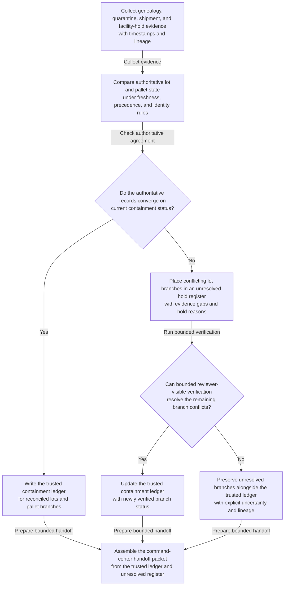
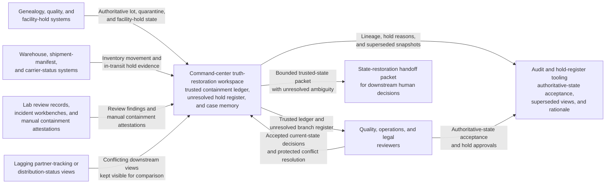

# Suspected contamination lot hold state truth restoration

## Linked pattern(s)

- `critical-authoritative-state-restoration`

## Domain

Operations.

## Scenario summary

During a declared contamination event, the command center finds that lot hold and movement status diverge across genealogy systems, warehouse quarantine records, shipment manifests, and quality-review workbenches. Some downstream pallets appear contained in one system but still in transit in another, while one facility's manual hold action has not propagated consistently across partner-facing tracking views. Before operations, quality, and legal leaders decide whether the exposed inventory picture is stable enough for recall scoping, partner direction, or regulator communication, the workflow must determine which lots are definitively quarantined, which shipments are still exposed, and which branches remain unresolved because authoritative evidence conflicts.

## Target systems / source systems

- Manufacturing genealogy, quality, and facility-hold systems containing authoritative lot and quarantine state
- Warehouse management, shipment manifest, and carrier-status systems showing inventory movement and in-transit holds
- Laboratory review records, incident command workbenches, and manual containment attestations from facility teams
- Partner-tracking or distribution-status views that may lag the internal hold systems
- Audit and hold-register tooling used to preserve unresolved lot branches and authoritative-state acceptance decisions

## Why this instance matters

This grounds the pattern in an operations workflow where the urgent task is restoring one trusted containment picture rather than packaging a safe external view, diagnosing the contamination source, or deciding the recall itself. Conflicting lot and shipment state during a safety event can create severe harm if teams assume containment that has not actually happened or overlook branches that remain exposed. The instance fits this family because it is centered on reconciling authoritative discrepancy and preserving unresolved truth gaps before any downstream action or communication is chosen.

## Likely architecture choices

- An orchestrated multi-agent workflow can separate genealogy retrieval, warehouse and shipment comparison, hold-branch classification, and handoff-packet assembly while maintaining one command-center truth ledger.
- Human reviewers should remain in the loop to confirm which sources outrank lagging partner views, accept the authoritative containment picture, and decide how unresolved branches are treated downstream.
- The workflow should stop at the trusted-state ledger, unresolved hold register, and command-center handoff packet rather than recommending recall scope, issuing partner instructions, or changing inventory state automatically.
- Shared case memory should preserve superseded lot views, late telemetry backfills, and reviewer-visible rationale for every hold or authoritative-state decision.

## Governance notes

- Every quarantine status, in-transit exposure flag, facility hold marker, and unresolved lot branch should retain lineage to the exact source records and timestamps that support it.
- The workflow should keep lot branches on hold whenever genealogy, shipment, and facility records cannot be reconciled inside approved freshness and precedence rules.
- Human quality, operations, and legal owners must approve any downstream use of the trusted-state packet for recall, partner communication, or regulator notification.
- Facility-specific and partner-sensitive identifiers should remain restricted when broader command-center consumers can work from generalized or aliased references.

## Evaluation considerations

- Time to first trusted containment ledger with complete lineage and explicit unresolved-branch handling
- Agreement between the workflow's authoritative lot-state picture and the final human-accepted current-state view
- Percentage of ambiguous shipment or pallet branches preserved in the hold register until evidence converges
- Reliability of the workflow when warehouse state, carrier updates, and manual facility holds arrive asynchronously during repeated command-center refreshes
