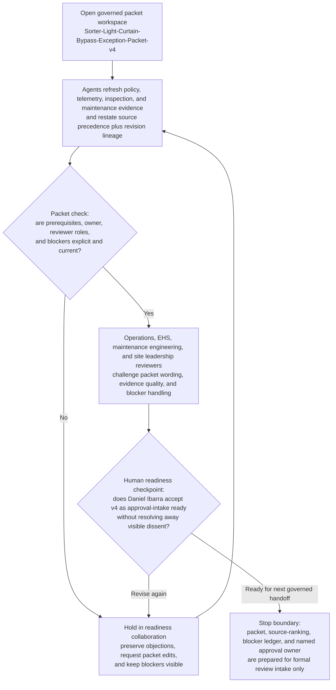

# Temporary sortation light curtain bypass exception package readiness loop

## Linked pattern(s)

- `approval-centered-collaboration`

## Domain

Operations.

## Scenario summary

A sortation operations readiness manager is coordinating one exact governed approval-readiness artifact, `Sorter-Light-Curtain-Bypass-Exception-Packet-v4`, because a high-throughput outbound lane cannot clear an accumulating carton backlog unless a failed light-curtain zone is placed under a tightly bounded temporary bypass exception, yet the request cannot enter formal safety approval review until operations, maintenance engineering, EHS, and site leadership agree that the packet is factually complete, source-ranked, and explicit about unresolved objections. In a governed collaboration workspace, the manager and agent support iterate only on readiness: they reconcile reviewer comments, refresh evidence links, rewrite packet sections to reflect accepted edits and visible dissent, and keep the current handoff ledger synchronized with blocker state and named ownership. The workflow stops at packet readiness collaboration and does not adjudicate the exception, release approval, execute any safety-control bypass, authorize maintenance work, restart the lane, or trigger downstream operational change.

- **Exact governed artifact:** `Sorter-Light-Curtain-Bypass-Exception-Packet-v4`
- **Authoritative source precedence:** signed machine safety standard `MS-447` and site temporary safeguard exception policy `SAFE-EXC-12` take precedence over the frozen PLC fault capture, OEM maintenance bulletin `SB-LC-208`, validated photo-eye and jam telemetry extracts, last certified light-curtain inspection report, current lane throughput loss dashboard, and lowest-precedence reviewer annotations in the collaboration workspace.
- **Prerequisite state:** the affected lane is already in a no-bypass hold state; lockout-tagout status for the failed curtain circuit is recorded; the current sorter asset record and guard-zone map are frozen for review; required reviewers are assigned; and the prior packet return from safety review on `v3` remains attached as the starting state for `v4`.
- **Visible blockers:** unresolved discrepancy between the PLC fault timestamp and maintenance log entry, missing countersignature on the temporary spotter coverage plan, stale OEM bulletin acknowledgment for the installed curtain controller revision, and open disagreement from EHS about whether the proposed pedestrian segregation diagram matches the current lane layout.
- **Revision lineage:** `Sorter-Light-Curtain-Bypass-Exception-Packet-v2` documented the initial exception rationale, `v3` was returned for stronger safeguarding evidence and explicit reviewer ownership, and `v4` is the current readiness revision with objection-preserving edits and refreshed source links.
- **Named accountable owner:** Daniel Ibarra, Regional Sortation Safety Readiness Manager.
- **Named reviewers in the loop:** Priya Shah, Site EHS Manager; Marcus Delerme, Controls Maintenance Engineering Lead; and Tessa Nolan, Fulfillment Operations Director.

## Target systems / source systems

- Governed operations review workspace containing `Sorter-Light-Curtain-Bypass-Exception-Packet-v4`, reviewer comments, blocker state, readiness status, and the handoff ledger
- Warehouse controls historian and PLC fault archive with frozen light-curtain trip events, bypass-interlock state, lane-stop timestamps, and controller revision metadata
- Maintenance management system with the sorter asset record, open corrective-maintenance ticket, prior inspection history, technician notes, and lockout-tagout status
- EHS and machine-safeguarding repository with `MS-447`, `SAFE-EXC-12`, pedestrian-segregation requirements, temporary spotter-plan template, and prior exception-review findings
- OEM service documentation store with controller-specific bulletin `SB-LC-208`, replacement-part lead times, and validated service advisories for the installed curtain assembly
- Operations performance dashboard with carton backlog growth, lane utilization, divert-capacity constraints, and the current no-bypass contingency routing snapshot

## Why this instance matters

This grounds the pattern in a tightly bounded operations collaboration workflow where the governed object is not a general maintenance deferral but one exact approval-readiness packet for a temporary safety-control bypass exception on a live sortation lane. The scenario is materially distinct from the fuel-system test deferral example because the center of gravity is machine-safeguarding evidence, lane-layout objections, and temporary pedestrian-protection review rather than weather-timed preventive-maintenance postponement and continuity planning. It shows how agents can accelerate packet revision, objection preservation, and evidence ranking without implying that the bypass is approved, that the equipment may operate in bypass mode, or that any maintenance or restart decision has been made.

## Likely architecture choices

- Human-in-the-loop collaboration should remain primary because temporary safeguarding posture, residual worker-exposure judgment, and readiness for formal exception review require accountable operations and EHS ownership.
- An orchestrated multi-agent setup fits when separate agent roles refresh authoritative policy references, reconcile PLC and maintenance evidence, normalize reviewer objections, and maintain the approval-readiness handoff ledger across multiple packet revisions.
- Agents may draft revised packet sections, blocker summaries, and evidence-response tables, but exception adjudication, approval release, bypass activation, maintenance dispatch, and lane restart must remain outside this workflow and explicitly human-controlled.

## Governance notes

- The workspace should distinguish authoritative policy text, raw machine and maintenance facts, reviewer objections, agent-authored revision proposals, and human-accepted packet language so downstream approvers can see exactly what remains contested.
- Every material claim about safeguard failure mode, temporary spotter coverage, pedestrian separation, throughput impact, part availability, or inspection status should link to inspectable evidence; stale or contradictory support should block readiness rather than be summarized away.
- Source precedence should remain visible on the face of `Sorter-Light-Curtain-Bypass-Exception-Packet-v4` so reviewer commentary cannot outrank signed safeguarding policy, frozen controller evidence, or the latest certified inspection record.
- The handoff ledger should record Daniel Ibarra as the current accountable owner, the mandatory reviewers, open blockers, and the precise stop boundary where approval-readiness collaboration ends before formal exception adjudication or any operational action begins.
- If refreshed evidence indicates an immediate uncontrolled personnel exposure, undocumented bypass state, or active safeguard tampering, the workflow should pause and escalate into incident containment or emergency maintenance handling rather than continue polishing the readiness packet.

## Evaluation considerations

- Time to produce an internal-review-ready `Sorter-Light-Curtain-Bypass-Exception-Packet-v4` that preserves blocker visibility, source precedence, and named ownership without erasing reviewer disagreement
- Reviewer correction rate for sections where agent-assisted edits overstate safeguard sufficiency, understate lane-layout concerns, or imply that the packet is already approved rather than merely ready for formal intake
- Reliability of the blocker-and-handoff ledger, including whether prerequisite state, source ranking, unresolved objections, and the accountable owner remain synchronized with the latest packet revision
- Rate at which formal safety approval intake returns the packet because collaboration masked evidence conflicts, lost revision lineage, or blurred the boundary between readiness work and actual bypass authorization
