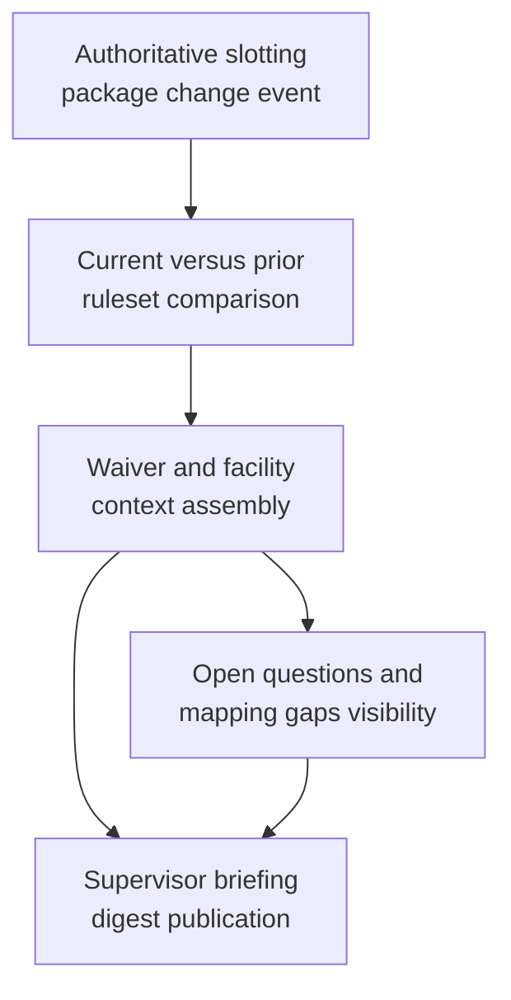
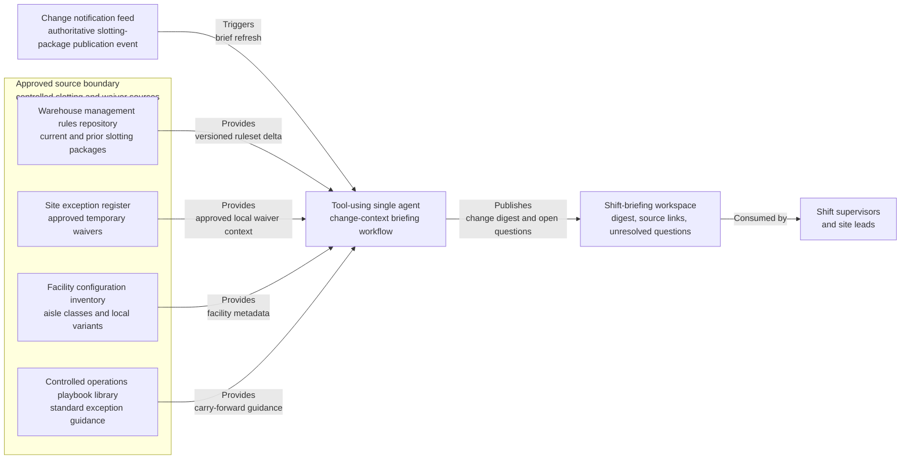

# Warehouse slotting rule change digest for shift supervisor briefing

## Linked pattern(s)

- `change-triggered-context-briefing`

## Domain

Operations.

## Scenario summary

A fulfillment network operations excellence team publishes a controlled slotting-rule package each Thursday before the next wave of weekend replenishment. When the authoritative ruleset changes, shift supervisors need a grounded digest showing which aisle-capacity constraints, hazardous-adjacency restrictions, seasonal overflow rules, scanner exception handling steps, and locally approved temporary waivers changed versus the prior package. The workflow should stop at a concise contextual briefing for supervisors and site leads; it should not reprioritize labor, assign move tasks, or decide whether a site should request a special operating exception.

## Target systems / source systems

- Warehouse management rules repository containing the current approved slotting package, the superseded version, and versioned rule metadata
- Site exception register with approved temporary waivers for pallet-height, hazmat adjacency, or overflow-location handling
- Shift-briefing workspace where the digest, source links, and unresolved questions are published for supervisors
- Facility configuration inventory showing aisle classes, overflow zones, scanner profiles, and applicable local variants
- Controlled operations playbook library for standard receiving, restocking, and exception-escalation guidance
- Change notification feed that emits the authoritative slotting-package publication event

## Why this instance matters

This grounds the pattern in an operations workflow where the trigger is a bounded ruleset revision rather than an incident, optimization cycle, or planning request. Supervisors often hear about changes through informal notes or a raw diff, which makes it hard to see which prior constraints still stand and which local waivers remain in force. The value comes from assembling a trustworthy digest that highlights the operational context around the changed rule package without drifting into work assignment or escalation decisions.

## Likely architecture choices

- Event-driven monitoring fits because the workflow starts from the authoritative slotting-package publication event and refreshes the digest only when the approved bundle changes.
- A tool-using single agent can compare the new and prior rulesets, retrieve applicable site waivers and facility metadata, and publish a supervisor-ready change digest with source traceability.
- Bounded delegation is appropriate because operations owners can predefine the source bundle, template, and audience while humans retain control over any downstream staffing, slotting override, or exception request.
- The workflow should preserve a delta trace that distinguishes newly changed rules, unchanged carry-forward guardrails, and unresolved local waiver questions for each affected site class.

## Governance notes

- Only the approved rules repository and controlled waiver register should drive the digest; chat notes, shift-manager memory, or draft spreadsheet edits should not be treated as authoritative changes.
- The published briefing should minimize site-sensitive operational detail and include only the excerpts or identifiers supervisors need to inspect what changed.
- If facility metadata is stale or a local waiver does not clearly map to the new ruleset, the workflow should surface that as an open question instead of implying that the site is ready to operate under the change.
- Audit logs should retain the triggering ruleset version, the prior baseline version, and any manually added clarifications so supervisors can reconstruct why a specific digest was published.

## Evaluation considerations

- Percentage of authoritative slotting-rule revisions that produce a digest with complete version, waiver, and facility-context traceability
- Reviewer correction rate for changed-rule summaries, carry-forward constraints, or waiver applicability during post-brief sampling
- Rate at which unresolved local exceptions or stale facility mappings are surfaced explicitly before supervisors act on the briefing
- Usefulness of the digest for helping site leads understand what changed without forcing them to reconstruct the rule package manually
