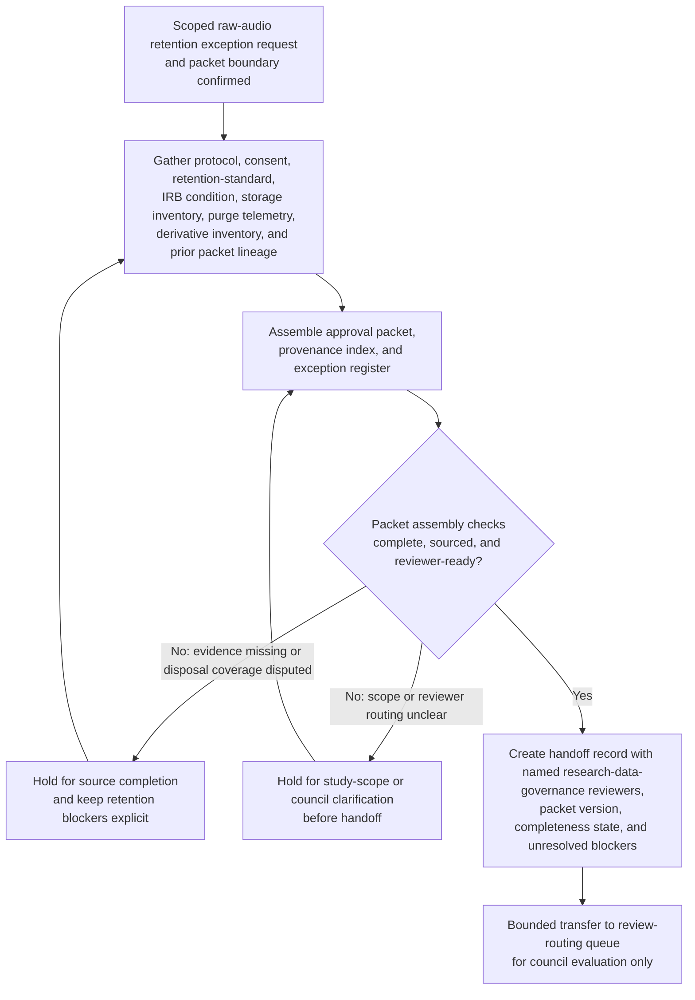

# Adolescent voice-diary raw-audio retention exception approval packet for research data governance council review

## Linked pattern(s)

- `approval-packet-generation`

## Domain

Research.

## Scenario summary

A research data governance manager must assemble a decision-ready approval packet because the scheduled destruction of raw audio from the adolescent voice-diary study cannot proceed on time after a transcription quality recheck and derivative-embedding inventory mismatch leave a bounded request to retain the restricted recordings for an additional ninety days pending research data governance council review. The workflow assembles one exact governed packet, `AVD-Retention-Exception-Packet-v4`, and gives source precedence to the approved study protocol amendment, signed participant consent and withdrawal schedule, the institutional restricted-audio retention standard, and the latest IRB continuing-review condition over the storage inventory snapshot, transcription completion dashboard, vault purge telemetry, secure-erase work order notes, and analyst annotations. Packet assembly may begin only after study enrollment is closed, transcript QA sign-off is recorded, the current restricted reviewer roster is frozen, and the prior packet revision `AVD-Retention-Exception-Packet-v3` is marked returned for rework; agents keep visible blockers such as Site 3 withdrawal coding still under reconciliation, a missing cold-vault erase certificate for one replica, and disputed derivative-embedding disposal coverage in an explicit exception register while preserving the revision lineage under named owner Priya Nandakumar. The workflow stops at packet generation and handoff; it does not recommend whether the retention exception should be granted, adjudicate participant-risk acceptability, amend the protocol, notify participants or sites, enable additional data access, or execute any retention, deletion, or downstream study action.

## Target systems / source systems

- Research data-governance exception workspace holding the scoped retention request, `AVD-Retention-Exception-Packet-v4` draft, completeness checklist, blocker register, and handoff state
- Study protocol registry, consent repository, withdrawal ledger, and IRB continuing-review system containing the authoritative retention commitments, participant limitations, approved amendment scope, and governing review conditions
- Restricted media inventory, cold-vault storage platform, secure-erase orchestration logs, and purge-telemetry dashboards documenting recording locations, replica status, deletion attempts, and missing erase evidence
- Transcription quality-control tracker, derivative-embedding inventory, and approved analysis workspace preserving transcript completion state, downstream derivative dependencies, and disposal-coverage evidence
- Research data governance policy library and council routing rules defining retention-exception criteria, mandatory disclosures, reviewer authority, and required packet sections
- Prior exception archive and review-routing queue preserving `AVD-Retention-Exception-Packet-v3`, returned-for-rework notes, named council reviewers, and the bounded transfer target for the finished packet

## Why this instance matters

This grounds `approval-packet-generation` in a research-governance workflow where the hard part is assembling one inspectable retention-exception packet from protocol, consent, IRB, storage, and derivative-disposal evidence without allowing unresolved restricted-data handling gaps to disappear behind a clean narrative. Research data-governance review depends on a packet that makes source precedence, prerequisite state, visible blockers, and revision lineage explicit before reviewers decide whether the request is ready for their lane. The example stays inside the gather-family boundary because the primary outputs are the packet, evidence index, exception register, and handoff record rather than a recommendation, approval outcome, protocol amendment, participant communication, access change, or deletion execution.

## Likely architecture choices

- Orchestrated multi-agent retrieval and synthesis fit because protocol conditions, consent limits, IRB requirements, storage telemetry, and derivative-disposal evidence usually live in separate systems and need coordinated packet assembly.
- Human-in-the-loop checkpoints should remain mandatory so Priya Nandakumar can confirm packet scope, reviewer routing, and whether unresolved disposal or withdrawal gaps are acceptable to surface in the packet before handoff.
- Agents may reconcile recording identifiers, align retention and purge timelines, and draft packet sections, but they should not decide whether the exception is acceptable, extend the retention period, authorize research reuse, or trigger deletion, protocol, or site actions.

## Governance notes

- Every consequential claim about study scope, consent limitations, withdrawal population, retention window, replica count, derivative-disposal coverage, or council routing should link to inspectable source evidence in the provenance index, with the protocol amendment, consent schedule, retention standard, and IRB condition overriding lower-precedence operational dashboards when conflicts remain unresolved.
- The exception register should keep Site 3 withdrawal-code reconciliation, the missing cold-vault erase certificate, disputed derivative-embedding disposal scope, and any stale reviewer roster or prior-packet carryover issue visible so the packet cannot appear cleaner than the underlying control state.
- The handoff record should name Priya Nandakumar as packet owner, identify the intended research data governance council reviewers, preserve lineage from `AVD-Retention-Exception-Packet-v3` to `AVD-Retention-Exception-Packet-v4`, show prerequisite-state checks, packet completeness state, unresolved blockers, and the explicit boundary where packet generation ends and human approval review begins.
- Sensitive participant audio metadata, withdrawal details, adolescent-study identifiers, and storage-path evidence should remain access-controlled, minimally excerpted, and fully auditable across packet assembly and handoff.
- If new evidence shows unconsented reuse, a broader retention-policy failure, participant harm escalation, or an active storage-security incident outside the packet scope, the workflow should stop and escalate into investigation or incident handling rather than continue packet assembly.

## Evaluation considerations

- Percentage of research data governance council intakes accepted without missing mandatory evidence, routing corrections, or hidden retention exceptions
- Reviewer correction rate for packet sections where agent-assisted synthesis overstated consent coverage, understated disposal gaps, or implied review readiness without sufficient support
- Time required for reviewers to trace a challenged packet claim back to the exact protocol amendment, consent record, IRB condition, storage log, or derivative-inventory artifact in the provenance index
- Bounce rate from council review caused by stale source precedence, incomplete blocker visibility, broken revision lineage, or unclear handoff ownership
