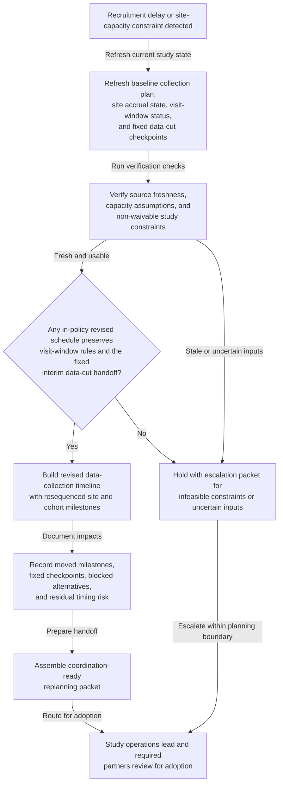
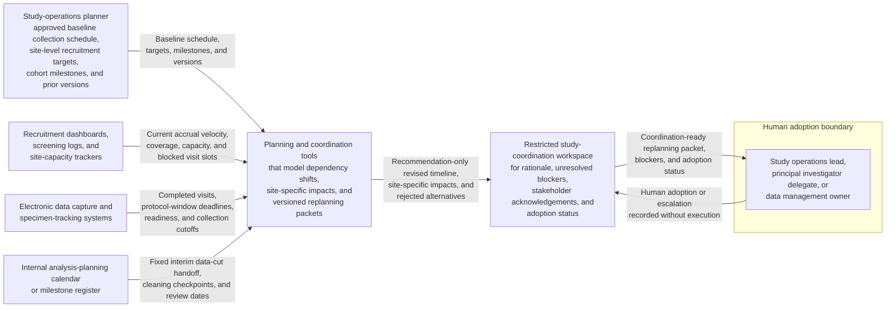

# Applied-study data-collection schedule replanning after recruitment delay or site-capacity constraint

## Linked pattern(s)

- `schedule-adjustment-and-replanning`

## Domain

Research.

## Scenario summary

An applied research program already has an approved data-collection plan that sequences site activation, screening ramp checks, cohort recruitment targets, protocol-defined visit windows, specimen-processing cutoffs, source-data verification preparation, and a fixed interim data-cut handoff for internal analysis planning. Then the baseline plan stops being feasible: recruitment at one site lags below the expected accrual curve, a high-volume site loses coordinator capacity for several weeks, or both shifts compress the original path to the interim data cut without changing the non-waivable visit-window rules. The workflow should recompute a revised data-collection timeline, document which site milestones can move and which checkpoints must stay fixed, and prepare a coordination-ready replanning packet for the study operations lead, site managers, recruitment analytics partner, data management lead, and biostatistics liaison rather than deciding whether enrollment criteria should change, approving a protocol amendment, contacting participants, or executing the revised collection plan itself.

## Target systems / source systems

- Study-operations planner with the approved baseline collection schedule, site-level recruitment targets, cohort milestones, visit-window assumptions, and prior schedule versions
- Recruitment dashboards, screening logs, and site-capacity trackers showing current accrual velocity, coordinator coverage, room or equipment availability, and blocked visit slots by site
- Electronic data capture and specimen-tracking systems showing completed visits, upcoming protocol-window deadlines, source-data verification readiness, and any non-waivable collection cutoffs
- Internal analysis-planning calendar or milestone register containing the fixed interim data-cut handoff, downstream cleaning checkpoints, and already-committed review dates that the revised schedule must preserve
- Planning and coordination tools that can model dependency shifts, site-specific impacts, rejected alternatives, and versioned replanning packets for handoff
- Restricted study-coordination workspace where rationale, unresolved blockers, stakeholder acknowledgements, and adoption status of the revised plan are recorded

## Why this instance matters

This grounds the replanning pattern in research operations where the main problem is restoring a feasible data-collection path after recruitment or site-capacity changes invalidate the original study schedule. The valuable output is a revised timeline, an explicit dependency and impact ledger, and a coordination-ready handoff packet for human adoption. The workflow stays inside the planning family boundary by stopping before enrollment-policy changes, protocol amendment decisions, participant outreach, scientific tradeoff adjudication, or study execution.

## Likely architecture choices

- An orchestrated multi-agent workflow fits because one role can refresh recruitment, visit-window, and site-capacity state, another can test candidate schedules against fixed data-cut and protocol-window constraints, and another can package the accepted replanning proposal with site-specific impacts and unresolved blockers.
- Human-in-the-loop adoption remains necessary because the study operations lead, principal investigator delegate, or data management owner must approve any material movement of cohort milestones, site sequencing, or downstream handoff timing before the revised schedule becomes authoritative.
- Recommendation-only autonomy is the right ceiling: the workflow can propose a feasible updated collection timeline and identify dependency risk, but it should not alter visit-window rules, authorize enrollment-policy changes, approve a protocol amendment, or trigger site execution steps.

## Governance notes

- Hard constraints should remain explicit throughout replanning: protocol-defined visit windows, fixed interim data-cut timing, specimen-processing or data-ingestion cutoffs, required source-data verification lead time, and any non-waivable site-activation or staffing rules.
- The rationale and impact ledger should preserve lineage from the baseline collection plan to the revised proposal, including which site milestones moved, which checkpoints remained fixed, what alternatives were rejected, and what residual timing risk still remains.
- Source freshness matters because a revised schedule built on stale accrual, visit-completion, or site-capacity assumptions can create false confidence and trigger another avoidable replanning cycle.
- The coordination-ready handoff packet should share only role-relevant timing, dependency, blocker, and site-readiness detail rather than participant identifiers, health information, sensitive screening notes, or draft scientific interpretation.
- The workflow should escalate instead of improvising when no in-policy timeline can preserve both the visit-window rules and the fixed interim data cut, when a proposed revision would effectively require enrollment-policy or protocol changes, or when unresolved site-capacity uncertainty makes any revised plan misleading.

## Evaluation considerations

- Time from recruitment-delay or site-capacity trigger to a revised data-collection timeline with explicit dependency impacts and adoption-ready handoff
- Rate of replanning events resolved with an accepted revised schedule without forcing a full manual rebuild of the study collection plan
- Frequency of adopted revised timelines that still miss visit-window or interim data-cut checkpoints because constraint interactions were not surfaced early enough
- Audit usefulness of the rationale ledger for reconstructing which site milestones moved, which checkpoints stayed fixed, what residual timing risk remained, and why human owners accepted or escalated the revised plan
