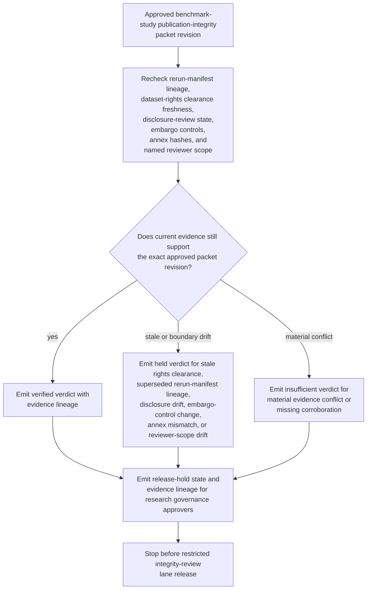
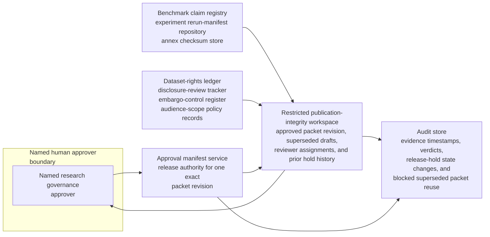

# Approved benchmark study publication-integrity packet evidence gate verification

## Linked pattern(s)

- `evidence-gated-verification-for-release`

## Domain

Research.

## Scenario summary

A research publication-operations team already has one approved publication-integrity packet revision for a benchmark study, but that exact packet cannot be released into the restricted integrity-review lane until current evidence still supports human reliance on it. The workflow rechecks rerun-manifest lineage, dataset-rights clearance freshness, disclosure-review state, embargo controls, annex hashes, and named reviewer scope against the approved packet, then emits a verified, held, or insufficient verdict with explicit evidence lineage and release-hold state for research governance approvers. It must not refresh the packet, recommend whether the study should be published, submit a manuscript, repair missing evidence, or start downstream review execution.

## Target systems / source systems

- Restricted publication-integrity workspace holding the approved packet revision, superseded drafts, reviewer assignments, and prior hold history
- Benchmark claim registry, experiment rerun-manifest repository, and annex checksum store used to confirm the packet's cited evidence lineage and immutable attachments
- Dataset-rights ledger, disclosure-review tracker, embargo-control register, and audience-scope policy records referenced by the approved packet
- Approval manifest service recording which research governance reviewers may release one exact packet revision into the protected integrity-review lane
- Audit store preserving evidence timestamps, verified or held verdicts, release-hold state changes, and blocked reuse of superseded packet revisions

## Why this instance matters

This grounds the pattern in research where the difficult problem is not assembling a new intake packet or deciding publication posture, but proving that one already approved packet revision is still trustworthy at the moment of downstream handoff. A rerun manifest may be superseded, a dataset-rights clearance may age out after a partner restriction changes, or the named reviewer boundary may narrow before the packet is actually released. The value is a bounded verification gate that shows whether one exact publication-integrity packet revision remains evidence-sufficient for restricted downstream reliance without drifting into packet refresh, publication recommendation, integrity adjudication, or manuscript submission.

## Likely architecture choices

- Approval-gated execution fits because the verification packet can be assembled automatically while downstream integrity-review intake remains blocked until a named research governance approver releases that exact packet revision.
- Human-in-the-loop review should remain mandatory because publication-operations, rights, and disclosure owners must interpret held conditions before anyone relies on the packet for a consequential review handoff.
- Durable verification state should preserve superseded verdicts, repeated release holds, and packet-version lineage so later reviewers can distinguish genuine evidence refresh from duplicate verification noise.

## Governance notes

- The verification result should show packet revision lineage, rerun-manifest identifiers, annex hash checks, dataset-rights clearance timestamps, disclosure-review status, embargo controls, and the approved restricted reviewer boundary directly in the approval-ready packet.
- A packet should remain held whenever cited rerun evidence is superseded, rights clearance falls outside the approved freshness window, disclosure review is no longer current, one annex hash no longer matches the approved packet, or the requested downstream lane exceeds the named integrity-review boundary.
- Human approval is required before the verified packet is handed into restricted publication-integrity review or used to justify downstream reliance by publication-operations, governance, or communications partners.
- Any recommendation about whether the benchmark study should be published, any packet repair or refresh, and any manuscript, artifact-release, or external disclosure execution belongs in adjacent recommendation, transformation, or execution workflows rather than this verification gate.

## Evaluation considerations

- Percentage of approved publication-integrity packets that receive a verdict with complete rerun, rights, disclosure, annex, and reviewer-boundary lineage
- Rate at which stale clearances, superseded rerun manifests, annex mismatches, or restricted-lane scope drift are caught before downstream research reviewers rely on the packet
- Reviewer agreement that verified versus held outcomes reflect the intended sufficiency rules for packet freshness, evidence lineage, and protected review scope
- Reliability of repeated verification when rerun evidence, rights controls, or reviewer-scope policy changes land near the restricted handoff window
