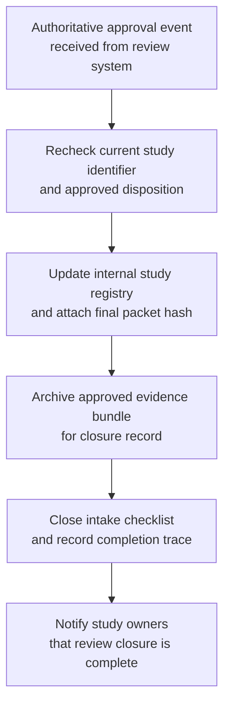

# Approved benchmark study review disposition closure

## Linked pattern(s)

- `workflow-hand-off-and-completion`

## Domain

Research for benchmark governance.

## Scenario summary

An internal research-governance council records that a multimodal benchmark study is approved for internal catalog inclusion after reviewers finish reproducibility, licensing, and disclosure checks. The decision itself is already final in the review system. The remaining workflow is low-risk downstream completion: detect the authoritative approval event, recheck that the study identifier and approved disposition are still current, update the internal study registry, attach the final review packet hash to the catalog record, archive the approved evidence bundle, close the intake checklist, and notify the study owners that the review is complete. The workflow must not publish the work externally, change the approved disposition, or infer any new release decision beyond the recorded council outcome.

## Target systems / source systems

- Research review system that records the authoritative approved disposition and emits a state-change event
- Internal benchmark-study registry or catalog used to track approved studies and their governance status
- Evidence archive holding the final review packet, reproducibility notes, and approved artifact hashes
- Team notification channel or workflow queue used to signal that review closure completed successfully
- Audit store for completion traces, idempotency decisions, and manual follow-up records

## Why this instance matters

This grounds the pattern in a research workflow where the important action is not another decision and not a risky external submission. It is the low-risk but operationally necessary follow-through after the decision is already made. Research programs often accumulate confusion when approved studies remain open in one tracker, missing from another registry, or archived without a clear closure trace. This example shows why event-triggered completion, replay-safe updates, and explicit auditability belong in execute-automate without drifting into recommendation, review, or publication execution.

## Likely architecture choices

- An event-driven completion worker can subscribe to approved-disposition events from the review system and start the downstream closure sequence only for allowed study states.
- The worker should re-read the current disposition before updating the registry or archive so a revoked or superseded decision is not propagated from a stale event.
- Completion state should be durable and idempotent because the same event may be delivered more than once or the archive step may succeed before notification is retried.
- Human follow-up should be triggered when the catalog record is missing, the packet hash no longer matches the approved archive, or the study already appears closed under a conflicting disposition.

## Governance notes

- The workflow should copy only the identifiers, approved status, archive references, and closure timestamps needed for bookkeeping rather than broad review commentary or sensitive draft content.
- Audit traces should capture the source event id, the verified disposition version, the registry record updated, the archive reference attached, and whether any step was skipped because it had already completed.
- If the review board later changes the disposition from approved to hold or requests additional evidence, the workflow should stop and emit a manual follow-up record instead of trying to reopen or reinterpret the case autonomously.
- The automation should stay bounded to closure and handoff tasks; publication decisions, abstract submissions, or public benchmark updates remain outside scope.

## Evaluation considerations

- Percentage of approved benchmark reviews that reach catalog, archive, and checklist closure without manual bookkeeping cleanup
- Rate of stale, duplicate, or superseded approval events detected before incorrect registry closure occurs
- Completeness of audit traces linking the approved disposition to registry, archive, and notification updates
- Reliability of partial replay when the archive succeeds but notification delivery or checklist closure must resume later
