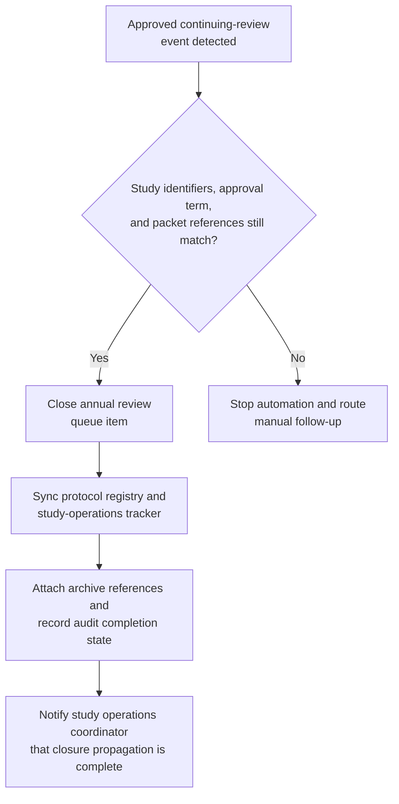

# Approved human-subjects continuing-review closure and protocol-registry synchronization

## Linked pattern(s)

- `workflow-hand-off-and-completion`

## Domain

Research.

## Scenario summary

A university-affiliated research compliance office has already recorded an approved continuing-review disposition for a longitudinal human-subjects study in the authoritative ethics workflow after the board completed its decision-making work. That approval is final for this workflow and must not be reopened, reinterpreted, or extended into participant-facing study execution. The remaining execute step is limited to low-risk closure bookkeeping: detect the approved continuing-review event, recheck that the protocol identifier, approval term, and approved packet references still match the source record, close the annual review queue item, sync the internal protocol registry and study-operations tracker to the recorded review-complete state, attach archive references for the final approval letter and continuing-review packet, record completion state in the audit store, and notify the study operations coordinator that review closure propagation is complete. If the protocol was reopened, the approval term changed, or the target registry points to a different study record, the workflow should stop and route manual follow-up instead of guessing.

## Target systems / source systems

- Restricted ethics or research-compliance workflow system that records the approved continuing-review disposition and emits the authoritative state-change event
- Internal protocol registry or study-operations tracker that needs the approved review-closure state reflected
- Annual review queue holding the study until post-decision closure bookkeeping is complete
- Archive or evidence store containing the final approval letter, continuing-review packet, and closure note references
- Internal study-operations notification channel plus audit store for completion traces, idempotency markers, and manual follow-up records

## Why this instance matters

This grounds the pattern in a research workflow that is distinct from benchmark governance and stays safely downstream of an already-made ethics decision. Research programs often finish continuing review in the authoritative system but still carry manual cleanup across the annual review queue, protocol registry, archive links, and coordinator handoff, which creates avoidable drift and weak audit trails. The example shows why execute-automate is useful for a tightly bounded, event-triggered closure slice after the governing board has already acted, while keeping protocol amendment drafting, participant outreach, recruitment changes, and new data collection decisions explicitly out of scope.

## Likely architecture choices

- An event-driven completion worker can subscribe to approved continuing-review events from the ethics workflow and start the closure sequence only for allowed post-decision states.
- The worker should re-read the current source record before writing anywhere so a reopened protocol, superseded approval term, or changed packet reference is not propagated from a stale event.
- Durable completion state should track queue closure, protocol-registry synchronization, archive linkage, notification delivery, and skipped idempotent actions because duplicate events or partial retries are normal operational conditions.
- Human follow-up should trigger when the study record mapping is missing, the archive reference no longer matches the approved packet, or a requested next step would require new protocol execution beyond bookkeeping.

## Governance notes

- The workflow should copy only the protocol identifiers, approved review-closure state, archive references, and timestamps needed for internal record synchronization rather than participant details, reviewer deliberations, or protected study narrative.
- Audit traces should record the source event id, verified approval term, queue item closed, registry records updated, archive references attached, notification target, and whether any step was skipped because it had already completed.
- Every automatic update should be reversible and idempotent so replay does not create duplicate queue cleanup, conflicting closure timestamps, or repeated archive attachments.
- The automation must not submit amendments, alter consent materials, authorize new recruitment, contact participants, change study procedures, or interpret the approved continuing-review decision beyond low-risk closure propagation.

## Evaluation considerations

- Percentage of approved continuing-review dispositions that reach queue closure, protocol-registry synchronization, archive linkage, and coordinator notification without manual bookkeeping repair
- Rate of stale, duplicate, or mismapped approved continuing-review events detected before incorrect closure state is propagated across restricted research systems
- Completeness of audit traces linking the authoritative review event to queue, registry, archive, and notification updates
- Reliability of replay-safe recovery when one target is already updated or temporarily unavailable while other closure steps remain pending
