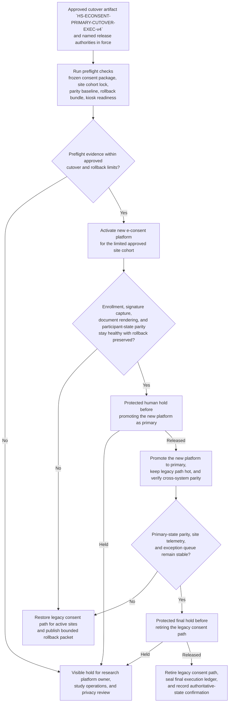

# Approved human-subjects e-consent platform primary cutover staged execution

## Linked pattern(s)

- `staged-change-execution-with-rollback-holds`

## Domain

Research.

## Scenario summary

After the institutional review board, study sponsor operations, and research platform change authority approve promotion of a new human-subjects e-consent platform to become the primary live consent path for one active multisite study, research systems operations must execute one exact governed cutover artifact, `HS-ECONSENT-PRIMARY-CUTOVER-EXEC-v4`, during a controlled production window. Source precedence is explicit before execution begins: the signed cutover order and approved rollback plan outrank the IRB-approved consent package and study site-activation roster, which outrank the frozen environment baseline, parity snapshots, and lower-precedence operator notes or vendor chat. The prerequisite state is also fixed in advance: consent content is frozen, the live study configuration baseline is pinned, the legacy consent path is in controlled no-change mode, the new platform release is already deployed but dark, rollback credentials and the legacy restore bundle are verified, and the approved site cohort for limited activation is locked. Visible blockers remain attached to the execution record until cleared: Site 04 still shows one unsigned translated assent PDF in the legacy cache, participant status parity for two in-progress reconsent cases has not yet matched between platforms, and one clinic kiosk profile has not confirmed rollback-package receipt. Revision lineage from `v2` through `v4` remains inspectable, and Dr. Serena Malik, Director of Human Subjects Research Platforms, is accountable for staged execution quality only. The workflow stays bounded at governed cutover execution: it does not reopen approval adjudication, rewrite consent policy, design participant communications, or run downstream study enrollment operations.

## Target systems / source systems

- Governed change-control workspace holding `HS-ECONSENT-PRIMARY-CUTOVER-EXEC-v4`, prior revisions `v2` and `v3`, named release authorities, blocker register, and rollback criteria
- IRB-approved consent package repository, participant-facing assent and consent document archive, and study site-activation roster defining the authoritative approved content and in-scope clinic cohort
- New e-consent platform, legacy consent platform, and feature-flag or routing control plane used to stage limited activation, primary promotion, and legacy retirement
- Participant registry, enrollment workflow, signature-capture service, and consent document rendering or storage services used for parity verification during each cutover stage
- Monitoring, audit, and evidence systems preserving preflight results, hold releases, parity snapshots, rollback readiness checks, rollback actions, and final authoritative-state confirmation

## Why this instance matters

This grounds the pattern in a research workflow where the consequential action is not authoring consent language or securing approval to change platforms, but carrying an already approved live cutover through staged activation while participant-facing consent state remains trustworthy. Human-subjects programs often have both regulatory sensitivity and immediate operational risk: if document rendering, signature capture, or participant-state synchronization drifts during cutover, the study can create unusable consent records before staff notice. The instance stays cleanly in this execution slice because it centers on preflight discipline, protected hold points, parity verification, rollback readiness, and final retirement of the legacy path rather than approval decisions, policy changes, communications planning, or downstream study conduct.

## Likely architecture choices

- Orchestrated multi-agent coordination fits because preflight validation, site activation control, participant-state parity checking, and rollback-readiness verification usually require distinct research systems and operational roles over one shared execution ledger.
- Human-in-the-loop holds should remain standard before the new platform becomes the primary consent path and again before the legacy path is retired, because those stages materially reduce reversibility.
- Exception-gated autonomy is appropriate because automation may advance through limited activation when parity and telemetry remain inside approved bounds, but missing assent artifacts, signature-capture degradation, or rollback-readiness loss should force a visible hold or rollback packet.
- The execution record should preserve which release authority cleared each protected hold, which site cohort was live at that time, and which parity snapshot justified continuing.

## Governance notes

- Source precedence should remain explicit throughout the run: the signed cutover order and approved rollback plan govern stage sequence and protected limits; the IRB-approved consent package and site-activation roster govern in-scope content and site eligibility; live telemetry, parity snapshots, and operator notes may inform execution but cannot silently expand scope or override approved boundaries.
- Execution should begin only when consent content is frozen, the active study configuration baseline is pinned, the legacy path is in controlled no-change mode, rollback credentials and restore bundles are current, and the limited site cohort remains locked to the approved roster.
- Visible blockers such as unsigned translated assent assets, unresolved participant-state parity gaps, stale kiosk rollback packages, or routing-control drift should remain attached to `HS-ECONSENT-PRIMARY-CUTOVER-EXEC-v4` until cleared or explicitly escalated.
- Audit evidence should preserve revision lineage from `v2` through `v4`, stage timestamps, live site scope, hold-release identity, parity and rendering checks, rollback-readiness proofs, and any restoration steps without unnecessarily copying participant-identifying data into broader logs.
- Dr. Serena Malik is the accountable owner for execution quality and hold discipline only; participant outreach, site retraining, protocol amendments, enrollment decisions, and downstream study execution remain outside this workflow boundary.

## Evaluation considerations

- Percentage of approved e-consent platform cutovers completed without participant-facing consent failure, emergency rollback, or post-cutover parity repair
- Rate of rendering, signature-capture, participant-state, or rollback-readiness issues caught at preflight or protected hold points before the new platform becomes the sole primary path
- Completeness of the execution ledger linking the approved cutover artifact, staged site activations, hold releases, parity evidence, rollback actions, and final retirement decision
- Time and clarity of restoring the legacy consent path when the new platform passes initial health checks but fails deeper parity or document-integrity verification after promotion
