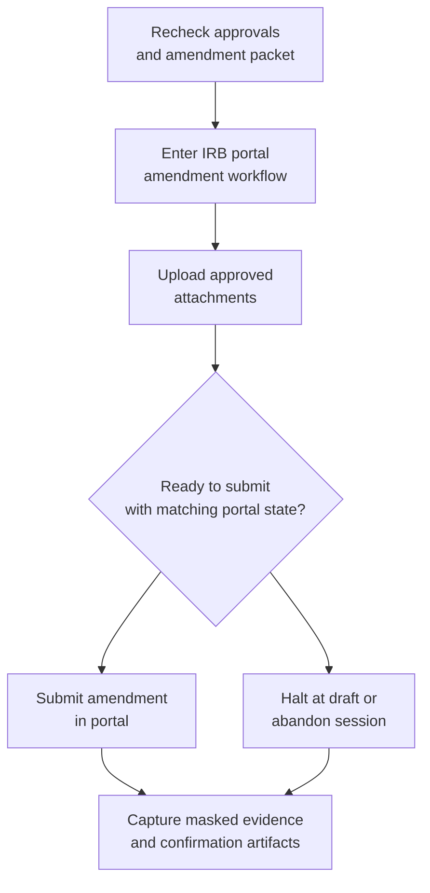
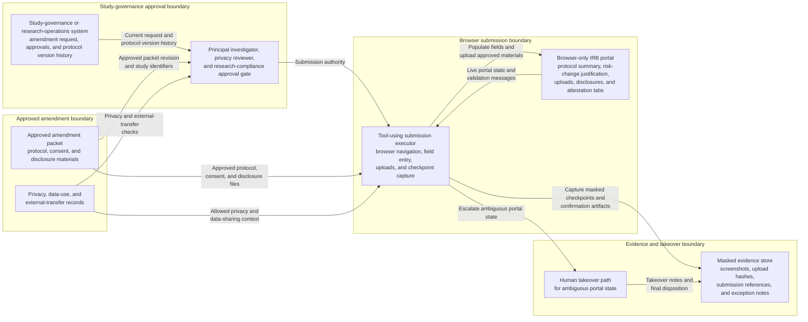

# Approved human-subjects ethics amendment portal submission

## Linked pattern(s)

- `browser-based-form-completion-with-approval-gates`

## Domain

Research for human-subjects study governance.

## Scenario summary

An academic-industry research operations lead needs to submit an already approved ethics amendment for a longitudinal human-subjects study after the team adds a new wearable-derived biomarker, revises participant recontact language, and expands a data-sharing pathway to an external statistical lab. The target institutional review board portal is browser-only, spreads the amendment across protocol summary, risk-change justification, consent-document uploads, external-collaborator disclosures, and investigator-attestation tabs, and final submission may proceed only after the principal investigator, privacy reviewer, and institutional research compliance office have all signed off in the study-governance system. Because a mistaken commit could authorize the wrong protocol version or expose sensitive participant-handling details, the workflow must recheck approvals, confirm the amendment packet still matches the approved protocol materials, and halt safely if the live portal, attachment state, or confirmation path becomes ambiguous.

## Target systems / source systems

- Study-governance or research operations system holding the amendment request, required approvals, and protocol version history
- Browser-only IRB or ethics-review portal used for protocol amendments and continuing-review submissions
- Approved amendment packet, redlined protocol, consent-form revisions, recruitment or recontact language, and collaborator disclosure forms
- Privacy, data-use, and external-data-transfer records covering the new biomarker workflow and outside statistical lab access
- Evidence store for masked screenshots, submission reference numbers, uploaded-document hashes, and exception or takeover notes

## Why this instance matters

This grounds the execution pattern in a research workflow where the browser submission can change what human-subjects procedures are allowed to proceed under an active study. The value is not simple portal automation. It is governed execution that proves the exact amendment packet was approved, the submitted protocol details matched the authorized study materials, and the workflow stopped rather than improvising when the ethics portal or approval state no longer looked trustworthy.

## Likely architecture choices

- Approval-gated execution should assemble the amendment packet, verify that principal investigator, privacy, and research-compliance approvals are still current, and block final commit until those approvals are rechecked immediately before submit.
- A tool-using single agent can navigate the IRB portal, populate protocol-change fields, upload the approved consent and disclosure documents, and capture masked evidence at each gated checkpoint.
- Human-in-the-loop control should remain standard for changed risk classifications, unexpected requests for additional disclosures, participant-population mismatches, missing attachment versions, or any portal warning that the amendment would supersede a different active protocol record than the approved packet references.

## Governance notes

- The workflow should confirm that the study identifier, protocol version, amendment rationale, consent revision set, and external-collaborator disclosures all align before any browser entry begins.
- Screenshots, logs, and evidence bundles should minimize participant-identifying or health-related details while still preserving which approvals unlocked submission, which document versions were attached, and which portal confirmation was received.
- If the portal shows an unapproved prior draft, a different study status, a changed required-review path, or attachment validation that does not reconcile to the approved amendment packet, the workflow should stop at a saved draft or abandon the session rather than guess and file a potentially noncompliant amendment.
- Human takeover steps should preserve the current page state, entered-but-unsubmitted values, uploaded-file references, and reasons for the halt so research compliance staff can resume safely without duplicate filings or silent protocol drift.
- Auditability should be explicit: the final evidence bundle should let reviewers reconstruct which protocol changes were submitted, when approvals were revalidated, and why any exception or manual checkpoint occurred.

## Evaluation considerations

- Percentage of approved ethics amendments submitted without IRB rejection, duplicate filing, or post-submission correction to protocol or consent materials
- Rate of stale approvals, wrong-document versions, portal drift, or study-identifier mismatches caught before final submission
- Completeness of masked evidence bundles linking submitted portal fields and attachments to the approved amendment packet and approval chain
- Reliability of safe halt and human takeover when the ethics portal changes, times out, requests unexpected disclosures, or returns ambiguous confirmation for a high-governance submission
