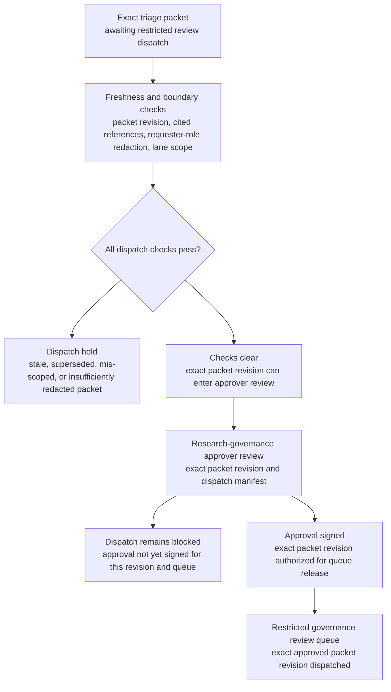
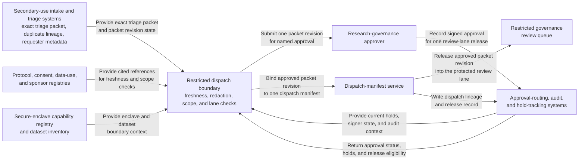

# Approved secondary-dataset access request triage packet for restricted governance review dispatch

## Linked pattern(s)

- `approval-gated-triage-dispatch`

## Domain

Research.

## Scenario summary

A research data-governance team already has one evidence-backed triage packet assembled for a secondary dataset access request tied to a completed human-subjects study. Earlier monitoring already merged the request form, protocol-scope checks, consent-restriction flags, enclave-capability notes, prior duplicate submissions, and one recent sponsor-use clarification into a single bounded packet. The next step is not to decide whether the requester may receive access, reinterpret consent, negotiate conditions, publish findings, or activate any data movement; it is to decide whether that exact triaged packet revision may cross into the restricted governance review lane that handles sensitive secondary-use review. The workflow watches packet freshness, requester-role redaction, approval state, and lane-boundary rules, then releases the packet only when the named research-governance approver signs the dispatch manifest for that one downstream review queue.

## Target systems / source systems

- Secondary-use intake and triage systems holding the already-triaged access-request packet, duplicate lineage, requester metadata, requested dataset scope, and unresolved caveat markers
- Protocol, consent, data-use agreement, and sponsor-restriction registries supplying the authoritative references already cited in the packet for freshness and scope checks
- Secure-enclave capability registry and dataset inventory recording allowed analysis environments, subset identifiers, retention tags, and restricted-field annotations used to confirm bounded downstream review context
- Restricted governance review queue and dispatch-manifest service used to release the exact packet revision into the protected secondary-use review lane
- Approval-routing, audit, and hold-tracking systems preserving signer identity, blocked dispatch attempts, superseded packet revisions, manual overrides, and reversible hold state

## Why this instance matters

This grounds `approval-gated-triage-dispatch` in a research-governance setting that is clearly different from benchmark disclosure-risk review because the packet concerns a proposed secondary dataset access request rather than unpublished benchmark claims or draft-sharing risk. Many research organizations can triage an access request into one packet with consent, sponsor, enclave, and dataset-scope context, yet still require explicit approval before that packet may enter a restricted governance lane empowered to review sensitive participant-data implications. The instance keeps the family boundary clean because the workflow owns packet release, queue-boundary control, hold visibility, and dispatch lineage only, not access adjudication, consent interpretation, data release, requester communication, or downstream review execution.

## Likely architecture choices

- Event-driven monitoring fits because consent references, sponsor restrictions, requester affiliation, enclave readiness, or packet freshness can change while the already-triaged request waits at the dispatch gate.
- Approval-gated execution fits because the packet is prepared for one bounded governance lane but remains concretely blocked until the required research-governance signer approves that exact revision and queue boundary.
- Human-in-the-loop review should stay on the normal path because dispatch into a restricted secondary-use governance lane changes who may inspect sensitive request context even though this workflow still stops short of granting access or choosing conditions.
- The workflow should emit only the released queue entry, dispatch manifest, hold register, and audit trail rather than an access decision, reuse-condition proposal, investigator notification, dataset extract, or any operational handoff that would begin execution.

## Governance notes

- The manifest should bind approval to one exact secondary-use triage packet revision, one restricted governance review queue identifier, one approved reviewer audience, and the requester-scope boundary authorized for dispatch.
- Dispatch should remain held when consent or sponsor references become stale, the packet is superseded by a newer duplicate-merge result, requested dataset scope exceeds the approved review boundary, or requester identifiers are not redacted to the lane's minimum necessary view.
- Broad queue views should minimize participant-linked attributes, requester personal details, sponsor constraints, and dataset sensitivity notes while preserving traceable references in governed research systems.
- Research governance owners must approve changes to signer roles, reviewer-roster boundaries, redaction policy, freshness rules, and hold-release logic; this workflow ends before access adjudication, condition setting, dataset provisioning, requester outreach, publication planning, or any downstream execution begins.

## Evaluation considerations

- Median time from packet readiness to approved restricted-lane dispatch or explicit placement into freshness, redaction, or scope hold state
- Rate of wrong-version, wrong-audience, or over-broad scope corrections detected after dispatch approval
- Completeness of audit lineage connecting packet revision, cited governance sources, signer approval, and the single downstream queue boundary
- Reliability of hold behavior when consent scope, sponsor-use constraints, requester affiliation, or enclave metadata changes during the approval window
