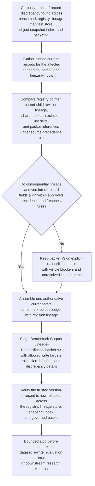
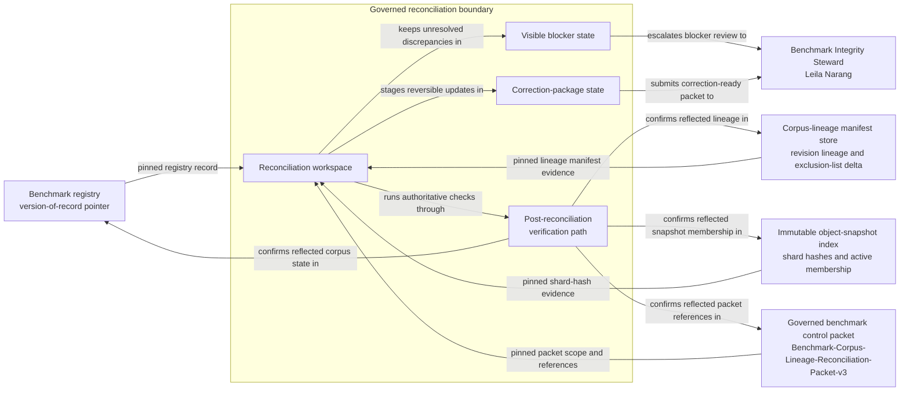

# Benchmark corpus lineage and version-of-record authoritative record reconciliation

## Linked pattern(s)

- `authoritative-record-reconciliation`

## Domain

Research.

## Scenario summary

After a benchmark corpus refresh is staged and storage metadata backfills land out of order, research platform governance discovers that the trusted version-of-record for one benchmark corpus no longer agrees across the benchmark registry, the corpus-lineage manifest store, the immutable object-snapshot index, and the governed benchmark control packet `Benchmark-Corpus-Lineage-Reconciliation-Packet-v3`. The registry still points benchmark `atlasbench-fairness-suite` to corpus revision `corpus-r18`, the lineage manifest records `corpus-r19-candidate` as the child revision derived from the same source snapshot plus an approved exclusion-list delta, and the object-snapshot index confirms most `r19` shard hashes but still carries one active shard reference from `r18`. The prerequisite state is that corpus ingest is paused, the benchmark freeze tag is active, and all four control surfaces have been pinned into one read-only reconciliation window; the visible blockers are the unresolved shard-hash mismatch, the missing confirmation that the exclusion-list delta propagated to every shard, and the stale registry pointer embedded in `Benchmark-Corpus-Lineage-Reconciliation-Packet-v3`. Before any benchmark release, dataset rewrite, evaluation rerun, or downstream research execution continues, the workflow must restore one trusted corpus version-of-record, preserve explicit revision lineage, and stage a correction-ready packet for controlled record repair, with Benchmark Integrity Steward Leila Narang accountable for reconciliation quality only.

## Target systems / source systems

- Benchmark registry records holding the steward-accepted corpus version-of-record pointer, benchmark identifier, freeze tag, and current control-surface references
- Corpus-lineage manifest store entries holding parent-child revision relationships, source snapshot ids, exclusion-list deltas, approved transformation notes, and manifest write timestamps
- Immutable object-snapshot index records holding shard object identifiers, content hashes, storage tier lineage, and active snapshot membership for each corpus revision
- Governed benchmark control packet records, including `Benchmark-Corpus-Lineage-Reconciliation-Packet-v3`, holding bounded write targets, blocker visibility, prior packet revisions, and correction-package metadata
- Reconciliation workspace tooling used to preserve field-level discrepancy ledgers, visible blocker state, revision-lineage traces, and reversible correction packages

## Why this instance matters

This grounds the pattern in a research-governance workflow where the urgent task is not deciding whether the benchmark should ship, whether the corpus should be rewritten, or why lineage drift happened, but restoring one defensible version-of-record before research control surfaces rely on contradictory corpus state. Benchmark governance often splits authority across lineage manifests, immutable storage evidence, registry pointers, and bounded control packets, so a seemingly current corpus revision can still be unsafe when parent-child lineage, exclusion deltas, or shard hashes do not line up. The instance stays in this family because it centers on authoritative-state restoration, blocker visibility, explicit revision lineage, and correction-ready packaging rather than benchmark approval, release management, dataset transformation, or downstream research execution.

## Likely architecture choices

- A tool-using single agent can gather the registry record, lineage manifest chain, snapshot-index evidence, and packet `Benchmark-Corpus-Lineage-Reconciliation-Packet-v3` into one bounded reconciliation run for the affected corpus.
- Human-in-the-loop review should remain standard when lineage ancestry is ambiguous, shard-hash mismatches cross the approved tolerance, or a proposed correction would alter the accepted version-of-record pointer for a governed benchmark.
- The workflow should perform authoritative post-reconciliation verification against the registry, lineage store, snapshot index, and packet references before marking packet `Benchmark-Corpus-Lineage-Reconciliation-Packet-v3` correction-ready, then stop before benchmark release, dataset rewrite, evaluation rerun, or broader research operations.
- Shared reconciliation memory should preserve superseded corpus pointers, manifest ancestry, packet revision lineage from v1 through v3, blocker history, and rollback references so later reviewers can inspect exactly why one corpus revision became authoritative.

## Governance notes

- Source precedence should be explicit at the field level: the immutable object-snapshot index is authoritative for shard identity and content hashes, the corpus-lineage manifest store is authoritative for parent-child revision ancestry and exclusion-list delta lineage, the benchmark registry is authoritative for the accepted version-of-record pointer once upstream lineage and hash evidence align, and `Benchmark-Corpus-Lineage-Reconciliation-Packet-v3` is authoritative only for governed correction scope, blocker visibility, and write-target packaging.
- The workflow should begin only when corpus ingest is paused, the benchmark freeze tag is active, and the source extracts for the registry, lineage manifest store, object-snapshot index, and packet v3 are pinned to one reconciliation window; otherwise the case must remain blocked rather than pretending a stable version-of-record exists.
- Visible blockers, including unresolved shard-hash gaps, missing exclusion-delta propagation proof, stale packet references, or conflicting manifest ancestry, should remain attached to packet `Benchmark-Corpus-Lineage-Reconciliation-Packet-v3` until cleared or explicitly escalated.
- Every consequential field, including benchmark identifier, corpus revision id, parent revision, source snapshot id, shard hash, exclusion-list delta, packet revision, and extraction timestamp, should retain lineage to the exact source record used in reconciliation.
- Benchmark Integrity Steward Leila Narang should receive the correction-ready packet and is accountable for reconciliation quality only; benchmark release approval, publication choice, and downstream benchmark use remain outside this workflow.

## Evaluation considerations

- Time to produce a human-reviewable authoritative benchmark corpus ledger with complete field-level lineage, visible blocker state, explicit revision ancestry, and a correction-ready `Benchmark-Corpus-Lineage-Reconciliation-Packet-v3`
- Agreement between the workflow's reconciled version-of-record and the final steward-accepted current-state view across the registry, lineage manifest store, object-snapshot index, and governed packet
- Percentage of lineage or shard-hash conflicts routed into explicit blocker or review states rather than silently overwritten during reconciliation
- Reliability of correction-package generation and post-reconciliation verification when storage backfills, manifest updates, or registry refreshes arrive out of order during repeated reconciliation runs
