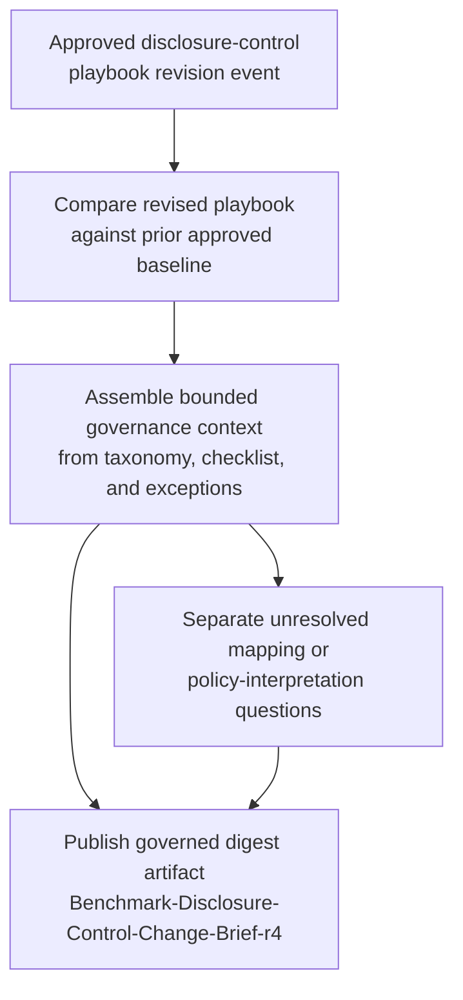
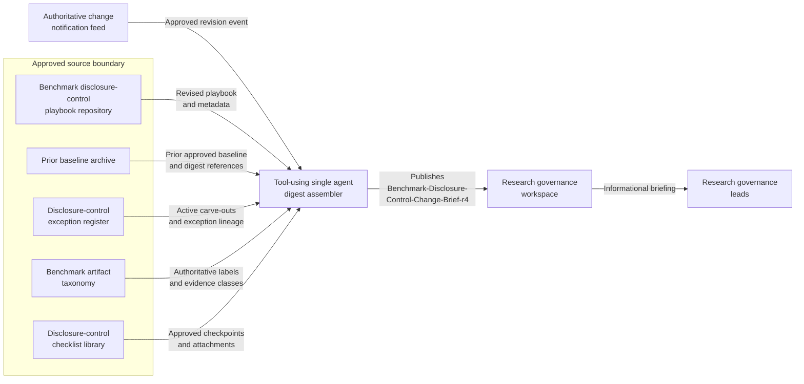

# Benchmark disclosure-control playbook change digest for research governance briefing

## Linked pattern(s)

- `change-triggered-context-briefing`

## Domain

Research.

## Scenario summary

A research governance program maintains an approved benchmark disclosure-control playbook covering small-cell suppression thresholds, qualitative claim-framing limits, benchmark artifact labeling rules, approved replication-evidence references, exception-handling steps, and reviewer briefing checkpoints used before benchmark materials are discussed with internal publication and policy stakeholders. When that playbook is revised, research-governance leads need one bounded digest artifact, `Benchmark-Disclosure-Control-Change-Brief-r4`, that explains what changed in the newly approved playbook, which surrounding benchmark-governance context still applies from the prior baseline and standing control set, and which unresolved questions remain visible before the next governance briefing. The workflow must stop at informational handoff for research-governance briefing; it must not recommend publication go/no-go, adjudicate exceptions, coordinate collaborators, investigate why the playbook changed, or execute any live disclosure or release action.

## Target systems / source systems

- Benchmark disclosure-control playbook repository containing the newly approved playbook revision, the superseded baseline version, revision metadata, and controlled publication status
- Prior baseline archive preserving the last approved disclosure-control playbook and prior digest references used to distinguish newly changed controls from carried-forward guidance
- Disclosure-control exception register with active benchmark-specific carve-outs, temporary review notes, and unresolved exception lineage that the digest may cite but not adjudicate
- Benchmark artifact taxonomy defining the authoritative labels, evidence classes, benchmark-output categories, and disclosure surface names referenced by the revised playbook
- Disclosure-control checklist library containing the currently approved reviewer checklist, required checkpoint order, and mandatory evidence attachments that remain in force around the changed playbook
- Research governance workspace where `Benchmark-Disclosure-Control-Change-Brief-r4`, source links, and unresolved questions are posted for governance leads
- Change notification feed that emits the authoritative playbook approval event and triggers digest refresh only after the revised playbook is published

## Why this instance matters

This grounds the pattern in a research-governance workflow where the central need is a reliable change digest about a controlled disclosure playbook rather than a crisis brief, publication recommendation, or approval packet. Research-governance leads often need to brief others on benchmark disclosure expectations quickly, but a raw redline does not clearly show which benchmark artifact rules still stand, which exception context remains active, and which interpretation questions need follow-up before anyone relies on the new playbook. The instance shows how a bounded digest can preserve governance continuity around benchmark disclosure controls without slipping into adjudication, investigative analysis, or release execution.

## Likely architecture choices

- Event-driven monitoring fits because the digest should refresh from the authoritative playbook approval event instead of from ad hoc reviewer requests or informal workspace chatter.
- A tool-using single agent can compare the revised playbook with the prior approved baseline, retrieve the narrow surrounding control set, and assemble `Benchmark-Disclosure-Control-Change-Brief-r4` with claim-to-source traceability.
- Bounded delegation works because research governance can predefine the approved source boundary, digest template, and audience while humans retain responsibility for any downstream publication, exception, or disclosure decisions.
- The workflow should preserve an explicit split between changed disclosure-control instructions, unchanged carry-forward benchmark-governance context, and unresolved questions about exception mapping, taxonomy alignment, or checklist interpretation.

## Governance notes

- Only the approved playbook repository, prior approved baseline, controlled exception register, benchmark artifact taxonomy, approved disclosure-control checklist, governance workspace, and authoritative change notification feed should drive the digest; draft slide decks, collaborator comments, or publication-channel speculation should remain out of scope.
- `Benchmark-Disclosure-Control-Change-Brief-r4` should cite only the excerpts, identifiers, and context needed for governance briefing so sensitive benchmark details or embargoed result fragments are not copied more broadly than necessary.
- If a revised playbook instruction conflicts with the current benchmark artifact taxonomy, references a checklist step that is not yet updated, or depends on an exception record with stale lineage, the workflow should surface that as an unresolved question rather than smoothing over the mismatch.
- Audit records should preserve the triggering playbook revision id, prior baseline id, cited exception and checklist versions, and any human clarification appended before the digest is shared with research-governance leads.
- The workflow boundary ends at the informational briefing artifact; publication disposition, exception approval, collaborator outreach, disclosure review scheduling, and live benchmark release actions remain outside this pattern.

## Evaluation considerations

- Percentage of approved disclosure-control playbook revisions that produce `Benchmark-Disclosure-Control-Change-Brief-r4` with complete version, source-boundary, and provenance traceability
- Reviewer correction rate for changed-control summaries, carried-forward benchmark-governance context, or unresolved-question framing during research-governance briefing review
- Rate at which taxonomy mismatches, stale exception lineage, or checklist alignment gaps are surfaced explicitly before governance leads rely on the digest
- Usefulness of the digest for helping research-governance leads understand what changed and what still applies without forcing them to reconstruct the playbook revision manually
