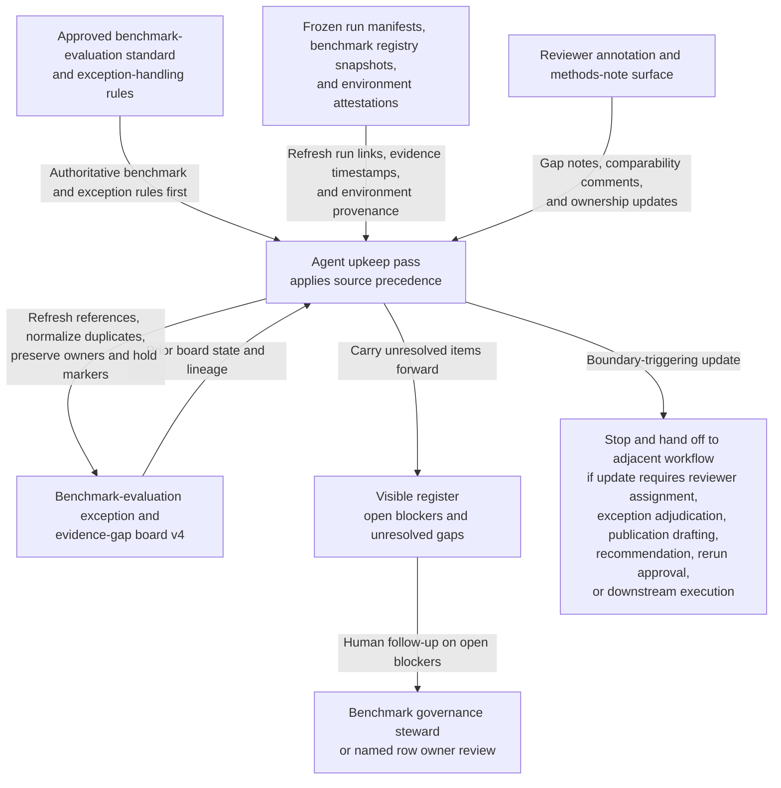
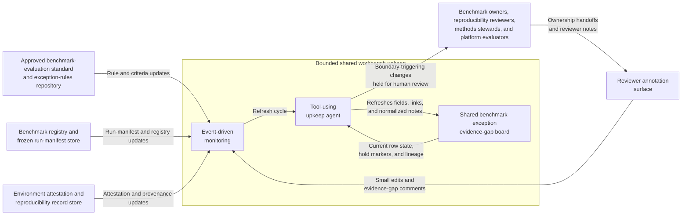

# Benchmark-evaluation exception and evidence-gap board shared workbench upkeep

## Linked pattern(s)

- `shared-workbench-orchestration`

## Domain

Research for internal benchmark governance and evaluation hygiene.

## Scenario summary

An internal benchmark governance group maintains one governed internal artifact, `Benchmark-Evaluation-Exception-Evidence-Gap-Board-v4`, while benchmark owners, reproducibility reviewers, methods stewards, and platform evaluators continuously refine notes attached to evaluation exceptions and missing support evidence across a shared model-benchmark program. Each row already carries prerequisite state: the benchmark suite id, exception ticket id, affected run-set reference, current evaluation-window tag, latest evidence-link bundle, accepted row owner, explicit blocker fields, unresolved comparability tags, and revision-aware lineage from `v2` and `v3` into `v4`. As small updates arrive, the agent keeps that bounded workbench synchronized by applying explicit source precedence from the approved benchmark-evaluation standard and exception-handling rules before frozen run manifests, benchmark registry snapshots, environment attestations, and reviewer annotations, refreshing source links, normalizing duplicate evidence-gap notes, preserving accepted hold-state markers, and carrying unresolved benchmark-scope, comparability, or evidence-freshness conflicts forward in a visible register. Humans remain responsible for deciding whether an exception is valid, whether the available evidence is sufficient, whether a benchmark result is still comparable, whether any rerun or disclosure note is required, whether publication or recommendation work should begin, and whether any downstream benchmark execution or reviewer assignment should occur.

## Target systems / source systems

- Shared benchmark-exception evidence-gap board with exception rows, prerequisite-state columns, blocker tags, source-precedence markers, ownership fields, hold-state markers, and append-only revision history
- Approved benchmark-evaluation standard and exception-rules repository containing authoritative benchmark suite definitions, approved comparability criteria, exception categories, evidence expectations, and superseding internal guidance
- Benchmark registry and frozen run-manifest store tracking benchmark suite ids, run-set versions, model and prompt variants, evaluation-window snapshots, and linked artifact bundles referenced by board rows
- Environment attestation and reproducibility record store containing hardware profiles, dependency-lock snapshots, dataset-version tags, disclosure-control notes, and benchmark execution provenance
- Reviewer annotation surface where benchmark owners, reproducibility reviewers, and methods stewards add small edits, evidence-gap comments, ownership handoffs, and follow-up notes

## Why this instance matters

This grounds the pattern in a research governance surface where the maintained artifact is one internal benchmark-exception board rather than a benchmark evidence matrix, a methodology caveat board, or a publication-readiness packet. The useful work is keeping prerequisite state, source precedence, visible blockers, ownership, and revision lineage synchronized as many small updates arrive from benchmark rules, run records, environment provenance, and reviewer channels. That keeps the collaboration centered on one inspectable internal board and preserves a hard stop before exception adjudication, reviewer assignment, recommendation, publication, rerun approval, or downstream execution begins.

## Likely architecture choices

- Event-driven monitoring fits because upkeep should react when approved benchmark rules, run-manifest snapshots, environment attestations, or reviewer notes change.
- A tool-using single agent can refresh source links, reconcile row metadata, normalize duplicate evidence-gap wording, and keep hold-state plus ownership markers synchronized inside one bounded board.
- Human-in-the-loop review remains necessary when an update would reinterpret comparability criteria, clear a blocker tied to missing evidence, or make a row sound like an adjudicated exception or benchmark recommendation.
- Bounded delegation works because benchmark governance owners can predefine allowable field updates, source-precedence rules, hold conditions, and lineage requirements without delegating exception decisions, reviewer assignment, publication posture, or benchmark execution.

## Governance notes

- The board should clearly separate authoritative benchmark-standard and exception-rule facts from lower-precedence run manifests, registry snapshots, environment attestations, and reviewer annotations so routine upkeep never implies that a comment overrides approved benchmark scope or comparability criteria.
- Each row should retain inspectable provenance for the benchmark suite id, exception id, affected run-set reference, evaluation-window tag, latest evidence-bundle timestamp, accepted owner assignment, current hold state, and prior revision links before any blocker is cleared or a status marker changes.
- Explicit blockers should remain visible for stale environment attestations, missing run-manifest links, unresolved prompt-template mismatches, incomplete disclosure-control notes, disputed comparability mappings, and ownership handoff uncertainty rather than being normalized away during board cleanup.
- The agent may normalize structure, merge duplicate evidence-gap notes, refresh links, and update confirmed owner or hold-state fields, but it should not decide whether an exception is acceptable, determine whether evidence is sufficient, assign reviewers, recommend reruns, draft publication language, or remove a hold that a human steward still considers open.
- If a requested update would choose an exception disposition, assign review responsibility, rank benchmark outcomes, approve a rerun, authorize publication language, or trigger any execution step, the workflow should stop and hand off to the appropriate adjacent pattern.

## Evaluation considerations

- Percentage of board refreshes that preserve correct benchmark-standard precedence, prerequisite-state fields, hold markers, named owner assignments, and revision lineage across repeated upkeep cycles
- Reviewer correction rate for normalized evidence-gap text, refreshed run or provenance links, ownership handoff updates, or automatically maintained blocker markers
- Rate at which interpretation-heavy, adjudication-like, reviewer-assignment, recommendation-like, publication-adjacent, or execution-adjacent edits are held for human review instead of being silently folded into the internal board
- Usefulness of the maintained workbench for helping benchmark governance collaborators resume exception-board upkeep without reconstructing stale lineage, blocker context, or source-precedence state by hand
