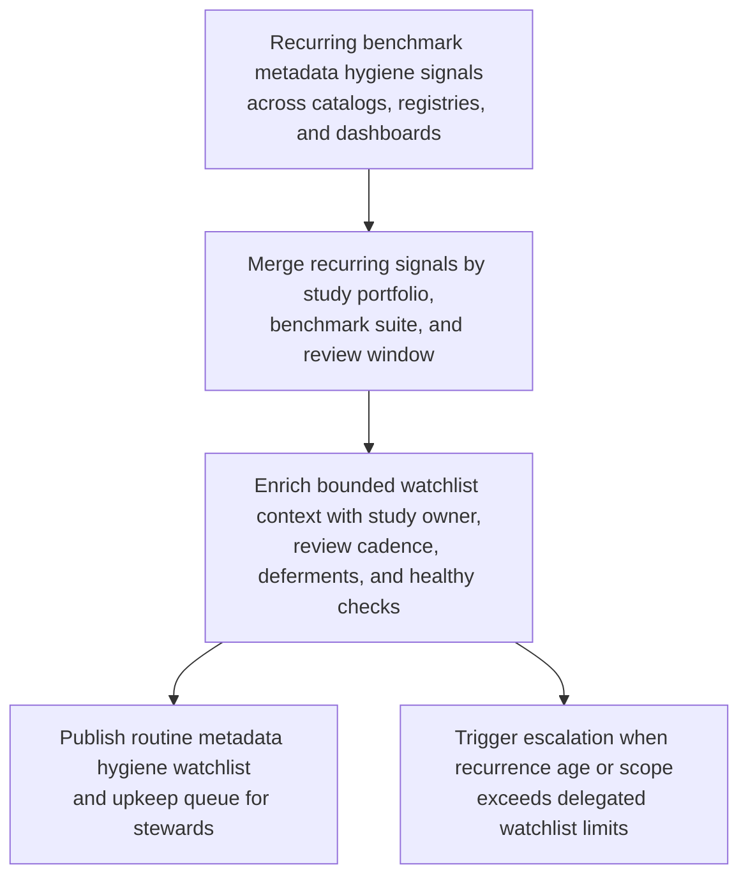
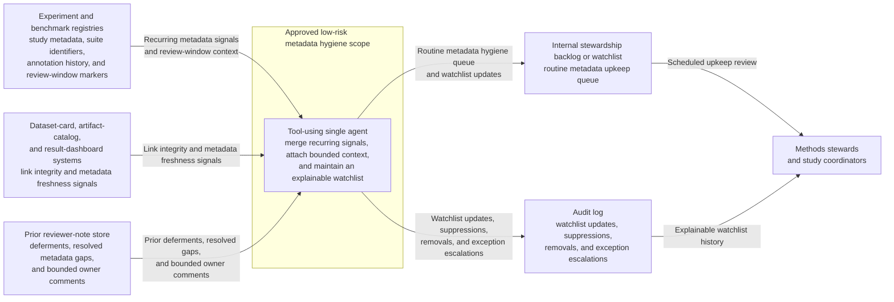

# Benchmark metadata hygiene watchlist upkeep

## Linked pattern(s)

- `explainable-watchlist-maintenance`

## Domain

Research.

## Scenario summary

A research methods stewardship team monitors recurring low-severity benchmark metadata hygiene signals across internal study catalogs, experiment registries, and result dashboards: missing annotation fields, stale dataset-card references, repeated absent reviewer tags, inconsistent benchmark-suite labels, and minor documentation gaps that do not yet call benchmark validity into question. The workflow must merge duplicate signals by study portfolio, benchmark suite, and review window, enrich each watchlist item with study owner, upcoming review cadence, prior deferments, and recent healthy metadata checks, and then publish a routine upkeep queue for methods stewards and study coordinators. The goal is to keep small but persistent metadata gaps visible before they mature into publication-readiness, disclosure, or integrity-review concerns, not to challenge study claims, block sharing, or launch a root-cause investigation automatically.

## Target systems / source systems

- Experiment and benchmark registries with study metadata, suite identifiers, annotation history, and review-window markers
- Dataset-card, artifact-catalog, and result-dashboard systems with link integrity and metadata freshness signals
- Internal stewardship backlog or watchlist used for recurring methods and catalog hygiene review
- Prior reviewer-note store capturing deferments, resolved metadata gaps, and bounded owner comments
- Audit log preserving watchlist updates, suppressions, removals, and exception escalations

## Why this instance matters

This grounds `explainable-watchlist-maintenance` in research work where recurring low-severity metadata issues are easy to ignore until they accumulate into more serious governance friction. Methods teams need durable visibility into small hygiene gaps without treating every missing tag or stale reference as an anomaly review or integrity case. The instance stays inside monitor/detect/triage because the workflow is continuous watchlist upkeep and routine queueing rather than benchmark adjudication, publication recommendation, or investigative verification.

## Likely architecture choices

- Event-driven monitoring fits because the watchlist should refresh as registry updates, metadata fixes, and recurring gap signals arrive across benchmark portfolios.
- A tool-using single agent can merge repeated metadata hygiene signals, check recent healthy-state evidence, attach bounded stewardship context, and maintain a routine methods-review queue.
- Exception-gated autonomy is appropriate because normal low-stakes watchlist updates can run autonomously, while signals that touch protected unpublished material, repeated unresolved age, or claim-sensitive benchmark releases should escalate.
- Decisions about publication readiness, disclosure posture, or whether a metadata gap indicates deeper integrity risk should remain with accountable human reviewers in adjacent workflows.

## Governance notes

- Queue views should minimize unpublished study detail and expose only the identifiers, cadence markers, and bounded evidence needed for methods stewardship.
- Watchlist items should separate recurring metadata hygiene gaps from signs of broader benchmark validity risk so low-stakes upkeep does not blur into anomaly review or integrity escalation.
- Reversibility should stay explicit: watchlist entries can be recomputed from catalog signals and recent metadata checks, but repeated unresolved hygiene gaps should force escalation before a review milestone passes silently.
- Auditability should preserve source timestamps, recurrence thresholds, prior deferments, removals, and exception escalations so methods stewards can inspect whether the watchlist remained trustworthy and appropriately scoped.

## Evaluation considerations

- Percentage of recurring benchmark metadata hygiene gaps surfaced before scheduled stewardship or release-readiness reviews
- Reduction in duplicate upkeep items through merged watchlist entries by study portfolio and benchmark suite
- Median time from a recurring metadata gap to an explainable watchlist item with owner, age, and healthy-state context
- Rate at which repeated unresolved watchlist items escalated before becoming publication, disclosure, or integrity-review blockers
- Steward override rate for items that were retained too long, suppressed too aggressively, or explained too weakly for routine review
