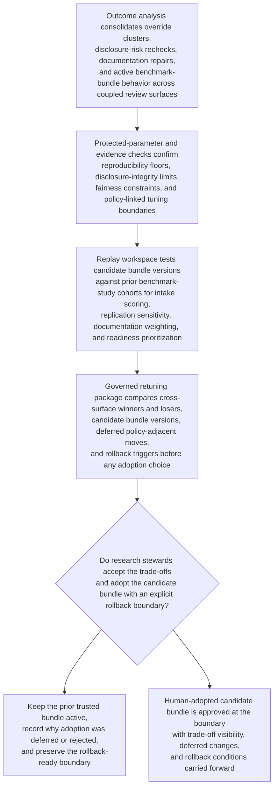

# Benchmark portfolio bundle retuning

## Linked pattern(s)

- `governed-optimization-bundle-retuning`

## Domain

Research.

## Scenario summary

A research operations lead oversees a shared benchmark-program tuning bundle that influences multiple coupled surfaces: study intake scoring, replication-review sensitivity, documentation-sufficiency weighting, and publication-readiness prioritization for a portfolio of model benchmark studies. Recent outcome history shows that the current bundle favors novelty and short review-cycle completion, but replication-review overrides, disclosure-risk rechecks, and late-stage documentation repairs are rising for studies with weaker reproducibility evidence or more complex data-use constraints. The workflow must produce a governed retuning package that adjusts the shared bundle so reproducibility quality, disclosure integrity, and review stability improve together, without letting the system decide whether a study may publish, rewrite research policy, or trigger downstream release actions on its own.

## Target systems / source systems

- Benchmark-program intake and review systems with study metadata, current scoring outputs, replication-review queues, and publication-readiness state
- Research artifact and documentation stores with reproducibility evidence, dataset-governance notes, disclosure-risk findings, and reviewer annotations
- Outcome history showing reviewer overrides, re-opened review packages, replication discrepancies, publication delays, and prior tuning rollbacks
- Shared parameter registry containing the active research-review bundle, protected integrity floors, novelty weighting, and fairness constraints across study types
- Simulation and replay workspace used to test candidate bundle versions against historical benchmark-study cohorts before stewards adopt them
- Governance dashboard used by research leads and integrity reviewers to compare retuning options, defer policy-linked changes, and approve the next bundle version

## Why this instance matters

This shows optimize/adapt in a research setting where the key problem is governed retuning of shared optimization state across intake, replication, and readiness surfaces rather than one isolated threshold or queue. A naive optimizer could improve apparent throughput by overweighting novelty and underweighting reproducibility, causing replication-risk studies or governance-heavy datasets to require repeated late-stage intervention. The example remains inside the optimize/adapt boundary because the workflow ends at a human-adopted retuning package and candidate bundle, not publication disposition, project scheduling, or execution of benchmark releases.

## Likely architecture choices

- Orchestrated multi-agent coordination is useful because different roles can specialize in outcome analysis, reproducibility guardrail checking, historical replay, and package assembly while working from one shared bundle history.
- Human-in-the-loop review should be normal because research integrity owners must decide whether proposed bundle trade-offs are acceptable before any shared tuning state changes.
- Recommendation-only autonomy is appropriate because the system should surface better bundle options and explicit trade-offs, but final adoption must remain with human stewards responsible for integrity and disclosure posture.
- Research leads should remain able to reject throughput-improving bundles that weaken reproducibility floors, defer policy-adjacent parameter moves, and keep the prior trusted bundle active while further evidence is gathered.

## Governance notes

- Parameters affecting reproducibility floors, disclosure-risk handling, sensitive-dataset review posture, and protected study-type fairness should be treated as protected bundle components rather than ordinary tuning knobs.
- Retuning packages should show when novelty, speed, and documentation-effort objectives conflict so a local cycle-time win cannot obscure a portfolio-level integrity regression.
- Auditability should preserve replay cohorts, reviewer override patterns, proposed versus adopted bundle versions, deferred policy-linked changes, and rollback decisions after any harmful adoption.
- Optimization views should minimize exposure of confidential study content and retain only the evidence needed for authorized integrity and governance review.
- Reversibility should be explicit: if replication-review churn rises or late-stage documentation repairs increase after adoption, the workflow should restore the prior bundle and mark the failed trade-off for investigation.
- The workflow must not decide publication readiness, approve disclosures, or route benchmark artifacts for release; it only recommends changes to shared optimization state.

## Evaluation considerations

- Reduction in replication-review overrides, re-opened readiness packets, and late documentation repairs after a retuned bundle is adopted
- Change in treatment of governance-heavy datasets, lower-visibility studies, and reproducibility-sensitive work across the coupled surfaces that share the bundle
- Accuracy of deferred-change handling when proposed tuning would effectively revise integrity policy rather than bounded optimization
- Speed and clarity with which stewards can inspect cross-surface trade-offs and roll back a harmful bundle version
