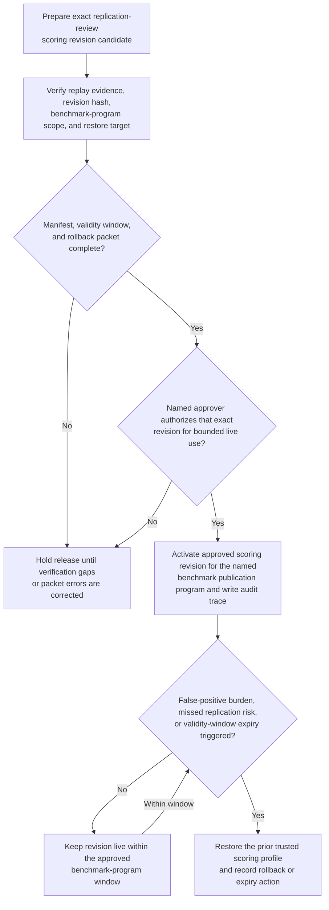
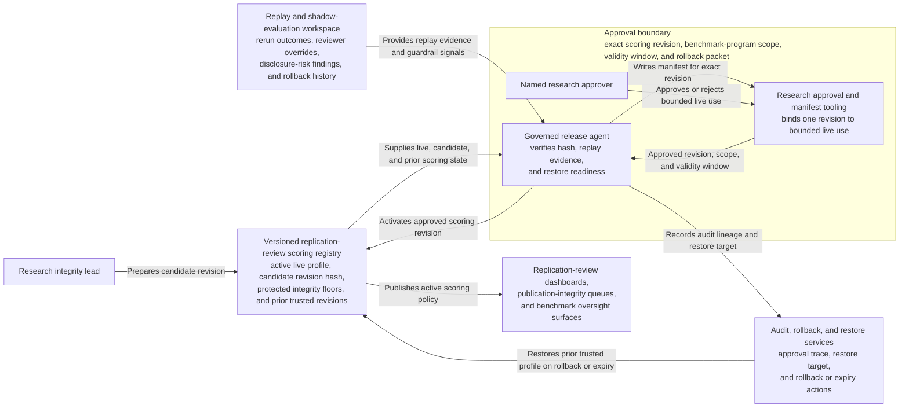

# Benchmark replication-review scoring revision approved for live use

## Linked pattern(s)

- `approval-gated-optimization-state-release`

## Domain

Research.

## Scenario summary

A research integrity lead has prepared one exact replication-review scoring revision for a benchmark publication program after replay shows that the current live profile underweights cross-lab divergence, dataset-governance caveats, and disclosure-sensitive benchmark claims during final review. The candidate revision increases sensitivity to rerun instability, tightens protected integrity floors for governance-heavy datasets, and defines a restore target if false-positive burden or missed replication risk rises. The workflow must release that exact scoring revision into bounded live use only after a human approver confirms the manifest, validity window, and rollback packet, while staying bounded at optimization-state release rather than deciding publication readiness, revising benchmark claims, or releasing study artifacts externally.

## Target systems / source systems

- Versioned replication-review scoring registry with the active live profile, candidate revision hash, protected integrity floors, and prior trusted revisions
- Replay and shadow-evaluation workspace with rerun outcomes, reviewer overrides, disclosure-risk findings, publication-council bounce-backs, and prior rollback history
- Research approval and manifest tooling used by integrity leadership to authorize one bounded live scoring revision for the named benchmark publication program
- Audit, rollback, and restore services that can return the prior profile if replication misses, governance-heavy dataset handling, or reviewer burden worsens
- Replication-review dashboards, publication-integrity queues, and benchmark oversight surfaces that consume the active scoring policy

## Why this instance matters

This grounds the pattern in research where the released object remains a versioned tuning artifact rather than a publication decision packet. The workflow governs one exact replication-review scoring revision that changes how future benchmark studies are emphasized for human integrity review, with explicit expiry and rollback discipline. That keeps the instance inside optimize/adapt because the core problem is safe live release of bounded optimization state, not publication adjudication, schedule management, or external disclosure.

## Likely architecture choices

- Approval-gated execution fits because the scoring revision can be prepared and technically ready, but the live switch remains blocked until a named research integrity owner approves that exact version and program scope.
- Human-in-the-loop review remains necessary because accountable stewards must accept the trade-offs among rerun sensitivity, governance-heavy dataset protection, and reviewer workload before bounded live use begins.
- A governed release agent can compare revision hashes, verify replay evidence, register rollback conditions, and maintain the audit trace, but it should not decide whether a study may publish, alter benchmark claims, or release any artifact outside the review system.

## Governance notes

- Approval should bind to one exact scoring revision, one named benchmark publication program, and one validity window so later tuning changes cannot reuse stale authorization.
- Protected integrity floors for governance-heavy datasets, disclosure-sensitive claims, and lower-visibility benchmark cohorts should remain explicit in the release packet.
- Expiry should restore the prior trusted profile automatically unless integrity leadership deliberately extends the revision after reviewing live replication and reviewer-burden signals.
- Rollback triggers should include missed replication-risk cases, worsening publication-council bounce-backs, or increased false-positive review burden that undermines steward trust.
- Audit records should preserve the approved and prior revision ids, replay windows, approver identity, validity timing, rollback criteria, and any extension or restore action.
- The workflow must not approve publication, settle disclosure posture, or trigger external benchmark release; it only governs release of the scoring revision used by human replication-review surfaces.

## Evaluation considerations

- Reduction in missed replication-risk cases, late publication-integrity bounce-backs, and reviewer overrides after the approved scoring revision becomes live
- Accuracy of manifest binding among the approved revision hash, protected integrity floors, and activated benchmark-program scope
- Reliability of automatic expiry or rollback when rerun instability or reviewer-burden assumptions breach the approved guardrails
- Time required for research integrity leaders to inspect one revision, approve bounded live use, and verify safe restoration to the prior trusted profile
