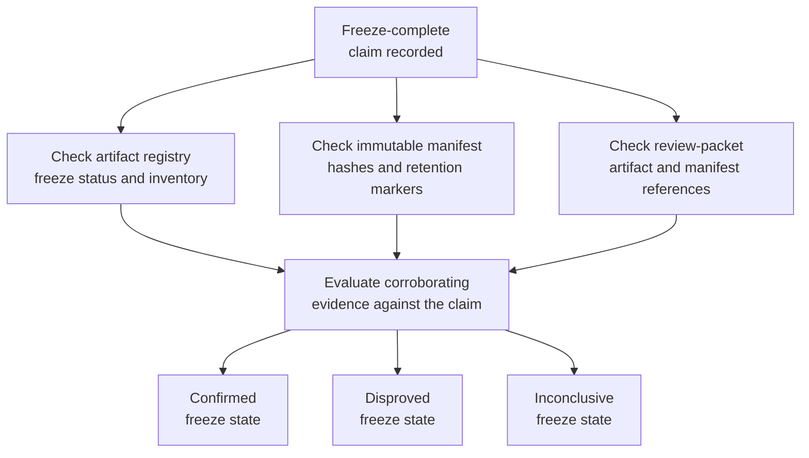

# Benchmark study artifact freeze completion verification

## Linked pattern(s)

- `claimed-state-verification`

## Domain

Research.

## Scenario summary

A benchmark-study owner records that the study's artifact freeze is complete after uploading the final evaluation outputs, manifests, and supporting notebooks for an internal governance review. Governance coordinators still need to confirm whether that claimed freeze state is actually supported by the approved artifact registry, immutable object-store manifest, and review-packet references before they rely on the study as fixed-input evidence. The workflow verifies the claim against those authoritative sources and emits a bounded verdict; it must not approve the study, reopen the evidence packet, or decide any publication or review outcome.

## Target systems / source systems

- Benchmark artifact registry containing the study identifier, freeze status, and expected artifact inventory
- Immutable object-store manifest with checksums, write-once retention markers, and bundle timestamps
- Governance review packet workspace referencing the frozen artifact bundle and source manifest ids
- Study workflow tracker or event feed recording the artifact-freeze-complete claim and any later retries
- Verification audit store preserving evidence checks, verdict history, and manual follow-up records

## Why this instance matters

This grounds the pattern in research work where people often rely on a tracker status that says a study is frozen even though one manifest reference or immutable-retention marker is still missing. The workflow stays inside investigate/reconcile/verify because the value is proving whether the claimed low-risk state actually holds, not recommending a review decision or propagating closure into downstream systems. It also keeps governance explicit by preserving evidence lineage and uncertainty when the freeze cannot yet be confirmed cleanly.

## Likely architecture choices

- Event-driven monitoring fits because the verification run should begin when the freeze-complete claim is recorded, not only when a reviewer later notices uncertainty.
- A tool-using single agent can query the artifact registry, validate manifest hashes and retention markers, compare review-packet references, and emit one evidence-backed verdict.
- Bounded delegation is suitable because research governance owners can predefine the required corroborating evidence and tolerated lag while humans retain authority over any study approval, rerun, or packet correction.
- Durable verification state should keep repeated freeze checks and unresolved missing-manifest cases visible across governance handoffs.

## Governance notes

- The workflow should treat the artifact registry, immutable manifest, and approved review-packet references as authoritative; investigator memory or draft spreadsheet copies should not confirm the claim.
- Verification traces should preserve artifact identifiers, manifest hashes, retention markers, and packet references so the freeze verdict can be audited later.
- If one corroborating source is missing or stale, the result should remain inconclusive rather than implying that the study is fully frozen because the tracker says so.
- Approval of the study, correction of missing artifacts, or any change to publication posture remains human-owned and outside this verification pattern.

## Evaluation considerations

- Percentage of artifact-freeze claims that receive a verdict with complete registry, manifest, and packet-reference traceability
- Rate at which incomplete freeze claims are detected before reviewers rely on the study as fixed evidence
- Reviewer agreement that the workflow applied the correct corroboration and freshness rules for freeze confirmation
- Usefulness of follow-up records for distinguishing expected lag from genuinely incomplete artifact freezes
