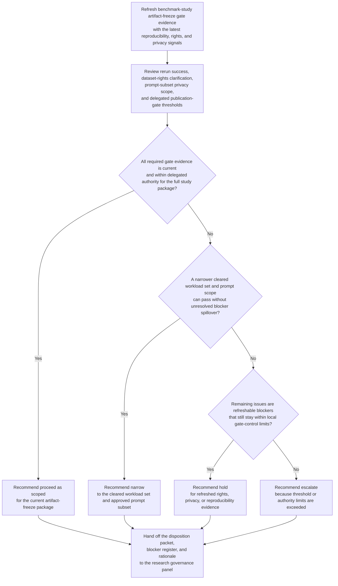

# Benchmark study artifact-freeze readiness gate disposition recommendation

## Linked pattern(s)

- `readiness-gate-disposition-recommendation`

## Domain

Research.

## Scenario summary

A research governance panel is reassessing whether a benchmark study can pass its artifact-freeze gate before an external workshop submission deadline. Since the previous check, one reproducibility rerun succeeded, a license clarification for a third-party evaluation corpus remains unresolved, and a late privacy review note requires narrowing one prompt subset unless additional redaction evidence arrives. The workflow must recommend whether research should proceed with the package as scoped, hold the gate, narrow the submission to the fully cleared workload set, or escalate because reproducibility, disclosure, or dataset-rights thresholds now sit outside delegated publication-gate authority before any external artifact is finalized.

## Target systems / source systems

- Study governance tracker, artifact-freeze checklist, and publication-gate policy library
- Experiment tracker, rerun evidence store, and reproducibility verification reports
- Dataset inventory, license register, and privacy or disclosure review notes
- Submission calendar, reviewer comment log, and prior artifact-gate exception register
- Internal research archive containing draft figures, prompt-set references, and approved disclosure boundaries

## Why this instance matters

This instance grounds the pattern in research without drifting into paper drafting, collaborative review-loop management, or final publication execution. The hard problem is refreshing a governed readiness judgment as evidence and blocker state change, while keeping the workflow bounded at a disposition recommendation for the artifact-freeze gate.

## Likely architecture choices

- Event-driven monitoring fits because reproducibility reruns, license-status changes, privacy review updates, and deadline thresholds should trigger a refreshed gate recommendation as soon as the gate context materially changes.
- Human-in-the-loop review is mandatory because the workflow should advise on proceed, hold, narrow, or escalate posture, not approve the submission, edit the artifact package, or disclose the study externally.
- Read-only integration with experiment, licensing, review, and archive systems is preferable so the agent cannot silently convert a readiness recommendation into an irreversible publication action.

## Governance notes

- The output should separate full-proceed options, narrow-scope artifact packages that exclude unresolved workloads or prompt subsets, hold conditions tied to missing evidence, and escalation triggers for licensing or disclosure concerns.
- Any narrow recommendation should show exactly which claims, figures, prompt subsets, or workloads remain inside the approved package and which blockers remain unresolved outside that boundary.
- Unresolved third-party rights, late privacy concerns, or non-reproducible headline results should trigger explicit escalation rather than schedule pressure from the submission deadline.
- Unpublished results, prompt content, reviewer notes, and license restrictions should remain visible only to authorized research, legal, privacy, security, and communications reviewers under normal embargo controls.
- Recommendation packets should preserve evidence timestamps, blocker history, and rationale for each refreshed disposition so governance owners can later inspect why the study package was advanced, narrowed, held, or escalated.

## Evaluation considerations

- Reviewer agreement with the recommended artifact-freeze disposition before any submission-ready package is approved
- Rate at which reproducibility, licensing, or privacy blockers are surfaced before the external deadline hardens the decision
- Quality of evidence linking rerun results, disclosure thresholds, and blocker scope to the recommendation
- Stability of recommendations when late reruns, rights clarifications, or review comments change the gate context during final preparation
