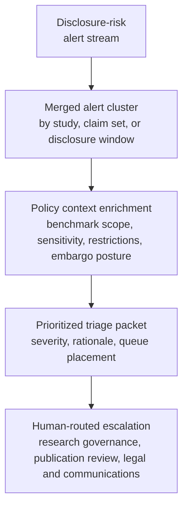

# Benchmark study disclosure risk alert triage

## Linked pattern(s)

- `risk-alert-triage`

## Domain

Research.

## Scenario summary

A research governance team monitors a continuous stream of disclosure-risk signals around active benchmark studies, including draft-paper sharing events, slide-deck exports, embargo milestones, reproducibility regression alerts, dataset-rights changes, external-review requests, and publication-policy exceptions. The workflow must collapse duplicate signals tied to the same study, claim set, or disclosure window; enrich each alert with benchmark scope, artifact sensitivity, prior reviewer concerns, partner or vendor restrictions, and current embargo posture; and then prioritize which cases need immediate human review. A case should rise to the urgent queue when, for example, an externally shareable draft still depends on a newly failed replication, a dataset license changes after benchmark figures were circulated for review, or multiple external-access requests arrive near an embargo boundary for a study with unresolved disclosure caveats. The goal is to create an evidence-backed triage packet for research governance, publication-review, or legal-and-communications reviewers, not to decide publication posture, rewrite the benchmark claims, grant artifact access, or run a retrospective investigation.

## Target systems / source systems

- Benchmark study workspace with draft papers, slide decks, artifact manifests, reviewer comments, and controlled-sharing records
- Experiment-tracking and reproducibility systems with rerun outcomes, failed replication alerts, variance thresholds, and benchmark configuration history
- Dataset inventory, license registry, partner-data terms, and vendor-comparison disclosure restrictions that can change study release posture
- Publication-governance workflow with embargo dates, approved claim boundaries, exception history, and required review checkpoints
- Document-access telemetry, external-review intake channels, and collaboration tools showing link creation, export attempts, outside-domain sharing, and reviewer requests
- Audit-grade case queue and evidence store preserving alert lineage, suppression rationale, routing decisions, policy versions, and human escalation actions

## Why this instance matters

This grounds `risk-alert-triage` in research work where the hard problem is not producing the publication recommendation itself, but continuously noticing when weak signals converge into a disclosure-risk case that deserves urgent governed review before an external claim hardens. A weak workflow would either flood research leads with repetitive draft-sharing and embargo reminders or miss the one combined signal pattern that shows a benchmark disclosure is drifting outside reproducibility, licensing, or communications guardrails. The instance stays inside monitor/detect/triage because the agentic work is continuous watching, duplicate suppression, context assembly, prioritization, and human-routed escalation rather than publication approval, calendar coordination, document execution, or deep root-cause analysis.

## Likely architecture choices

- Event-driven monitoring should continuously ingest benchmark artifact activity, embargo-state changes, reproducibility alerts, dataset-rights updates, and external-review requests, then reopen or merge alert clusters as new evidence arrives.
- A tool-using single agent can correlate study identifiers across experiment, artifact, and governance systems; suppress duplicate notifications from the same disclosure thread; attach policy-relevant context; and publish a prioritized queue with explicit urgency drivers.
- Human-in-the-loop review should remain mandatory for any alert that could trigger external sharing restrictions, legal review, partner notification, executive communications review, or a change to what benchmark claims may be discussed outside the approved group.
- Approval-gated escalation is the right boundary because the workflow can recommend urgent routing to research governance, legal, privacy, or communications reviewers, but it should not independently approve disclosure, revoke access, or notify external parties.

## Governance notes

- Triage packets should show which disclosure, embargo, reproducibility, sharing, or license-change rules fired; which raw alerts were merged; what benchmark artifacts or claims were implicated; and why the case entered a given urgency tier.
- Duplicate suppression should preserve lineage across sharing events, rerun alerts, and review requests so auditors can reconstruct why repeated signals were merged into one case rather than surfaced separately.
- Privacy and confidentiality controls should minimize exposure of unpublished results, sensitive prompt sets, reviewer identities, partner restrictions, and restricted dataset details in broad queue views while keeping traceable evidence available to authorized reviewers.
- Reversibility should be explicit: queue order, merged-alert decisions, and urgency labels can be recomputed as embargo terms, rerun outcomes, or access records change, but once an external draft, benchmark figure, or comparative claim is shared beyond the approved boundary, the disclosure may be only partially recoverable, so low-confidence high-consequence cases should bias toward human review instead of silent suppression.
- Approval boundaries must remain firm: only authorized research-governance, legal, privacy, communications, or designated study owners may decide whether outside review proceeds, whether a disclosure exception is granted, whether a case is closed, or whether downstream publication review must be escalated.
- Auditability should preserve source timestamps, policy versions, suppression rationale, queue movements, and reviewer overrides so the organization can later reconstruct how a disclosure-risk case was prioritized during publication-governance or partner-review scrutiny.

## Evaluation considerations

- Recall of historically material disclosure-risk cases that should have reached urgent human review before external sharing or embargo deadlines tightened
- Reduction in duplicate reviewer work from merged draft-sharing, embargo, and reproducibility alerts without lowering capture of true research-governance risk
- Median time from first relevant sharing, rights-change, or replication signal to a triage packet containing benchmark context, policy basis, and routing rationale
- Reviewer override rate for alerts that were over-ranked because benign collaboration activity looked risky or under-ranked because cross-system disclosure context was not assembled well enough
- Auditability of suppression, merge, policy-version, and escalation decisions during publication-governance review, partner dispute reconstruction, or internal research-controls testing
