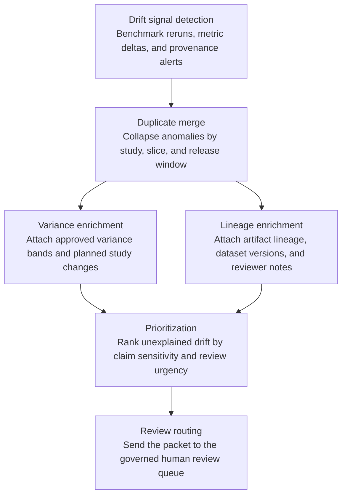
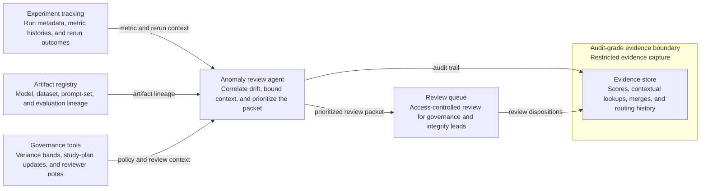

# Benchmark study metric drift anomaly review

## Linked pattern(s)

- `anomaly-detection-review`

## Domain

Research.

## Scenario summary

A research governance team monitors benchmark reruns, experiment metadata, artifact provenance checks, dataset-version changes, and reviewer comments to detect mid-severity metric-drift anomalies before they become publication, disclosure, or integrity incidents. The workflow must collapse duplicate anomalies tied to the same study, benchmark slice, and release window; enrich each case with expected variance bands, planned methodological changes, artifact lineage, prior reviewer notes, and claim sensitivity; and then prioritize which unexplained drifts deserve human review. A case should enter the review queue when, for example, a headline benchmark score jumps beyond the approved variance band without a matching study-plan update, repeated reruns disagree because one artifact lineage is incomplete, or a dataset-version change coincides with unexplained subgroup drift in a study slated for near-term sharing. The goal is an explainable anomaly review packet for benchmark governance, study owners, or research-integrity reviewers, not to decide publication posture, retract claims, run a root-cause analysis, or notify outside parties automatically.

## Target systems / source systems

- Experiment-tracking systems with run metadata, metric histories, benchmark slices, configuration provenance, and rerun outcomes
- Artifact registries and study workspaces with model, dataset, prompt-set, and evaluation-manifest lineage
- Research-governance tools with planned methodology updates, reviewer comments, approved variance bands, and release milestones
- Access-controlled review queues used by benchmark leads, research governance reviewers, and research-integrity specialists
- Audit-grade evidence storage preserving anomaly scores, contextual lookups, duplicate merges, reviewer dispositions, and routing decisions

## Why this instance matters

This grounds `anomaly-detection-review` in research work where the hard problem is not yet explaining why benchmark drift occurred, but noticing when an explainable packet should bring a non-trivial anomaly to human attention before it leaks into claims, external sharing, or publication-readiness decisions. A weak workflow would either overwhelm reviewers with normal experimental variance or underplay the one unexplained drift pattern that later undermines confidence in the study. The instance stays inside monitor/detect/triage because the agentic work is continuous anomaly watching, bounded context assembly, queueing, and governed routing rather than publication adjudication, disclosure handling, or retrospective investigation.

## Likely architecture choices

- Event-driven monitoring should continuously ingest rerun results, benchmark metric deltas, provenance-check failures, and planned-study updates, then reopen or merge anomaly clusters as fresh evidence arrives.
- A tool-using single agent can correlate study identifiers across experiment, artifact, and governance systems; compare the anomaly against approved variance bands; attach bounded lineage context; and publish a prioritized review packet with explicit uncertainty markers.
- Bounded delegation fits because in-policy mid-severity drift packets can route into a preapproved research review queue without case-by-case approval, while higher-consequence anomalies still escalate to humans before any claim, disclosure, or publication action is taken.
- Investigation into methodology defects, disclosure risk, or publication decisions should remain downstream workflows owned by accountable humans.

## Governance notes

- Review packets should distinguish observed drift, known methodological changes, expected variance explanations, and unresolved concerns so reviewers can see what is signal versus uncertainty.
- Sensitive unpublished results, prompt sets, reviewer identities, partner restrictions, and artifact details should be minimized in broad queue views while remaining traceable in restricted evidence systems.
- Reversibility should remain explicit: queue placement, anomaly labels, and packet contents can be recomputed as reruns complete or provenance gaps are repaired, but missed review windows may be only partially recoverable once claims are drafted or shared.
- Approval boundaries must remain firm: only authorized benchmark leads, governance reviewers, integrity specialists, or designated study owners may decide whether the anomaly triggers deeper investigation, publication hold, external disclosure change, or closure.
- Auditability should preserve source timestamps, anomaly thresholds, duplicate handling, reviewer overrides, and routing history so later study review can reconstruct why a drift pattern did or did not receive attention.

## Evaluation considerations

- Recall of historically meaningful benchmark drift anomalies that should have reached human review before publication-readiness or disclosure pressure increased
- Reduction in duplicate reviewer work from merged rerun and provenance anomalies without lowering capture of genuine unexplained drift
- Median time from first anomalous metric pattern to a review packet containing variance context, lineage references, unresolved uncertainty, and routing rationale
- Reviewer override rate for anomalies that were over-ranked because expected study updates were missed or under-ranked because cross-system context was not assembled clearly enough
- Auditability of suppression, merge, and routing decisions during research-governance review or internal integrity controls testing
