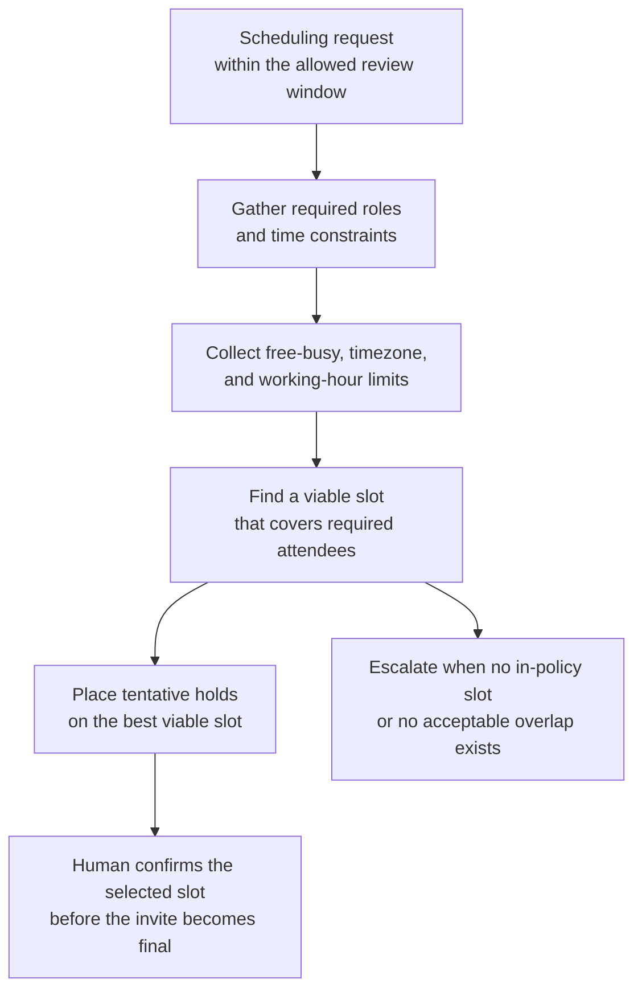

# Benchmark study publication-readiness review scheduling

## Linked pattern(s)

- `calendar-conflict-coordination`

## Domain

Research for pre-publication benchmark governance.

## Scenario summary

An applied research program manager needs to schedule a publication-readiness review for an internal benchmark study before the team can submit a workshop abstract and circulate the headline results to product leadership. The meeting must include the study lead, the reproducibility reviewer, the privacy reviewer, the dataset licensing owner, and the research communications partner because the review sits inside a five-business-day embargo window between final result freeze and external abstract submission. The workflow is about constructing a viable slot across San Francisco, New York, and London calendars, placing reversible holds, and escalating quickly when no in-policy overlap exists rather than guessing at attendee substitutions, relaxing the embargo window, or making the final meeting commitment without human confirmation.

## Target systems / source systems

- Publication-governance tracker with study stage, embargo dates, abstract deadline, and required review roles
- Team calendars for applied research, reproducibility, privacy, legal or licensing review, and research communications
- Research milestone calendar showing benchmark freeze windows, conference submission deadlines, and internal review blackouts
- Calendar and meeting tools that support tentative holds, timezone-normalized drafts, and reversible invite packets
- Research coordination workspace where attendee exceptions, rationale, and final confirmation status are recorded

## Why this instance matters

This grounds the scheduling pattern in a research workflow where the main value is assembling the right governance and publication stakeholders before outward-facing benchmark claims move any closer to release. It is distinct from synthesis, recommendation, or execution work because the workflow is not interpreting the benchmark results, deciding whether the paper should be accepted, or submitting anything externally. Instead, it handles bounded-delegation schedule construction so researchers and reviewers can spend their attention on the publication-readiness discussion once the required people are aligned at the right time.

## Likely architecture choices

- A tool-using single agent gathers free-busy availability, embargo-window constraints, abstract-deadline metadata, required-attendee rules, and timezone preferences from approved research systems.
- Bounded delegation fits because the agent can rank feasible slots, place short-lived tentative holds, and draft a meeting packet linked to the publication-governance record, but it should not move the abstract deadline, replace a required reviewer silently, or confirm the final review invite without the research program manager's approval.
- Human checkpoints remain necessary when no compliant overlap exists before the embargo expires, when only after-hours options remain for a required reviewer, or when a proposed delegate would change who owns privacy, licensing, or reproducibility sign-off in the meeting.

## Governance notes

- Required attendees should be explicit and role-based before any hold is placed: study lead, reproducibility reviewer, privacy reviewer, dataset licensing owner, and research communications partner for externally scoped benchmark work.
- Calendar access should stay limited to free-busy, timezone, delegate, and policy metadata rather than exposing private event titles, unpublished study names, or sensitive review notes.
- Tentative holds should be reversible, time-bounded, and tied to the specific benchmark-study governance record so stale placeholders do not block other review windows.
- The workflow should minimize copied context in invites and coordination messages, sharing only the meeting purpose, timing window, and role requirements needed for scheduling while keeping embargo-sensitive study details inside approved systems.
- The workflow should escalate instead of improvising when no in-policy slot exists before the submission deadline, when the only overlap crosses protected after-hours boundaries, or when a substitute attendee would alter who can speak for privacy, licensing, or publication readiness.
- Final commitment should stay human-owned: the research program manager or study lead confirms the selected slot and any approved attendee substitution before the invite becomes authoritative.

## Evaluation considerations

- Median time from publication-readiness scheduling request to a viable review slot covering all required research-governance roles inside the approved embargo window
- Percentage of benchmark publication-readiness reviews confirmed without manual back-and-forth beyond defined program-manager checkpoints
- Frequency of rescheduling caused by stale free-busy data, expired tentative holds, or missed required-attendee constraints near the abstract deadline
- Audit usefulness of the coordination log for showing which slots were rejected, which reversible holds were placed, and why a human had to approve the final commitment or attendee exception
