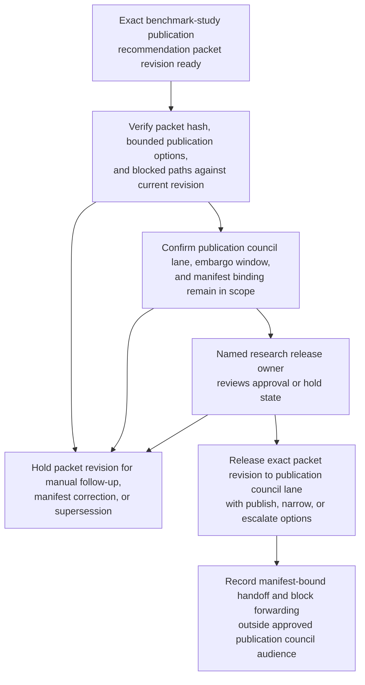
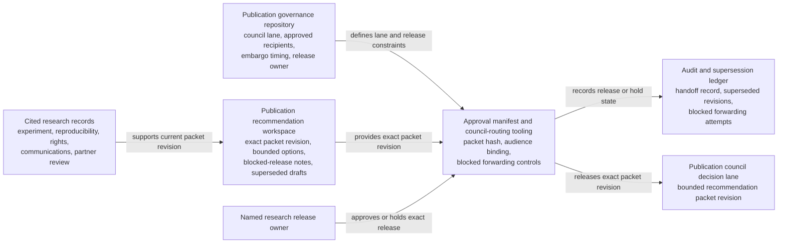

# Benchmark study publication recommendation packet revision approved for publication council decision lane

## Linked pattern(s)

- `approval-gated-recommendation-release`

## Domain

Research.

## Scenario summary

A research publication workflow has already prepared one exact recommendation packet revision for an external benchmark-study release. The packet narrows the bounded options to publish the workshop paper and approved abstract as scoped, narrow the release to the cleared workload set and claim bundle, or escalate to chief research and legal review, and it keeps blocked paths such as a broader vendor-comparison blog post or public artifact release before rights clearance explicit. Before that exact packet revision can enter the restricted publication council decision lane, a named research release owner must approve the council scope, embargo window, and manifest binding so reviewers receive the governed recommendation artifact rather than a stale or broadened copy. The workflow stops at governed release of that packet revision; it does not decide whether publication proceeds, submit the paper, or disclose the benchmark externally.

## Target systems / source systems

- Publication recommendation workspace holding the current packet revision, bounded claim and option set, blocked-release notes, and superseded drafts
- Experiment, reproducibility, dataset-rights, communications, and partner-review records already cited by the recommendation packet
- Publication governance repository defining the named publication council lane, approved recipients, embargo timing, and the human owner who may approve packet release
- Approval manifest and council-routing tooling that records the exact packet hash, council audience, and any blocked forwarding attempts outside the approved lane
- Audit and supersession ledger used to hold older packet revisions when rerun evidence, rights status, or disclosure scope changes before council review

## Why this instance matters

This grounds the pattern in research where the governance problem is not to adjudicate publication, but to control release of one bounded recommendation artifact into one human decision lane. Benchmark-publication packets often shift late as reproducibility reruns complete, dataset rights are clarified, or communications reviewers narrow what may be claimed, so approval must stay tied to one reviewed revision rather than to a vague permission to keep circulating publication advice. The example keeps the family boundary clean by ending at publication-council handoff rather than publication adjudication, submission execution, or external disclosure.

## Likely architecture choices

- Approval-gated execution fits because the recommendation packet remains held until a named research owner authorizes release into the publication council decision lane.
- Human-in-the-loop review remains necessary because only accountable publication governance owners should confirm embargo scope, audience, and blocked-claim visibility without collapsing the workflow into publication approval itself.
- A governed agent can compare packet hashes, assemble the release manifest, and block broadened distribution, but it should not submit the paper, approve the benchmark claims, or release the study artifacts externally.

## Governance notes

- Approval should bind to one immutable packet revision, one named publication council lane, one embargo or expiry window, and one exact bounded claim set so later edits cannot inherit release authority silently.
- Reproducibility gaps, dataset-rights caveats, partner-review restrictions, and blocked public-artifact paths should remain visible in the released packet rather than being flattened into a simple ready-to-publish answer.
- If rerun evidence, disclosure scope, or council audience changes during approval review, the pending packet should be held and superseded rather than routed under stale approval.
- Audit records should preserve the released packet id, claim and option-set hashes, approver identity, council-recipient scope, embargo timing, and any blocked redistribution attempts.

## Evaluation considerations

- Percentage of publication-council releases where the benchmark recommendation packet revision, bounded claim set, and manifest metadata align exactly without later correction
- Rate at which superseded or stale publication recommendation packets are blocked before council review
- Time required to move from packet-ready status to approved bounded council release when reproducibility, rights, and disclosure evidence are complete
- Reviewer correction rate for missing blocked claims, wrong audience scope, or stale-state handling after the council receives the released recommendation packet
