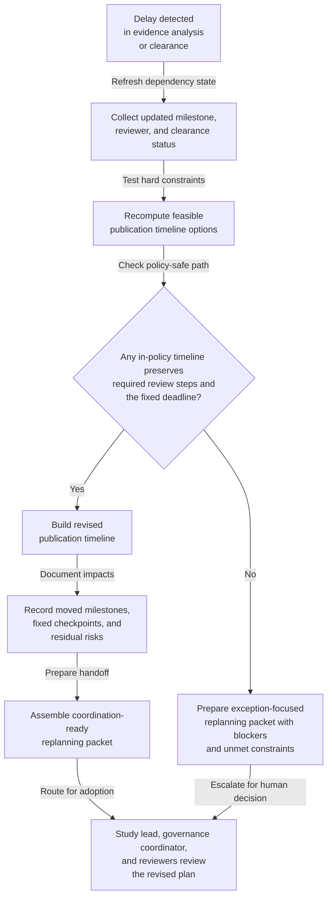

# Benchmark study publication timeline replanning after evidence-analysis or clearance delay

## Linked pattern(s)

- `schedule-adjustment-and-replanning`

## Domain

Research.

## Scenario summary

An applied research program already has an internal benchmark-study publication timeline that sequences final evidence analysis, reproducibility review, data-governance clearance, publication-readiness review, abstract lock, and the external submission deadline. Then the baseline plan stops being feasible: a late evidence-analysis rerun delays one benchmark claim package, or data-governance clearance for a training-data subset takes longer than expected, compressing the original publication-review window and threatening the abstract submission path. The workflow should recompute a revised timeline, document which milestones can move or must stay fixed, and prepare a coordination-ready replanning packet for the study lead, governance coordinator, reproducibility reviewer, and communications partner rather than deciding whether review steps may be skipped, adjudicating publication integrity, or submitting anything externally.

## Target systems / source systems

- Publication-governance tracker with the approved baseline study timeline, embargo window, abstract deadline, required review checkpoints, and prior schedule versions
- Experiment tracker, evidence-analysis workboard, rerun manifest store, and reproducibility checklist showing which benchmark claims are still incomplete or waiting for refreshed evidence
- Data-governance clearance queue with approval status, review dependencies, and the earliest allowed release date for governed datasets or prompt corpora
- Research program calendar and coordination workspace tracking reviewer availability, draft packet handoffs, and already-committed internal publication checkpoints
- Planning or milestone tools that can preserve dependency links, critical-path changes, blocked alternatives, and handoff-ready schedule packets

## Why this instance matters

This grounds the replanning pattern in research work where the main problem is recovering a feasible publication timeline after upstream evidence or governance delays invalidate the original sequence. The valuable output is not a recommendation about whether the study should publish, a judgment about integrity, or an abstract-submission action. Instead, the workflow stays inside plan-family scope by producing a revised schedule, a rationale and impact ledger, and a coordination-ready handoff packet so human owners can decide whether to adopt the new plan.

## Likely architecture choices

- An orchestrated multi-agent workflow fits because one role can refresh dependency state from evidence-analysis and clearance systems, another can test revised milestone feasibility against hard deadlines, and another can package the accepted candidate timeline with explicit impacts and unresolved blockers.
- Human-in-the-loop adoption remains necessary because the study lead or research program manager must approve any consequential change to review timing, reviewer sequencing, communications prep, or internal deadline compression before the revised timeline becomes authoritative.
- Recommendation-only autonomy is the right ceiling: the workflow can propose revised milestone order, identify at-risk downstream checkpoints, and prepare the handoff packet, but it should not waive data-governance clearance, shorten mandatory reproducibility review below policy minimums, or convert the replanning packet into a publication go/no-go decision.

## Governance notes

- Hard constraints should remain explicit during replanning: abstract submission cutoff, embargo or disclosure window, minimum reproducibility-review lead time, required data-governance clearance, and any non-waivable publication-readiness checkpoint.
- The replanning rationale should preserve lineage from the baseline timeline to the revised proposal, including which milestones moved, which stayed fixed, which alternatives were rejected, and what new deadline risk remains.
- Source freshness matters because a revised schedule built on stale rerun completion or clearance-state assumptions can create false confidence and trigger avoidable coordination churn.
- The coordination-ready handoff packet should include only role-relevant timing, dependency, and blocker detail rather than copying unpublished benchmark claims, sensitive dataset notes, or draft manuscript content into broad scheduling channels.
- The workflow should escalate instead of improvising when no in-policy timeline can preserve both the required review steps and the abstract deadline, when a proposed change would effectively waive governance review, or when unresolved evidence uncertainty makes any revised plan misleading.

## Evaluation considerations

- Time from evidence-analysis or clearance delay trigger to a revised publication timeline with explicit dependency impacts and adoption-ready handoff
- Rate of replanning events resolved with an accepted revised schedule without forcing a full manual rebuild of the benchmark publication plan
- Frequency of adopted revised timelines that still require immediate corrective replanning because hard publication, governance, or reviewer constraints were missed
- Audit usefulness of the impact ledger for reconstructing which publication milestones moved, which remained fixed, what deadline risk remained, and why human owners accepted or rejected the revised plan
